# C FOR BEGINNERS

## 1 Intro

**Topics**

- Overview of C - efficient, portable, power and flexibility, programmer oriented
- Language Feauters - impreative language, top-down planning, structured programming and modular design
- Advantages of using C - small, fast programss, reliable, easy to learn and understand
- How to use a modern, cross-platform IDE (MS vscode) to write, edit and debug
- Basic C concepts - structure of a prgram, comments, output using printf, "Hello World"
- Makefiles - how to build
- Variables - declaring and using
- Data Types - int, float, double, char etc
- Basic Operators - logical, arithmetic and assignment
- COnditional Statements - making decisions (if, switch)
- Repeating code - looping (for, while, and do-while)
- Arrays - defining and initializing, multi-dimensional
- Functions - declaration and use, arguments and parameters, called by value vs. call by reference
- Debugging - call statk, common mistakes, understanding compiler messages
- Structs - initializing, nested structures, variants
- Character Strings - basic, arrays of chars, character operation
- Pointers - defintion and use, using with functions and arrays, malloc, pointer arithmetic
- The Preprocessor - #define, #include
- Input and Output - getchar, scanf
- File Input/Output - reading and writing to a file, file operations
- Standard C Library - string functions, math functions, utility functions, standard header files

**Course Outcomes**

- Able to write beginner C programs
- Able to write efficient, high quality C code
  - modular
  - low coupling
- Able to find and fix errors
  - Understand compiler messages
- Understand fundamental aspects of the C Programming language

## 2 Class Organization

**Class Organization**

- Lectures are designed around explaining the why and providing the how
  - A complete learning experience
  - Understand the programming language as a whole
  - Lacking in most Udemy courses

**Demoonstrations of code in IDE**

**Challenges (coding assignments/projects)**

## 3 Fundamentals of a Program

### 3.1 Basics - Computer Instructions

- Computers are very dumb machines
  - They only do what they are told to do
- The basic operations of computer will form what is known as the computer's intruction set
- To solve a program using a computer, you must provide a solution to the program by sending instructions to the instruction set
  - A compluter program sends the instructions necessary to solve a specific problem

### 3.2 Basics - Algorithm

- The approach or method that is used to solve the problem is known as an algorithm

  - So, if we were to create a program that tests if a number is odd or even
    - The statements that solve the problem becomes the program
    - The method that is used to test if the number is even or odd is the algorithm

- To write a program, you need to write the instructions necessary to implement the algorithm
  - These instructions would be expressed in the statemetns of a particular computer language, such as Java, C++, Objective-C, or C

### 3.3 Terminology

- CPU (Central Processing Unit)

  - Does most of the computing work
  - Instructions are executed here

- RAM (Random Access Memory)
  - Stores the data of a program while it is running
- Hard Drive (Permanent Storage)

  - Stores files that contain program source code, even while the computer is turned off

- Operating System

  - Developed to help make it more convenient to use computers
  - A program that controls the entire operatio of a computer
    - All input and output
    - Manages the computer's resources and handles the execution of programs
    - Windows, Unix, Android, etc.

- Fetch/Execute Cylce (life of a CPU)
  - Fetches an instruction from memory (using registers) and executes it (loop)
  - A gigahertz CPU can do this about a billion times per second

**Fetch/Execute Cycle**
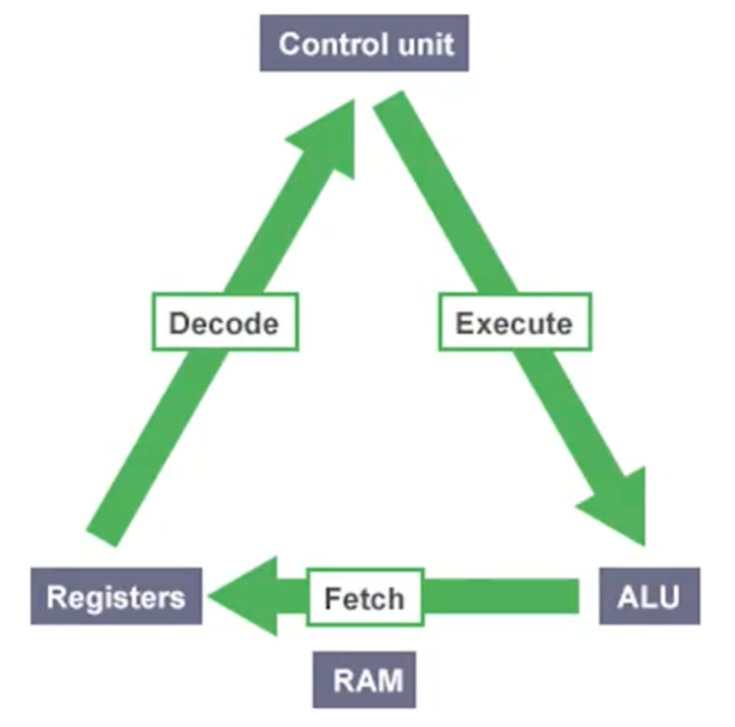

### 3.4 Higher Level Programming Languages

- High-level programming languages make it easier to write programs

  - Opposite of assembly language
  - C is a higher programming language that describe actions in a more abstract form
  - The instructions (statements) of a program look more like problem solving steps
  - Do not have to worry about the precise steps a particular CPU would have to take to accomplish a particular task
    - `total = x + ` `mv ax, 5, mv cx4`, etc....

- Compilers

  - A program that translate the high-level language source code into the detailed set of machine language instructions the computer requires
  - The program does the high-level thinking and teh compiler generates the tedious instrutions to the CPU

- Compilers will also check that your program has valid syntax for the programming language that you are compiling

  - Finds errors that it reports them to you and doesn't produce an executable until you fix them

- High-level languages are easier to learn and much easier to program in than are machine languages

### 3.5 Writing a Program

- The act of writing a C program can be broken down into multiple steps

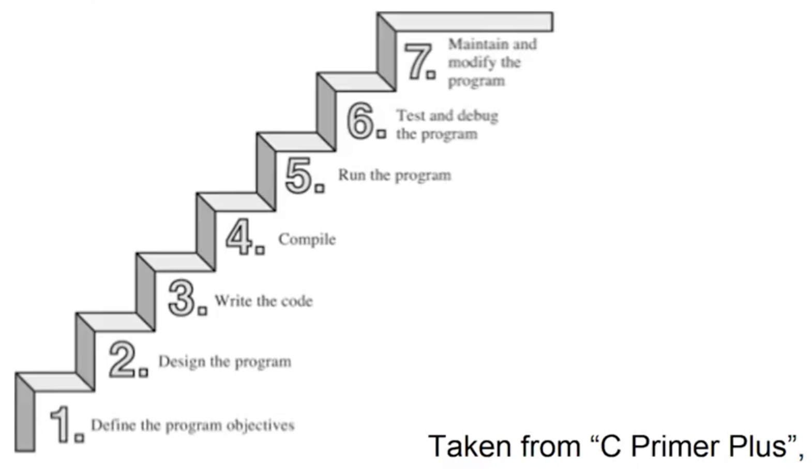

1. Define the program objectives
2. Design the program
3. Write the code
4. Compile
5. Run the program
6. Test and debug the program
7. Maintain and modify the program

**Step in Writing a Program**

1. <ins>Define the program objectives</ins>

   - Understand the requirements of the program
   - Get a clear idea of what you want the program to accomplish

2. <ins>Deisgn</ins>

   - Decide how the program will meet the above requirements
   - What should the user interface be like?
   - How should the program be organized?

3. <ins>Write the code</ins>

   - Start implementation, translate the design in the syntax of C
   - You need to use a text editor to create what is called a _source code_ file

4. <ins>Compile</ins>

   - Translate the source code into machine code (executable code)
   - Consists of detailed instructions to the CPU expressed in numeric code

5. <ins>Run the Program</ins>

   - The executable file is a program you can run

6. <ins>Test and debug</ins>

   - Just becuase a program is running, does not mean it works as intended
   - Need to test, to see that your program does what it is supposed to do (may find bugs)
     - Debugging is the process of finding and fixing program errors
     - Making mistakes is a natural part pf learning

7. <ins>Maintain and modify</ins>
   - Programs are released and used by many people
   - Have to continue to fix new bugs or add new features

- For the above steps, you may have to jump around steps and repeat steps
  - E.g. when you are writing code, you might find that your plan was impractical
- Many new programmers ignore steps 1 and 2 and go directly to writing code
  - A big mistake for large programs, may be ok for very simple programs
  - The larger and more complex program is, the more planning it requires
  - Should develop the habit of planning before coding

## 4 Overview

### 4.1 Overview

- C is a general-purpose, imperative computer programming language that supports structured programming

  - Uses statements that change a program's state, focuses on how

- Currently, it is one of the most widely used programming languages of all time

- C is a modern language

  - Has most basic control structures and features of modern languages
  - Designed for top-down planning
  - Organized around the use of functions (modular design) structured programming
  - A very reliable and readable program

- C is used on everything from minicomputers, Unix/Linux systems to PC's and mainframes
- C is the preferred lanaguage for producing word processing programs, spreadsheets and compilers

- C has become popular for programming embedded systems

  - Used to program microprocessors found in automobiles, cameras, DVD players, etc

- C has and continues to play a strong role in the development of Linux

- C programs are easy to modify and easy to adapt to new models or lanaguages

- In the 1990s, many software houses began turning to the C++ language for large programming projects

- C is a subset of C++ with object-oriented programming tools added

  - Any C program is a valid C++ program
  - By learning C, you also learn much of C++

- C remains a core skill needed by corporations and ranks in the top 10 of desired skills

- C provides constructs that map efficiently to typical machine instructions and thus is used by programs that were previously implement in assembly language

  - Provides low-level access to memory (has many low-level capabilities)
  - Requires minimal run-time support

- Was invented in 1972 by Dennis Ritchie of Bell Laboratories

  - Ritchie was working on the design of the UNIX operating system

- Was created by as a tool for working programers

  - Main goal is to be a useful language
  - Easy readability and writability

### 4.2 History

- C initially became widely known as the development language of the UNIX operating system

  - Virtually all new major operating systems are written in C and/or C++

- C evolved from a previous programming language named B

  - Uses many of the important concepts of B while adding data typing and other powerful features
  - B was a "typeless" language - every data item occupied one "word" in memory, and the burden of typing variables fell on the shoulders of the programmer

- C is available for mosst computers

- C is also hardware independent

- By the late 1970s, C had evolved into what is now reffered to as "traditional C"

- The rapid expansion of C working on many different hardware platforms led to many variations that were similar but often incompatible

  - A standard version of C was created (C89/C90, C99, C11)

- A program written only in Standard C and without any hardware-dependent assumptions will run correctly on any platform with a standard C compiler

  - Non-standard C programs may run only on a certain platform with a particular compiler

- C89 is supported by current C compilers

  - Most C code being written today is based on it

- C99 is revised standard C for the C programming language that refines and expands the capabilities of C

  - Has not been widely adopted and not all popular C compilers support it

- The current standard is commonly referred to as C11

  - Some elements of the language as defined by C11 are optiontal
  - Also possible that a C11 compiler may not implement all of the languages features mandated by the C11 standard

- C is one of the most important popular programming languages

- It has grown because people try it and like it

- In the past decade or two, many have moved from C to languages such as C++, Objective C, and Java
  - C is still an important language in its own right, as well as a migration path to these others

## 5 Language Features

### 5.1 Overview

- C produces compact and efficient programs

- C is one of the most important languages and will continue to be so

- The main features of C are the following
  - Efficient
  - Portable
  - Powerful and Flexible
  - Programmer Oriented

### 5.2 Efficiency and Portability

- C is an efficient language

  - Takes advantage of the capabilities of current computers
  - C programs are compact and fast (similar to assembly language programs)
  - Programmers can fine-tune their programs for maximum speed or most efficient use of memory

- C is a portable language

  - C programs written on one system can be run on other systems with little or no modifications
  - A leader in portability
  - Compilers are available for many computer architectures

- Linux/Unix systems typically come with a C compiler as part of the package

  - Computers are available for personal computers

- A good chance that you can get a C compiler for whatever device you are using

### 5.3 Power ad Flexibility

- The Unix/Linux kernel is written in C

- Many compilers and interpreters for other languages (FORTRAN, Perl, Python, Pascal, LISP, Logo and BASIC)

- C programs have been used for solving physics and engineering problems and even for animating special effect for movies

- C is flexible

  - Used for developing just about everything you can imagine by way of a computer program
  - Accounting applications to word processing and from games to operating sytems
  - It is the basis for more advanced languages, such as C++

- It is also used for developing mobile phone apps in the form of Objective-C

- C is easy to learn because of its compactness
  - It is an ideal first language to learn if you want to be a programer
  - You will acquire sufficent knowledge for practical application development quickly and easily

### 5.4 Programmer Oriented

- C fulfills the needs of programmers

  - Gives you access to hardware
  - Enables you to manipulate individual bits in memory

- C contians a large selection of operators which allws you to express yourself succinctly

- C is less strict than most languages in limiting what you can do

  - Can be both an advantage and a danger
  - Advantage is that many tasks (such as converting forms of data) are easier in C
  - Danger is that you can make mistakes (pointers) that are impossible in some languages
  - C gives you more freedom, but it also puts more responsibility on you

- C implementations have a large libary of useful C functions
  - Deal with common needs of most programmers

### 5.5 Other Features

- Provides low level features that are generally provided by the lower level languages

- Programs can be manipulated using bits

  - Ability to manage memory representation on bit level
  - Provides wide variety of bit manipulation operators

- Pointers play a big role in C
  - Direct access to memory
  - Supports efficient use of pointers

### 5.6 Disadvantages

- Flexibility and freedom also requires added responsibility

  - Use of pointers is problematic and abused
  - You can make programming errors that are difficult to trace

- Sometimes because of its wealth of operators and its conciseness, it makes the language difficult to read and follow
  - There is an opportunity to write obscure code

### 5.7 Summary


## 6 Creating a C Program

### 6.1 Overview

- There are four fundamental tasks in the creation of any C program

  - Editing
  - Compiling
  - Linking
  - Executing

- These tasks will become second nature to you because you will be doing it so often

- The processes of editing, compiling, linking, and executing are essentially the same for developing programs in any environment and with any compiled language

- Editing is the process of creating and modifying your C source code
  - Source code is inside a file and contains the program instructions your write
  - Choose a wise name for your base file name (all source files end in the .c extension)

### 6.2 Compiling

- A compiler converts your source code into machine language and detects and reports errors in your code

  - The input to the compiler is the file your produce during your editing (source file)

- Compilation is a two-statge process

  - The first stage is called the preprocessing phase, during which your code may be modified or added to
  - The second stage is the actual compilation that generates the object code

- The compiler examines eash program statement and checks it to ensure that it conforms to the syntax and semantics of the language

  - Can also recoginze structural errors (dead code)
  - Does not find logic errors
  - Typical errors reported might be due to an expression that has unbalanced parentheses (syntactic error), or due to the use of a variable that is not "defined" (semantic error)

- After all errors are fixed, the compiler will the take each statement of the program and translate it into assembly language

- The compiler will then translate the assembly language statements into acutal machine instructions

  - The output from the compiler is known as object code and it is stored in files called object files (same name as source file with a .obj or .o extension)

- The standard command to compile the C programs will be `cc` (or the GNU compiler which is `gcc`)
  - `cc -c myprog.c` or `gcc -c myprog.c`
  - If you omit the `-c` flag, your program will automatically be linked as well

### 6.3 Linking

- After the program has been translated into object code, it is ready to be linked

  - The purpose of the linking phase is to get the program into a final form for execution on the computer
  - Linking usually occurs automatically when compiling depending on what system you are on, but, can sometimes be a separate command

- The linker combines the object modules generated by the compiler with additional libraries needed by the program to create the whole executable

  - Also deetects and reports errors
    - If part of the program is missing or a nonexistent library component is referenced

- Program libraries support and extend the C language by providing routines to carry out operations, that are not part of the language

  - Input and output libraies, mathematical libraies, string manipulation libraries

- A failure during the linking phase means that once again you have to go back and edit your source code

- Success will produce an executable file

  - Windows - .exe extension
  - UNIX/Linux - no such extension (a.out by default)
  - Many IDEs have a build option, which will compile and link your program in a single operation to produce the executable

- A program of any signficant size will consist of several source code files

  - Each source code file needs the compiler to generate the object file that need to be linked

- The program is much easier to manage by breaking it up into a number of smaller source files
  - It is cohesive and makes the development and maintenance of the program a lot easier
  - The set of source files that make up the program will usually be integrated under a project name, which is used to refer to the whole program

### 6.4 Executing

- In most IDEs, you'll find an appropriate menu command that allows you to run or execute your compiled program

  - Otherwise double click the exe file or type a.out on the console in linux manually

- THe execution stage is where you run your program

  - Each of the statements of the program is sequentially executed in turn
  - If the program requests any data from the user the program temporarily suspend its execution so that the input can be entered
  - Results that are displayed by the program (output) appear in a window called the console

- This stage can also generate a wide variety of error conditions

  - Producing the wrong output
  - Just sitting there and doing nothing
  - Crashing your computer

- In the program does not perform the intended functionality then it will be necessary to go back and renalayze the program's logic
  - Known as the debugging phase, correct all the known problems or bugs from the program
  - Will need to make changes to the original source program
  - The entire process of compiling, linking, and executing the program must be repeated until the desired results are obtained

### 6.5 C Compilation Stages


## 7 Installing Code::Blocks

## 8 Exploring the Code::Blocks Environment

## 9 Creating a New Project in Code::Blocks

## 10 Running the First Code in Code::Blocks

Using vscode should be better!

## 11 Challenge : Writing a C Program

### 11.1 Requirements

- Write a C program that displays your first name as output
  - Create a project in code::blocks
  - Delete the "main.c" file that was auto-generated when creating the Project
  - Create a new source file in the above project (name the file test.c)
  - Copy the source code as bellow

```c
#include <stdio.h>

int main()
{
    printf("Hi, my name is .....");
    return 0;
}
```

### 11.2 Next Steps

- Modify the source code to display your name

- Compile and link the source code

- Run the program!!!

- Analyze the output to confirm it is correct and displays your name!!!

## 12 Demonsttration : Writing a C Program

## 13 Structure of a C Program

```c
#include <stdio.h>

// Speicial function as the entry function of the whole C program
int main()
{
    printf("Hi, my name is Jun");

    // Exit from the C program
    return 0;
}
```

## 14 Comments

### 14.1 Comments

- Comments are used in a program to document a program and to enhance its readability

- There to remind you, or someone else reading your code, what the program does or what a particular line of code is doing

- Comments are ignored by the compiler

- Comments are very useful
  - A programmer may return to a program that he coded six months ago and may not remember the purpose of a particular funciton or line of code
  - A simple comment can save a significant amount of time otherwise wasted on having to re-understand the code

### 14.2 Syntax

- There are two ways to add comments into a C program

```c
// single line comments

/*
multi-line comments
multi-line comments
multi-line comments
*/
```

### 14.3 Style & Example

```c
/* This program adds two integer values
and displays the results*/

#include <stdio.h>

int main(void)
{
    // Declare variables
    int value1, value2, sum;

    // Assign values and calculate their sum
    value1 = 50;
    value2 = 25;
    sum = value1 + value2;

    // Display the result
    printf("The sume of %i and %i is %i\n", value1, value2, sum);

    return 0;
}
```

### 14.4 Use of Coments

- It is possible to insert so many comments into a program that the readability of the program is actually degraded of improved!

- You need to intelligently use comments

- It is a good idea to get into the habit of inserting comment statements into the program as the program is being written or typed in

  - Easier to document the program while the particular program logic is still fresh in your mind
  - Reap the benifits of the comments during the debug phase, when program logic errors are being isolated and debugged

- A comment can helps you read through the program, but it can also help point the way to the source of the logic mistake

- Self documenting comments by using meaningful names

## 15 The Preprocessor

### 15.1 Overview

- Another unique feature of the C language that is not found in many other higher-level programming languages

- Allows for programers to be easier to develop, easier to read, easier to modify, and easier to port to different computer systems

- Part of the C compilation process that recognizes special statements

  - Analyzes these statements before analysis of the C program itself takes place
  - An instruction to the compiler to do something before compiling the source code
  - Could be anywhere in the code

- Preprocessor statements are identified by the presence of a pound sign - `#`, which must be the first non-space character on the line

- We will utilize the preprocessor to:
  - Create are own constants and macros with the `#define` statement
  - Build your own library files with the `#include` statement
  - Make more powerful programs with the conditional `#ifdef`, `#endif`, `#else`, and `#ifndef` statements

## 16 The `#include` Statement

### 16.1 Overview

- The `#include` statement is a preprocessor directive

- `#include <stdio.h>`

- It is not strictly part of the executable program, however, the program won't work without it

- The symbol # indicates this is a preprocessing directive

  - An instruction to your compiler to do something before compiling the source code
  - Many preprocessing directives
  - Are usually some at the beginning of the program source file, but they can be anywhere
  - Similar to be `import` statement in Java

- In the above example, the compiler is instructed to "include" in your program the contents of file with the name `stdio.h`

  - Called a header file because it is usually included at the head of a program source file
  - `.h` extension

  ### 16.2 Header Files

  - Header files define information about some of the functions that are provided by that file

    - `stdio.h` is the standard C library header and provides functionality for displaying output, among many other things
    - We need to include this file in a program when using `printf()` function from the standard library
    - `stdio.h` contains the information that the compiler needs to understand what `printf()` means, as well as other functions that deal with input and output
    - `stdio`, is short for _standard input/output_

  - Header files specify information that the compiler uses to integrate any predefined functions within a program

  - You will be creating your own header files for use with your programs

  ### 16.3 Syntax

  - Header file names are case sensitive

  - Two ways to `#include` files in a program

    - Using angle brackets (`#include <JunLuo.h>`)
      - Tells the preprocessor to look for the file in one or more standard system directories
    - Using double quotes (`#include "JunLuo.h`)
      - Tells the preprocesors to first look in the current directory

  - Every C compiler that conforms to the C11 standard will have a set of standard header files supplied with it

  - You should use `#ifndef` and `#define` to protect against multiple inclusions of a header file

```c
// some header

// typedef
typedef struct names_st names;

// function prototypes
void get_names(names *);
void show_names(const names *);
char * s_gets(char * st, int n);

/*
header files includes many different things
  #define directives
  structure declarations
  typedef statements
  function prototypes
*/

// executable code normally goes into a source code file, not a header file
```

## 17 Displayin Output

### 17.1 Overview

- In out first challeng, you should have noticed that there was a line of code that included the word `printf`

- `printf("Hello World!")`

- `printf()` is a standard library function
  - It outputs information to the command line (the standard output stream, which is the command line by default)
  - The information displayed in based on what appears between the parentheses that immediately follow the function name `printf`
  - Alos notice that this line does end with a semicolon `;`

### `printf` Function

- Probably the most common function used in C

- Provides an easy and conveninent means to display program results

- Not only can simply phrases be displayed, but the values of variables and results of computations can also be displayed
  - Used for debugging

## 18 Enums and Chars

### 18.1 Enums

- A data type that allows a programmer to define a vaiable specify the valid values could be stored into that variable

  - Can create a variable named "myColor" and it can only contain one of the primary color, red, yellow, or blue, and nother values

- First have to define the enum type and give a name
  - Initiated by the keyword `enum`
  - Then the name of enumaerated data type
  - Then list of identifiers (enclosed in a set of curly braces) that define the permissible value that can be assigned to the type

```c
enum primaryColor {red, yellow, blue};
```

- Variables declared to be of this data type can be assigned the values red, yellow, and blue inside the program, and no other values

- To declared a variable to be of type enum primaryColor
  - Use the keyword `enum`
  - Follow by the enumerated type name
  - Follow by the variable list. So the statement.

```c
enum primaryColor myColor, gregsColor;
```

- Defines two variables myColor and gregsColor to be of type primaryColor

  - The only permissible values that can be assigned to these variables are the names red, yellow, and blue
  - `myColor = red;`

- Another example

```c
enum month {January, February, March, April, May, June, July, August, Sepetember, October, Novemeber, December};
```

### 18.2 Enums as ints

- The compiler actually treats enumeration identifiers as integer constants
  - First name in list is 0

```c
enum month thisMonth;
...
...
...
```

- The value 1 is assigned to thisMonth (and not the name `February`) because it is the second identifiy listed inside in enumeration list

- If you want to have a specific integer value associated with an enumeration identifier, the integer can be assigned to the identifier when the data type is defined

```c
enum direction {up, down, left = 10, right}
```

- An enumerated data type direction is define with the values up, down, left and right
- `up = 0` because it appears first in the list
- 1 to down because it appears next
- 10 to left because it is explicitly assigned this value

- The compiler actually enumeration identifiers as integer constants
  first name in list is 0

### 18.3 Char

- Chars represent a single character such as teh letter 'a
  , the digit character `6`, or a semicolon (':')

- Character literas use single quotes such 'A' or 'Z'

- You can also declare char variable to be unsigned
  - Can be used to explicitly tell the compiler that a particular variable is a signed quality

### 18.4 Declaring a char

````c
char broiled;      /**declar a char variable*/
broiled = 'T';     /*OK*/
broiled = T;       /*Not OK! Thinks T is a variable*/
broiled = "T";     /*Not OK! Thinks "T" is a string */

- If you omit the quotes, the compiler thinks that T is the name of a variable
  -

- If you use double quotes, it thinks you are using a string

- You can also use the numerical code to assign values

```c
char grade = 65;    /*ok for ASCII, but poor style*/
````

### 18.4 Escape Characters

- C contains special characters that represent actions

  - Backspacing
  - Going to the next line
  - Making the terminal bell ring (or speaker beep)

- We can represent these actions by using sysmbol sequences

  - Called sequences

- Escape sequences must be enclosed in single quotes when assigned to a character variables

- Escape sequences must be enclosed in single quotes when assigned to a chracter value

```c
char x = '\n'
```

- Then print variable x = advance the printer or screen line

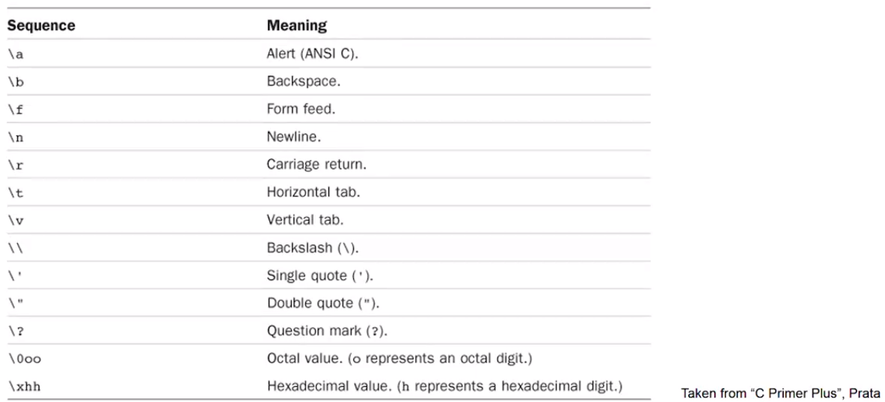

## 19 Format Specifiers

### 19.2 Overview

- Format specifiers are used when displaying variables as output
  - They specify the type of data of the variable to be displayed

```c
int sum = 89
printf("The sum %d\n", sum);
```

- The `printf()` function can display as output the values of variables

  - has wo items or arguments enclosed within the parentheses
  - arguments are separated by comma
  - first argument to the `printf()` routine is always the character string to be displayed
  - along with the display of the character string, you might also frequently want to have the value of a certain program varaibles displayed

- The percent character inside the first argument is a special character recognized by the `print()` function
  - the character that immediately follows the percent sign specifies what type of value is to be displayed

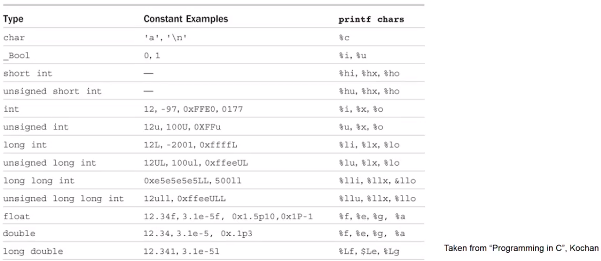

## 20 Command Line Arguments

### 20.1 Overview

- There are times when a program is developed that requires the user to enter a small amount of information at the terminal

- This information might consist of a number indicating the triangular number that you want to have calculated or a word that you want tot have looked up in a dictionary

- Two ways of handling this

  - Requesting the data from the user
  - Supply the information to the program at the time the program is executed (command-line arguments)

- We know that the `main()` function is a special function in C

  - Entry point of the program

- When `main()` is called by the runtime system, two arguments are actually passed to the function

  - the first argument (`argc` for argument count) is an integer value that specifies the number of arguments typed on the command line
  - the second argument (`argv` for argument vector) is an array of character pointers (strings)

- The first entry in this array is a pointer to the name of the program that is executing

```c
int main(int argc, char **argv[])
{
  ...
}
```

## 21 Challenge of Data Types and Variables: Print the Area of a Rectangle

- In this challenge, you are to create a C program that displays the perimeter and area of a rectangle

- The program should create 4 variables of type double

  - one variable to store the width of the rectangle
  - one variable to store the height of the rectangle
  - one variable to store the perimenter of the rectangle
  - one variable to store the area of the rectangle

- The program should perform the calculation for the perimeter of a rectangle

  - Use the `+` operator to addition and the `*` operator for multiplication
  - perimenter is calculated by adding the height and width and then multiplying by two
  - Area is calculated by multiplying the width \* height variables

- The program should display the height, width and perieter variables in the correct format in one first statement

- The program should display the height, width and perieter variables in the correct formatin one print statement

## 22 Challenge of Data Types and Variables: Create and use enum type

- Create a C program that defines an enum type and uses that type to display the values of some variables

- The program should create an enum type named Company

  - Valid values for this type are GOOGLE, FACEBOOK, XEROX, YAHOO, EBAY, MICROSOFT

- The program should create variables of the above enum type that are assigned values: XEROX, GOOGLE and EBAY

- The program should display as output, the value of the three variables with each variable separated by a newline
  - Correct output would be if XEROX, GOOGLE, nad EBAY variables are printed in that order:
    - 2
    - 0
    - 4

## 23 Operators: Overview

### 23.1 Overview

- Operators are functions that use a symbolic name

  - perform mathematical or logical functions

- Operators are predefined in C, just like they are in most other languages, and most operators tend to be combied with infix style

- A _logical operator_ (sometimes called a "Boolean operator") is an operator that returns a Boolean result that's based on the Boolean result of one or two other expressions

- An arithmetic operator is a mathematical function that takes two operators and performs a calculation on them

- Other operators include assignment, relational (<, >, !=), bitwise (<<, >>, ~)

### 23.2 Expressions and Statement

- Statement form the basic program steps of C, and most statements are constructed from expression

- An _expression_ consists of a combination of operators and operands
  - operands are what an operator operates on
  - operands can be constans, variables, or combination of the two
  - every expression has a value

```c
-6
4+21
a*(b+c/d)/20
q=5*2
x=++q%3
```

- Statement are the building blocks of a program (declaration)

  - A program is a series of statements with special syntax ending with a semicolon (simple statements)
  - A complete instruction to the computer

- Declearation statement: `int Jason;`
- Assignment statement: `Jason = 5;`
- Function call statement: `printf("Jason");`
- Structure statement: `while (Jason < 20) Jason = Jason + 1;`
- Return statement: `return 0;`

- C considers any expression to be a statement if you append a semicolon (expression statements)
  - So, `8;` and `3-4;` are perfectly valid in C

### 23.3 Compound Statements

- two or more statements grouped together by enclosing them in brances (block)

```c
int index = 0;
while (index < 10)
{
  printf("hello");
  index = index + 1;
}

```

## 24 Operators: Basic Operators

### 24.1 Overview

- Let's discuss, arithemtic, logical, assigment and relational operations

- An arithmetic operator is a mathemmatical function that takes operands and performs a calculation on them

- A logical operator (sometimes called a "Boolean opeator") is an operatpr that returns a Boolean result that's based on the Boolean result of one or two other operations

- Assignment operators set variable equal to values

  - Assign the value of the expression at its right to the variable at its left

- A relation operator will compare varibales against each other

### 24.2 Arithemetic Operators in C

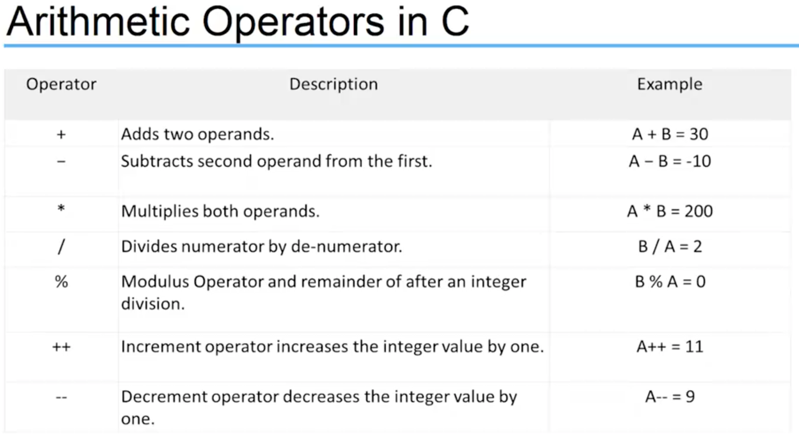

### 24.3 Logical Operators in C


### 24.4 Assignment Operators in C

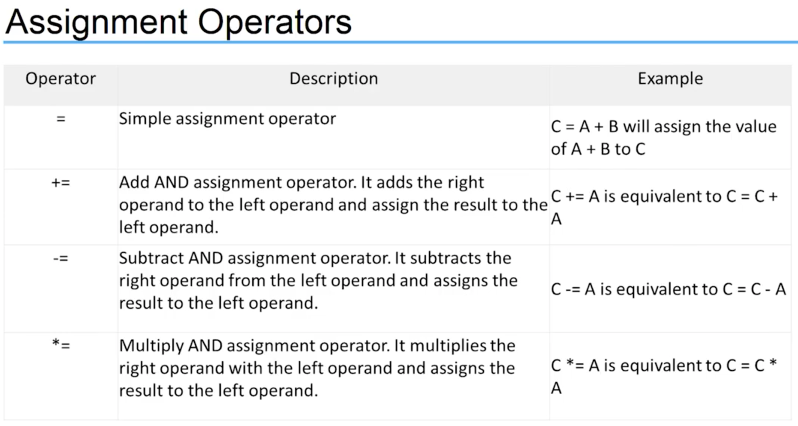
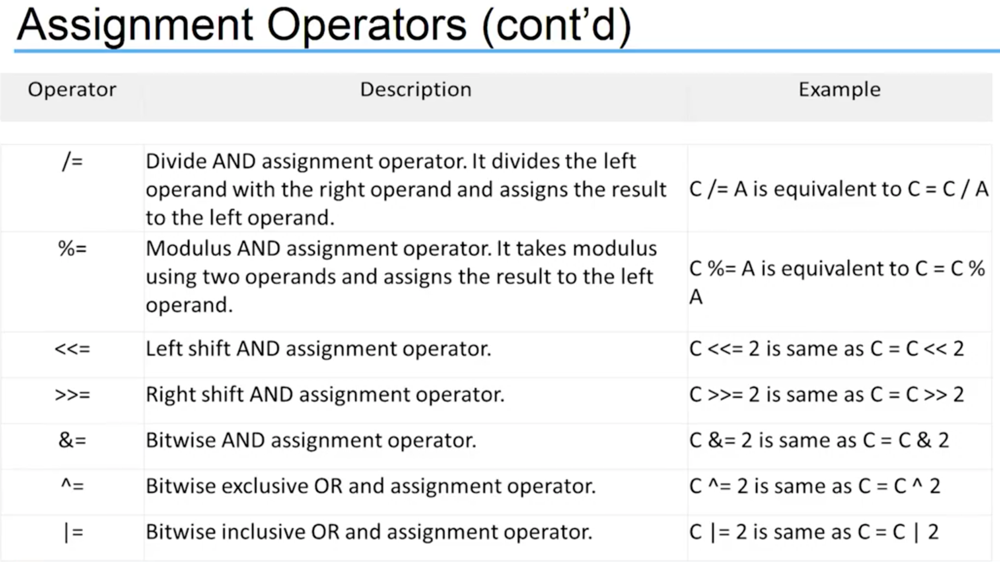

### 24.5 Relational Operators in C

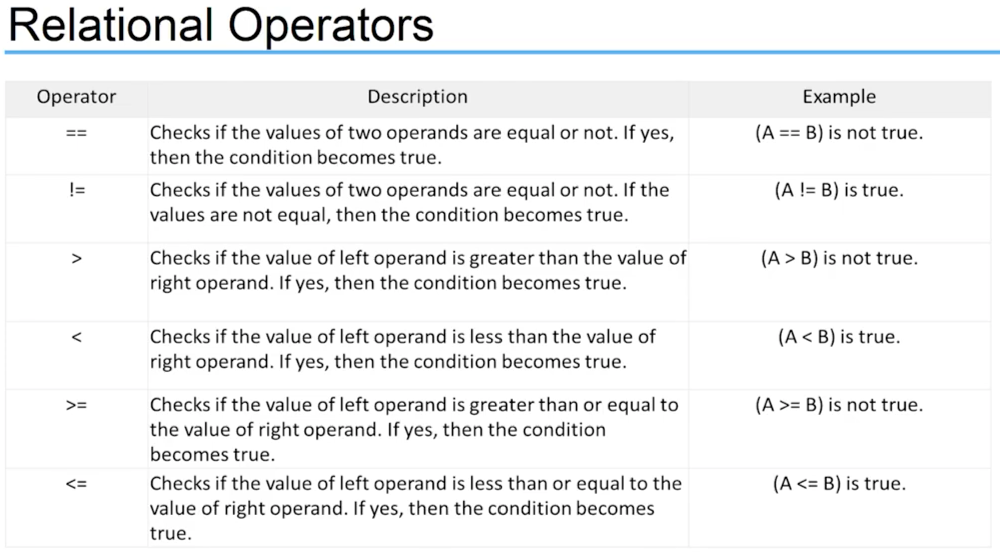

## 25 Bitwise Operators

### 25.1 Overview

- C offers bitwise logical operators and shift operators

  - look something like the logical operators you saw earlier but quite different
  - operate on the bits in integer values

- Not used in the common program
- One major use of the bitwise `AND`, `&`, and the bitwise `OR`, `|`, is in operators to test and bits in an integer variables

- You could use a single integer variable to store several characteristics of a persion.
  - store whether the persion is male or female with one bit
  - use three other bits to specify whether the person can speak French, German, or Italy
  - another bit to record whether the person's salary is $50,000 or more
  - in just four bits you have a substantial set of data recorded

### 25.2 Bitwise Operators (tutorials point)

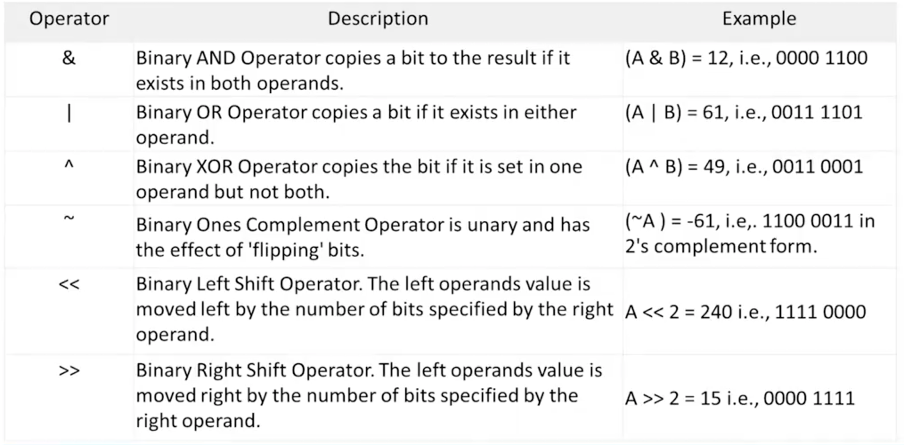

### 25.3 Truth Table

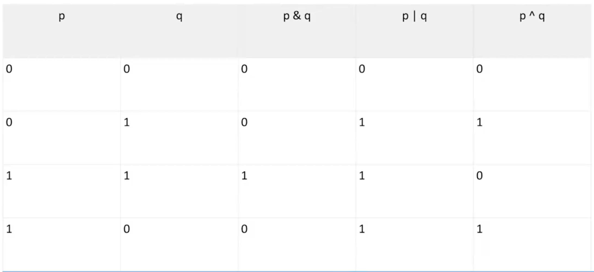

## 26 The Cast and Sizeof Operator

### 26.1 Tye Conversions

- Conversion of data between different types can happen automatically (implicit conversion) by the language or explicit by the program

  - to effectivly develop C programs, you must understand the rules used for the implicit conversion of floating-point and integer values in C

- Normally, you shouldn't mix types, but there are occasions when it is useful

  - remember, C is flexible, gives you the freedom, but, do not abuse it

- Whenever a floating-point value is assigned to an integer variable in C, the decimal portion of the number gets truncated

```c
int x = 0;
float f = 12.125;
x = f;
// value stored in x is the number 12, only the int portiion stored
```

- Assigning an integer variable does not cause any change in the value of the number

  - value is converted by the system and stored in the floating variable

- When performing integer arithmetic
  - if two operands in an expression are integers then any decimal portion resultingfrom a division operation is discarded, even if the result is floating variable
  - if one operand is an int and the other is float then operation is performed operation

### 26.2 The Cast Operator

- As mentioned, you should usually steer clear of autotype conversion, especially of demotions

  - better to do an explicit

- It is possible for you to demand the precise type conversion that you want

  - called a cast and consists of preceding the quantity with the name of desired type
  - parenthses and type name together constitude a cast operator, i.e. (type)
  - The actual type desired, such as long, is substituted for the actual type.

- The type cast operator has a higher precedence than all the arithmetic operations except minus and unary plus.

```c
(int)21.51 + (int)26.99
```

### 26.3 Sizeof Operator

- You can findout many bytes are occupied in memory by a give type using `sizeof` operator

  - `sizeof` is a special keyword in C

- `sizeof` is actually an operator, and not a function

  - evaluated at compile time and not at runtime, unless a variable-length array is used in its argument

- The argument to the sizeof operator can be a variable, an array name, the name of a basic data type, the name of a derived data type, or an expression

`sizeof(int)` will result the number of bytes of type int

- You can also apply the `sizeof` operator to an expression

  - result is the size the value

- Use the sizeof operators bitwise

### 26.4 Other Operators

- The asterisk `*` is an operator that represnets a pointer to a variable

```c
*a;
```

- `? : `is an operator used for comparisons
  - If condition is true ? then value x : other value y
  - name is the ternary operator

## 27 Operator Precedence

### 27.1 Overview

- Operator precedence determins the grouping of terms in an expression and decides how an expression is evaluated

  - Dictates order of evaluation when two operators share an operand
  - Certain operators have higher precedence than others
  - For example, the multiplication operator has a higher precedence than the addition operator

  ```c
  x = 7 + 3 * 2;
  ```

- Can result in 13 or 20 depending on the order of each operands evaluation

- The order of executing the various operations can make a difference, so C needs unambiguous rules for choosing what to do first
- In C, x is assigned 13, not 20 because operator `*` has higher precedece than `+`

  - FIrst gets multiplied with `3 * 2` and then adds into `7`

- Each operator is assigned a `precedence` level

  - Multiplication and division have a higher precedence than addtion and subtraction, so they are performed first

- Whatever is enclosed in parentheses is executed first, shuold just always use () to group expressions

### 27.2 Associativity

- What if two operators have the same precedence?

  - Then associativity rules are applied

- If they shared an operand, they are executed according to the other in which they occur in the statement

  - For most operators, the order is from left to right

```c
1 == 2 != 3
```

- operators `==` and `!=` have same precedence

  - associativity of both `==` and `!=` is left to right

- The expression above is equivalent to

```c
((1 == 2) != 3)
```

- `(1 == 2)` executes first resulting into `0(false)`, then `(0 != 3)` executing resulting into `1(true)`

### 27.3 Table (highest to lowest)

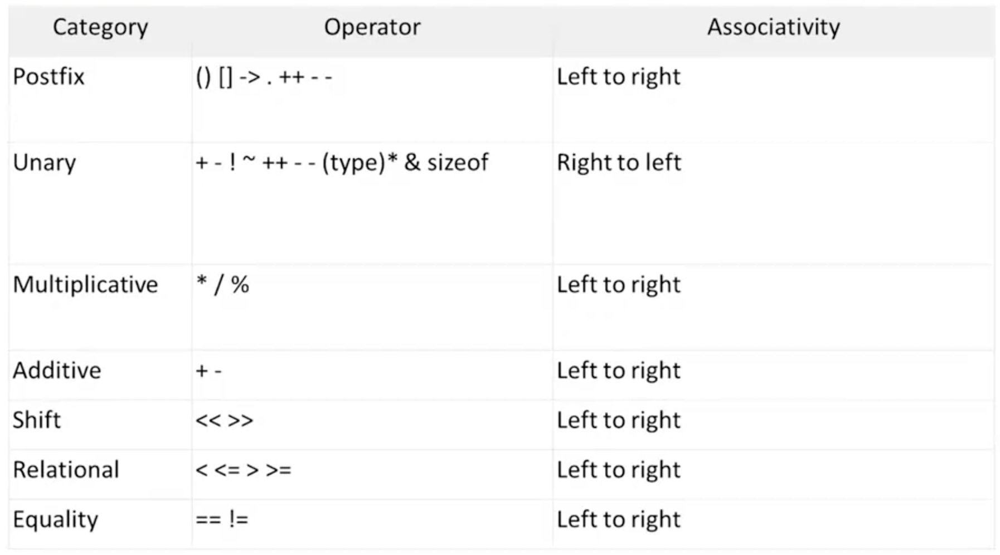

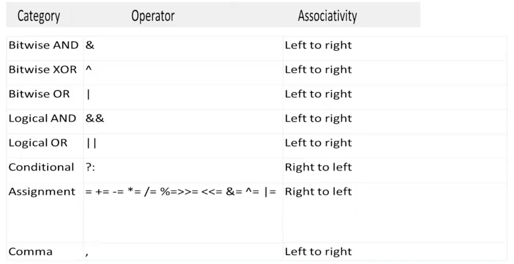

## 28 Challenge of Operators: Converting minutes to years and days

- In this challenge, you are to create a C program that converts the number of minutes to days and years

- The program should ask the user to enter the number of minutes via the termnical

- The program should display as output the minutes and then its equivalent in years and days

- The program should create variables to store (should all be of type double)

  - minutes (int)
  - minutes in year
  - Years
  - Days

- Need to perform a calculation and use arithmetic operators

### 29 Challenge of Operators: Print the byte size of the basic data types

- In this challenge, you are to create a C program that displays the byte size of basic data types supported in C

  - The output varies depending on the system you are running the program

- Display the byte size of the folloing types

  - int
  - char
  - long
  - long long
  - double
  - long double

- You can use the %zd format specifier to format each size

- Use the sizeof operator

- Test on more than one computer to see the differences

## 30 Control Flow Overview

### 30.1 Overview

- The statements inside your source file are generally executed from top to bottom, in the order that they appear.

- Control flow statements, however, break up the flow of execution by employing decision making, looping, and branching, enabling your program to conditionally execute particular blocks of code
  - Decision-making statements (if-then, if-then-else, switch, goto)
  - Looping statements (for, while, do-while)
  - Branching statements (break, continue, return)

### 30.2 Decision Making

- Structures require that the programmer specify one or more conditions to be evaluated or tested by the program
  - If a condition is true then a statement or statement are executed
  - If a condition is false then other statements are executed


### 30.3 If Statements

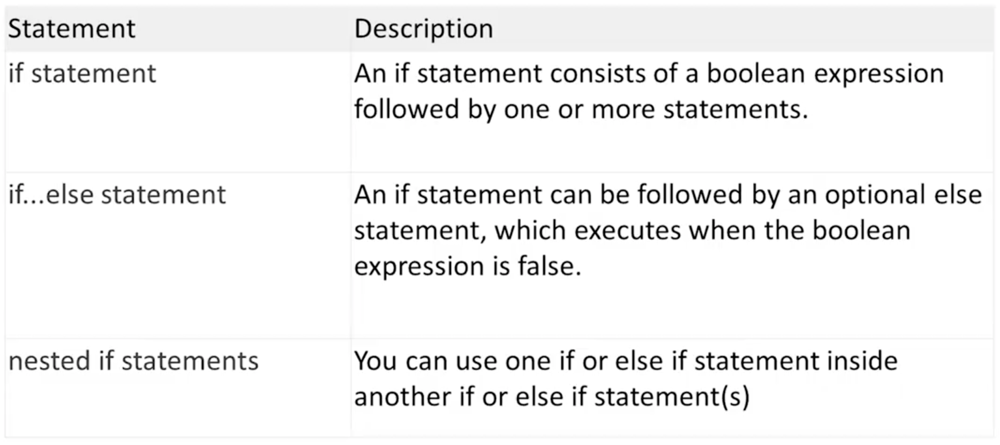

### 30.4 Repeating Code

- There may be a situation, when you need to execute a block of code serveral number of times

  - The statements are executed sequentially: The first statement in a function is executed first, followed by the second, and so on.

- A loop statement allows us to execute a statement or a group of statements multiple times

- Loop control statements change execution from its normal sequence

  - When execution leaves a scope, all automatic objects that were created in that scope are destroyed (`break` and `continue`)

- A loop becomes infinite loop if a condition never becomes false
  - The `for` loop is traditionally used for this purpose

### 30.5 Loop Dataflow


### 30.6 Loops


## 31 If Statements

### 31.1 Overview

- The C programming language provides a general decision-making capability in the form of a `if` statement

```c
if (expression)
  program statement
```

- Translating a statement such as "if it is not raining, then I will go swimming" into the C language is easy

```c
if (it is not raining)
  I will go swimming
```

- The `if` statement is used to stipulate execution of a program statements based upon specified conditions

  - I will go swimming if it is no raining

- The curly brackets are required for compound statements inside the `if` block

### 31.2 If Statement (example)

```c
int score = 95;
int big = 90;

// simple statement if, no brackets

if (score > big)
  printf("Jackpot!\n");

// compound statement if, brackets
if (score > big)
{
  socre++;
  printf("You win\n");
}
```

### 31.3 If with an else

- You can extend the `if` statement with a small addition that gives you a lot more flexibility

**If** the rain today is worse than the rain yesterday,
I will take my umbrella.
**Else**
I will take my jacket.
Then I will go to work.

- This is exactly the kind of decision making the `if-else` statement provides

```c
if (expression)
  Statement1;
else
  Statement2;
```

### 31.4 If with an else (example)

```c
// Program to determine if a number is even or odd

#include <stdio.h>

int main()
{
  int number_to_test, remainder;

  printf("Eneter your number to be tested: ");
  scanf("%i", &number_to_test);

  remainder = number_to_test % 2;

  if (remainder == 0)
    printf("The number is even.\n");

  else
    printf("The number is odd.\n");

  return 0;
}

```

### 31.5 `else if`

- You can handle additional complex decision making by adding an `if` statement to your else clause

```c
if (expression 1)
  program stateemnt 1
else
  if (expression 2)
    program stateemnt 2
  else
    program stateemnt 3
```

- The above extends the `if` statement from a two-valued logic decision to a three-valued logic decision
  - Formatted using teh `else if` construct

```c
if (expression 1)
  program stateemnt 1
else if (expression 2)
  program stateemnt 2
else
  program stateemnt 3
```

### 31.6 `else if` example

```c
// Program to implement the sign funciton
#include <stdio.h>

int main(void)
{
    int number, sign;

    printf("Please type in a number: ");
    scanf("%i", &number);

    if (number < 0)
        sign = -1;
    else if (number == 0)
        sign = 0;
    else // Must be positive
        sign = 1;

    printf("Sign = %i\n", sign);

    return 0;
}
```

### 31.7 Nested `if-else` statement

- A nested `if-else` statements means you can use one if or else if statement inside another if or else if statement(s)

```c
if (boolean_expression 1)
{
  /* Executes when the boolean expression 1 is true */

  if (boolean_expression 2)
  {
     /* Executes when the boolean expression 2 is true */
  }

}
```

### 31.8 Nested `if-else` statement (example)

```c
if (gameIsOver == 0)
  if (playerToMove == YOU)
    printf("You Move\n");

  else
    printf("My Move\n");
else
  printf("The game is over\n");

```

### 31.9 The conditional operator (ternary statement)

- The conditional operator is unique operator

  - unlike all other operators in C
  - Most operators are either unary or binary operators
  - Is a ternary operator (takes three operands)

- The two symbols that are used to denote this operator are the question mark (?) and the colon (:)

- The first operand is placed before the `?`, the second between `?` and the `:`, and the third after the `:`

```c
condition ? expression1 : expression2
```

- The conditional operator evaluates to one of two expressions, depending on whether a logical expression evaluates true or false

- Notice how the operator is arranged in relation to the operands
  - the `?` character follows the logical expression, condition
  - on the right of `?` are two operands, expression1 and expression2, that represnet choices.
  - the value that results from the operation will be the value of expression1 if condition evaluates to true, or the value of expression2 if condition evaluates to false

### 31.10 Conditional operator (example)

```c
x = y > 7 25 : 50;
```

- results in x being set to 25 if y is greater than 7, or to 50 otherwise

- An expression for the maximum or minimum of two varaibales can be written very simply using the conditional operator

## 32 Switch Statement

### 32.1 Overview

- The conditional operator and the if else statements make it easy to write programs that choose between two alternatives

- However, manty times a program needs to chooseone of serveral alternatives

  - You can do this by using if else if...else
  - tedious, prone to errors

- When the value of a variable is successively compared against different values use the switch statement
  - More convenient and efficient

### 32.2 `switch` syntax

```c
switch (expression)
{
  case value_1:
    program statement
    ...
    break;

  case value_n;
    program statement
    program statement
    ...
    break;

  default:
    program statement
    ...
    break;
}

```

### 32.3 `switch` statement details

- The expression enclosed within parentheses is successively compared against the values: value_1, value_2, ..., value_n

  - cases must be simple constants or constant expressions

- If a case is found whose value is equal to expression then the statements that follow the case are executed

  - When more than one statement is included, they do not have to enclosed within braces

- The `break` statement signals the end of a particular case causes execution of the switch statement to be terminated

  - include the `break` statement at the end of every case
  - forgetting to do so for a particular case causes program execution to continue into the next case

- The special optional case called default is executed if the value of expression does not match any of the case values
  - Same as "fall through" else

### 32.4 Switch case example

```c
enum Weekday {Monday, Tuesday, Wednesday, Thursday, Friday, Saturday, Sunday};
enum Weekday today = Monday;

switch(today)
{
  case Sunday:
    printf("Today is Sunday.\n");
  break;
  case Monday:
    printf("Today is Monday.\n");
  break;
  case Tuesday:
    printf("Today is Tuesday.\n");
  break;
  default
    printf("Whatever!.\n");
  break;
}
```

## 33 Challenge of Control Flow: Determine amount of Pay

- In this challenge, you are to create a C program that calculates your weekly pay.

- The program should ask the use to enter the number of hours worked in a week via the keyboard

- The program should display as output the gross pay, the taxes, and the net pay

  - Basic pay rate = $12.00/hr
  - Overtime (in excess of 40 hours) = time and a half
  - Tax rate:
    - 15% of the first $300
    - 20% of the next $150
    - 25% of the rest

- You will need to utilize `if/else` statements

## 34 For Loop

### 34.1 Overview

- Repeating Code:

  - The C programming language has a few constructs specifically designed to handle these situations when you need to use some code repeatedly
  - You can repeat a block of statements until some condition is met or a specific number of times
  - Repeating code without a condition is a forever/infinite loop

- The number of times that a loop is repeated can be controlled simply by a count

  - Repeating the statement block a given number of time (counter controlled loop)

- The number of times that a loop is repeated can depend on when a condition is met
  - The user entering "quit"

### 34.2 `for loop`

- You typically use the `for loop` to execute a block of statements a given number of times

- If you want to display the number from 1 to 10
  - Instead of writing ten statements that can printf(), you would use a for loop

```c
for (int count = 1; count <= 10; ++count)
{
  printf(" %d", count);
}
```

- The `for loop` operation is controlled by what appears between the parentheses that follow the keyword `for`

  - The three control expression that are separated by semicolons control the operation of the loop

- The action that you want to repeat each time the loop repeats is the block containing the statement that calls `printf()` (body of the loop)
  - For single statements, you can omit the braces

### 34.3 `for` syntax

- The general pattern for the `for` loop is:

```c
for (starting_condition; continuation_condition; action_per_iteration)
  loop_statement;
```

- The statement to be repeated is represented by `loop_statement`

  - Cound equally well be a block of several statements enclosed between braces

- The `start_condition` usually (but not always) sets an initial value to a loop control variable

  - The loop control variable is typically a counter of some kind that tracks how often the loop has been repeated
  - Can also declare and initialze several variables of the same type here with the declarations separated by commas
  - Variables will be local to the loop and will not exist once the loop ends

- The `continuation_condition` is a logical expression evaluating to true or false

  - Determines whether the loop should conti to be executed
  - As long as this condition has the value true, the loop will continues
  - Typically checks the value of the loop control variable
  - You can pu any logical or arithmetic expression here as long as you know what you are doing

- The `continuation_condition` is tested at the beginning of the loop rather than at the end

  - Means that the `loop_statement` will not executed at all if the `continuation_condition` starts out as false

- The `action_per_iteration` is executed at the end of each loop iteration
  - Usually an increment or decrement of one or more loop control variables
  - Can modify several variables here, just need to use commas to separate


### 34.4 Another Example

```c
for (int i = 1, j = 2; i <= 5; ++i, j = j+2)
  printf(" %5d", i*j);
```

- The output produced by this fragment will be values 2, 8, 18, 32, and 50 on a single line

### 34.5 `for` example (flexibility)

```c
unsigned long long sum = 0LL;   // Stores the sume of integers
unsigned int count = 0;         // The number of integers to be summed

// Read the number of integers to be sum
printf("\nEnter the number of integers you want to sum: ");
scanf(" %u", &count);

// Sum integers from 1 to count
for (unsigned int i = 1; i <= count; ++i)
  sum += i;

// OR
for (unsigned int i = 1; i <= count; sum += i++)

printf("\nTotal of the first %u number is %llu\n", count, sum);
```

### 34.6 Infinite loop

- You have no obligation to put any parameters in the `for` loop statement

```c
for (;;)
{
  /* statements */
}
```

- The condition for continuing the loop is absent, the loop will continue indefinitely
  - Sometimes useful for monitoring data or listening for connections

## 35 While and Do-While Loops

### 35.1 While Loop

- The mechanisom for repeating a set of statements allows execution to continue for as long as a specified logical expression evaluates to true

- The general syntax for the `while` loop is as follows (one statement in body):

```c
while(expression)
  statement1;
```

or

```c
while(expression)
{
  statement1;
  statement2;
}
```

- The condition for continuation of the while loop is tested at the start (top of the loop)

  - pre-test loop

- If expression starts out false, none of the loop statements will be executed

- If the loop condition starts out as true, the loop body must contain a mechanism for changing this if the loop is to end

### 35.2 Counter Controlled While loop Example

```c
int count = 1;

while (count <= 5)
{
  printf("%i\n", count);
  ++count;
}
```

### 35.3 Logic Controlled While loop Example

```c
int num = 0;
scanf("%d", &num);

while (num != -1)
{
  /* loop actions */
  scanf("%d", &num);
}
```

### 35.4 `do-while` loop

- In the `while` loop, the body is executed while the condition is true

- The `do-while` loop is a loop where the body is executed for the first time unconditionally
- Condition is at the bottom (post-test loop)

- After initial execution, the body is only executed while the condition is true

```c
do
  statement
while (expression);
```

```c
do
{
  prompt_for_password();
  read_user_input();
}
while (input_not_equal_to_password());
```

### 35.5 `do-while` loop example

```c
do
  scanf("%d", &number);
while (number != 20);
```

**_Or counter controlled_**

```c
int number = 4;
do
{
  printf("\nNumber = %d", number);
  number++;
}
while (number < 4);
```

### 35.6 Which loop to use???

- First, decide whether you need an pre or post test loop

  - Usually will be a pre test loop (for or while), a bit better option in most cases
  - It is better to look before you leap (or loop than) after
  - Easier to read if the loop test is found at the beginning of the loop
  - In manay uses, it is important that the loop to skipped entirelly if the test is not initially met

- So, should you use a `for` or a `while`
  - A matter of taste, because what you can do with one, you can do with the other
  - To make a `for` loop like a `while`, you can omit the first and third expressions

```c
for ( ; test; )
```

**_is the same as_**

```c
while (test)
```

### 35.7 `do-while` loop example

- To make a `while` like a `for`, preface it with an initialization and include update statements

```c
initialze;
while(test)
{
  body;
  update;
}
```

**_is the same as_**

```c
for (initialize; test; update)
  body;
```

- A `for` loop is appropriate when the loop involves initializing and updating a variable

- A `while` loop is better when the conditions are otherwise

- Recommendation:
  - `while` loop - logic controlled loops
  - `for` loop - counter controlled loops

```c
while (scanf("%i", &num) == 1)

for (count = 1; count <= 100; count++)
```

## 36 Nested Loops, Break and Continue

### 36.1 Nested Loops

- Sometimes you may want to place one loop inside another

- You might want to count the number of occupants in each house on a street

  - Step from house to house, and for each hous you count the number of occupants

- Going through all the houses could be an oouter loop, and for each iteration of the outer loop you would have an inner loop that counts the occupants

### 36.2 Nested Loops Example (`for` inside a `for`)

```c
for (int i = 0; i <= count; i++)
{
  sum = 0;      // Initialize sum for the inner loop

  // Calculate sum of integers from 1 to i
  for (int j = 1; j <= i; ++j)
    sum += j;

    printf("\n%d\t%d", i, sum);     // Output sum of 1 to i
}
```

### 36.3 Nested Loops Another Example (`while` inside a `for`)

```c
for (int i = 0; i <= count; i++)
{
  sum = 1;      // Initialize sum for the inner loop
  j = 1;        // Initialize integer to be added
  printf("\n1");

  // Calculate sum of integers from 1 to i
  while (j < i)
  {
    sum += ++j;
    printf(" + %d", j);       // Output +j - on the some line
  }

  printf(" = %d", sum);       // Output = sum
}
```

### 36.4 Contiune Statement

- Sometimes a situation arises where you do not want to end a loop, but you want to skip the current iteration

- The `continue` statement in the body of a loop does this

  - All you need to do is use the keyword `continue` in the body of the loop

- An advantage of using `continue` is that it can sometimes eliminate nesting or additional blocks of code

  - Can enhance readbility when the statements are long or are deeply nested already

- Don't use `continue` if it complicates rather than simplifies the code

### 36.5 Contiune Example

```c
enum Day { Monday, Tuesday, Wednesday, Thursday, Friday, Saturday, Sunday };

for (enum Day day = Monday; day <= Sunday; ++day)
{
  if (day == Wednesday)
    continue;
  printf("It's not Wednesday!\n");
  /* Do something usefule with day */
}
```

### 36.6 Break Statement

- Normally, after the body of a loop has been entered, a program executes all the statements in the body before doing the next loop test

  - We learned how continue works
  - Another statement named `break` alters this behavior

- The `break` statement causes the program to immediately exit from the loop it is executing

  - Statements in the loop are skipped, and execution of the loop is terminated
  - If the break statement is inside nested loops, it affects only the innermost loop containing it
  - Use the keyword `break;`

- `break` is often used to leave a loop when there are two separate reasons to leave

- `break` is also used in `switch` statement

### 36.7 Break Example

```c
while (p > 0)
{
  printf("%d\n", p);
  scanf("%d", &q);
  while (q > 0)
  {
    prinft("%d\n", p*q);
    if (q > 100)
      break;        // break from inner loop
    scanf("%d\n", &q);
  }

  if (q > 100)
    break;          // break from outer loop
  scanf("%d\n", &p);
}
```

## 37 Challenge of Control Flow: Guess the Number

### 37.1 Requirements

- Generate a random number from 0 to 20

- Ask the use to guess it

  - User should only be able to enter numbers from 0-20

- The program will indicate to the user if each guess is too high or too low

- The player wins the game if they can guess the number within five tries

### 37.2 Generating a Random Number

- To generate a random number from 0-20
  - include the correct system libraries

```c
#include <stdlib.h>
#include <time.h>
```

- Create a time variable

```c
time_t t;
```

- Initialize the random number generator

```c
srand((unsigned) time(&t));
```

- Get the random number (0-20) and store in an int variable

```c
int randomNumber = rand() % 21;
```

## 38 Arrays: Creating and using Arrays

### 38.1 Arrays

- It is very common to in a program to store many data values of a specified type

  - In a sports program, you might want to store the scores for all grames or the scores for each player
  - You could write a program that does this using a different variable for each score
  - If there are a lot of grames to store then this is very tedious
  - Using an array wil solve this problem

- Arrays allows you to group values together under a single name

  - You do not need separate variables for each item of data

- An arrays is a fixed number of data items that are all of the same type

### 38.2 Declaring an Array

- The data items in an array are referred to as elements

- The elements in an array have to be the same type (`int`, `long`, `double`, etc)

  - You cannot "mix" data types, no such thing as a single array of ints and doubles

- Declaring to use an array in a program is simliar to a normal variable that contains a single value
  - Different is that you need a number between square brackeets `[]` following the name

```c
long numbers[10];
```

- The number between square brackets defines how many elements the array contains
  - Called the size of the array or the array dimension

### 38.3 Accessing an array's elements

- Each of the data items stored in an array is accessed by the same name

- You select a particular element by using an index (subscript) value between square brackets following the array name

- index values are sequential integers that start from zero

  - index values for elements in an array of size 10 would be from 0-9
  - Arrays are zero based
    - `0` is the index value for the first array element
    - For an array of 10 elements, index value 9 refers to the last element

- It is a very common mistake to assume that arrays start from one

  - Referred to as the off-by-one error
  - You can use a simple integer to explicitly reference the element that you want to access
  - To access the fourth value in an array, you use the expression arrayName[3]

- You can also specify an index for an array element by expression in the square brackets following the array name

  - The expression must result in an integer value that corresponds to one of the possible index values

- It is very common to use a loop to access each element in an array

```c
for (i = 0; i < 10; i++)
  printf("Number is %d\n", numbers[i]);
```


### 38.4 Array out of bounds

- If you use an expression or a variable for an index value that is outside the range for the array, your program may crash or the array can contain garbage data

  - Referred to as an out of bounds error

- The compiler cannot check for out of bounds errors so your program will still compile

- Very important to ensure that your array inedxes are always within bounds

### 38.5 Assigning values to an Array

- A value can be stored in an element of an array simply by specifying the array element on the left side of a equal sign

```c
grades[100] = 95;
```

- The value 95 is stored in element number 100 of the grades array

- Can also use variables to assign values to an array

### 38.6 Example of using an array

```c
#include <stdio.h>

int main(int argc, char **argv)
{

    int grades[10];         // Array storing 10 values
    int count = 10;         // Number of values to be read
    long sum = 0;           // Sum of the numbers
    float average = 0.0f;   // Average of numbers

    printf("\nEnter the 10 grades:\n");     // Prompt for the input

    for (int i = 0; i < count; ++i)
    {
        printf("%2u>", (i + 1));
        scanf("%d", &grades[i]);            // Read a grade
        sum += grades[i];                   // Add it to sum
    }

    average = (float) sum / count;

    printf("Sum of grades: %lu\n", sum);
    printf("Average of grades: %.2f\n", average);

    return 0;
}
```

## 39 Array Initialization

### 39.1 Initializing an Array

- You will want to assign initial values for the elements of your array most of the time

  - Defining initial values for array elements makes it easier to detect when things go wrong

- Just as you can assign inital values to variables when they are declared, you can also assign inital values to an array's elements

- To initialize an array's values, simply provide the values in a list
  - Values in the list are separated by commas and the entire list is enclosed in a pair of braces

```c
int counters[5] = {0, 0, 0, 0, 0};
```

- Declares an array called counters to contain five integer values and initializes each of these elements to zero

```c
int integers[5] = {0, 1, 2, 3, 4};
```

- Declares an array named integers and sets the value of integers[0] to 0, integers[1] to 1, integers[2] to 2, and so on

- It is not necessary toccompletely initialize an entire array

- If fewer initial values are specified, only an equal number of elements are initialzed
  - Remaining values in the array are set to zero

```c
float sample_data[500] = {100.0, 300.0, 500.5};
```

- Initialized the first values of `sample_data` to 100.0, 300.0, and 500.5, and sets the remaining 497 elements to zero

### 39.2 Designeated Initializers

- C99 added a feature called designated initializers

  - Allows you to pick and choose which elements are initialized

- By enclosing an element number in a pair of brackets, specific array elements can be initialized in any order

```c
float sample_data[500] = { [2]=500.5, [1]=300.0, [0]=100.0}
```

### 39.3 Example of traditional initialization

```c
#include <stdio.h>

#define MONTHS 12

int main()
{

  int days[MONTHS] = {31, 28, 31, 30, 31, 30, 31, 31, 30, 31, 30, 31};
  int index;

  for (index = 0; index < MONTHS; index++)
    printf("Month %d has %2d days.\n", index+1, days[index]);

  return 0;
}
```

### 39.4 Example of designated initialization

```c
#include <stdio.h>

#define MONTHS 12

int main()
{

  // int days[MONTH] = {31, 28, 31, 30, 31, 30, 31, 31, 30, 31, 30, 31};
  int days[MONTHS] = {31, 28, [4] = 31,30,31, [1]=29};
  int index;

  for (index = 0; index < MONTHS; index++)
    printf("Month %d has %2d days.\n", index+1, days[index]);

  return 0;
}
```

### 39.4 Repeating an initial value

- C does not provide any shortcut mechnisoms for initializing array elements

- No way to specify a repeat count

- If it were desired to initially set all 500 values to sample_data to 1, all 500 would have to be explicitly assigned

- To solve this problem, you will want to initialize the array inisde the program using a loop

```c
#include <stdio.h>

int main(void)
{
  int array_values[10] = {0, 1, 4, 9, 16};
  int index;

  for (index = 5; index < 10; ++index)
    array_values[index] = index*index;

  for (index = 0, index<10; ++index)
    printf("array_values[%i] = %i", index, array_values[index]);

  return 0
}
```

## 40 Multidimensional Arrays

### 40.1 Overview

- The types of arrays that you have been exposed to so far are all linear arrays

  - A single dimension

- The C language allows arrays of any dimension to be defined

  - Two dimensional arrays are the most common

- You can visualize a two-dimensional array as a rectangular arrangement like rows and columns in a spreadsheet

- One of the most natural applications for a two-dimensional array arises in the case of a matrix

- Two-dimensional arrays are declared the same way that one-dimensional arrays are

```c
int matrix[4][5]
```

- Delcares the array `matrix` to be a two-dimensional array consisting of 4 rows and 5 columns, for a total of 20 elements
  - Note how each dimension is between its own pair of square brackets

### 40.2 Initializing a two dimensional array

- Two-dimensional arrays can be initialized in the same manner of a one-dimensional array

- When listing elements for initialization, the values are listed by row
  - The difference is that you put the initial values for each row between braces 0, {}, and then enclose all the rows between braces

```c
int numbers[3][4] = {
  {10, 20, 30, 40},
  {15, 25, 45, 45},
  {17, 27, 37, 47 },
};
```

- Commas are required after each braces that closes off a row, except in the case of the final row

- The use of the inner pairs of braces is actually optional, but, should be used for readability

### 40.3 Initializing a 2D array

- As with one-dimensional arrays, it is not required that the entire array be initialized

```c
int matrix[4][5] = {
  {1, 2, 3},
  {4, 5, 6},
  {7, 8, 9}
};
```

- Only initializes the first three elements of each row of the matrix to be indicated values
  - Remaining values are set to 0
  - In thi case, the inner pairs of braces are requied to force the correct initialization

### 40.4 Designated Initialer

- subscripts can allos in the initialization list, in a like manner to single-dimensional arrays

```c
int matrix[4][3] = { [0][0]=1, [1][1] =5}
```

- Intializes the three indicated elements of matrix to be specified values
  - Unspecified elements are set to zero by default
  - Each set of values that initialzes the elements in a row is between braces
  - The entire initializatio goes between another
  - The values for a row are separated
  - Each set of row values is separated from the next seet of a comma

### 40.5 Other dimensions

- Everything mentioned so far about two-dimensional arrays can be generated to three dimensional arrays and further

- You can declare a three-dimensional array in this way

```c
int box[10][20][30]
```

- You can visualize to one-dimensional array as a row of data
- You can visualize a one-dimensional array as a row data
- You can visualize a three-dimensional array as a stack of dat;

## 41 Variable Length Arrays

- C99 intriduced variable-length arrays primarily to allow C to become a btter language for numerical computing
  - VLAs make it easier to convert exsiting librairies of FORTRAN numerical calculation routines to C

```c
int n = 4;
int m = 8;
float a1[5];                    // yes
float a2[5*2 + 1];              // yes
float a3[sizeof(int) + 1];      // yes
float a4[-4];                   // no, size musth be > 0
float a5[0];                    // no, size musth be > 0
float a6[2.5];                  // no, size must be an integer
float a7[(int)2.5];             // yes
float a8[n];                    // not allowed before C99, VLA
float a9[m];                    // not allowed before C99, VLA
```

## 42 Challenge of Array: Generate Prime Numbers

### 42.1 Requirements

- Find the prime numbers from 3-100

- There will be no input to the program

- The output will be each prime number separated by a space on a single line

- You will need to create an array that will store each prime number as it is generated

- You can hard-code the first two prime number (2 and 3) in the primes array

- You should uilize loops to only find prime numbers up to 100 and a loop to print out the primes array

### 42.2 Hints

- The criteria that can be used to identify a prime number is that a number is considered prime if it is not evenly divisible by any other previous numbers

- Can use the following as an exit condition in the innermost loop

  - `p / primes[i] >= primes[i]`
  - a test to ensure that value of p does not exceed the square root of primes[i]

- Your program can be more efficient by skipping any checks for even numbers

## 43 Challenge of Arrays: Create a simple Weather Program

### 43.1 Challenge

- A two dimensional array in a weather program

- This program will find the total rainfall for each year, the average yearly rain fill, and the average rainfall for each month

- Input will be a 2D array with hard-coded values for rainfall amounts for the past 5 years
  - The array should have 5 rows and 12 columns
  - Rainfaill amounts can be floating point numbers

### 43.2 Example output

YEAR RAINFALL (inches)
2020 32.5
2011 37.9
2012 49.8
2013 44.0
2014 32.9

The yearly average is 39.4 inchees.

MONTHLY AERAGES:
Jan Feb Mar Apr May Jun Jul Aug Sep Oct Nov Dec
7.3 7.3 4.9 3.0 2.3 0.6 1.2 0.3 0.5 1.7 3.6 6.7

### 43.3 Hints

- Initialize your 2D array with hard-coded rainfall amounts

- Remember, to iterate through 2 2D array you will need a nested loop

- The key to this solution will be visualize a 2D array and understand how to iterate through how to iterate through one, via a nested loop

- As you are iterating , you can keep a running total(outer loop literate by niang), inner loop

- To get the average monthly rainfa, iterate though the 2D array by having the outer loop go through

## 44 Challenge of Arrays: Create a Simple Weather Program

### 44.1 Requirements

- Uses a two-dimensional array in a weather program

- This program will find the total rainfall for each year, the average yearly rainfall, and the average rainfall for each month

- The input will be a 2D array with hard-coded values for rainfall amounts for the past 5 years

  - The array should have 5 rows and 12 columns
  - Rainfall amounts can be floating point numbers

### 44.2 Example output

YEAR RAINFALL (inches)
2012 32.4
2011 37.9
2012 49.8
2013 44.0
2014 32.9

The yearly average in 39.4 inches.

MONTHLY AVERAGES:

Jan Feb Mar Apr May Jun Jul Aug Sep Oct Nov Dec
7.3 7.3 4.9 3.0 2.3 0.6 1.2 0.3 0.5 1.7 3.6 6.7

### 44.3 Hints

- Initialize your 2D array with hard-coded rainfall amounts

- To iterae through a 2D array you will need a nested loop

- The key to this solution will be to visualize a 2D array and understand how to iterate through one, via a nested loop

- As you are iterating, you can keep a running total (outer loop iterate by year, inner loop iterate by month) to get the total rainfall for all years

- To get the average monthly rainfalls, iterate though the 2D array by having the outer loop go through each month and the inner loop go through each year

## 45 Function Basics

### 45.1 Overview

- A function is a self-contained unit of program code designed to accomplish a particular task

- Syntax rules define the structure of a function and how it can be used

- A function in C is the same as subroutines or procedures in other programming languages

- Some functions cause an action to take place

  - `printf()` causes data to be printed on your screen

- Some functions find a value for a program to use
  - `strlen()` tells a program how long a certain string is

### 45.2 Advantages

- Allow for the divide and conquer strategy

  - It is very difficult to write an entire program as a single large main function
    - Difficult to test, debug and maintain

- With divide and conquer, takes can be divided into serveral independent subtasks

  - Reduces the overall complexity
  - Separate functions are written for each subtask
  - We can further divide each subtask into smaller subtask, further reducing the complexity

- Reduce duplication of code

  - Saves you time when writing, testing, and debugging code
  - Reduces the size of the source code

- If you have to do a certain task several times in a program, you only need to write an appropriate function once

  - Program can then sue that function wherever needed
  - You can also use the same function in different programs (`printf`)

- Helps with readability

  - Program is better organized
  - Easier to read and easier to change or fix

- The divide and conquer approach also allows the parts of a program to be developed, tested and debugged independently

  - Reduces the overall development time

- The functions developed for one program can be used in another program

  - Software reuse

- Many programmers like to thik a function as a "black box"

  - Information that goes in (its input)
  - The value or action it produces (its output)

- Using this "black box" thinking helps you concertrate on the program's overall design rather that the details
  - What the function should do and how it relates to the program as a whole before worrying about writting the code

### 45.3 Examples

- You have already used built-in functions such as `printf()` and `scanf()`

- You shoud have noticed how to invoke these functions and pass data to them
  - Argument between parentheses following the function name

e.g.
`printf()` - First argument is usually a string literal, and the succeeding arugments(of which there may none) are a series of variables or expressions whose value are to be displayed

- You should have notice how you can receive information back from a function
- The input is toredin in an argument
- As a return value.

### 45.4 Example

```c
#define SIZE 50
int main(void)
{
  float list[SIZE];

  readies(list, SIZE);
  sort(list, SIZE);
  average(list, SIZE);
}
```

45.5 Implementing functions

- Remember, just calling functions does not work unless we implement the function cod.

- Always use descriptive function names to make it clear what the program does how its organized
  - If you can make the functions gerneral enough, you can reuse them in other programs

### 45.6 `main()` function

- as a reminder, the `main()` is a specially recognized name in the C system
  - indicates C programs must always have a main()
  - all C programs must always have a main()
  - can pass data to it (command line arguments)
  - returaning data optional (error code)

## 46 Defining Functions

### 46.1 Overview

- When you create a function, you specify the function header as the first line of the function definition
  - Followed by a starting curly brace `{`
  - The excutable code in between the starting and ending braces
  - The ending curly brace `}`
  - The block of code between braces following the function header is called the function body
- The function header defines the name of the function

  - Parameters (which specify the number and types of values that are passed to the function when it's called)
  - The type for the value that the functon returns

- The function body contains the statements that are executed when the function is called

  - Have access to any values that are passed as arguments to the function

  ```c
  Return_type Function_name( Parameters - separated by commas)
  {
    // Statements...
  }
  ```

- The first line of a function definition tells the compiler (in order from left to right) three things about the function

  - The type of value it returns
  - Its name
  - The arguments it takes

- Choosing meaning function names is just as important as choosing meaningful variable names
  - Greatly affects the program's readability

### 46.2 Example: Defining Functions

```c
void printMessage(void)
{
  printf("Programming is fun.\n");
}
```

- The first line of the `printMessage()` function definition tells the compiler that the function returns to value: keyword `void`

- Next is its name: `printMessage`

- After that is that it takes no arguments (the second use the keyword `void`)

### 46.3 Defining a Function

- The statements in the function body can be absent, but the braces must be present

- If three are no statements in the body of a function, the `return` type must be `void`, and the function will not do anything

  - Defining a function with an empty body is often useful during the testing phase of a complicated program
  - Allows you to run the program with only selected functions actually doing something
  - You can then add the details for the function bodies step by step, testing at each stage, until the whole thing is implemented and fully tested

  ### 46.4 Naming Functions

  - The name of a function can be any legal name

    - Not a reserved word (such as `int`, `double`, `sizeof`, and so on)
    - Is not the same name as another funciton in your program
    - Is not the same name as any of the standard library functions
      - Would prevent you from using hte library function

  - A legal name has the same form as that of a variable

    - A sequence of letters and digits
    - First character must be a letter
    - Underline character counts as a letter

  - The name that you choose should be meaningful and relevant to what the function does

  - You will often define function names (and variables, too) that consist of more that one word

  - There are three common approaches you can adopt
    - Separate each of the words in a function name with an underline character
    - Capatialize the first letter of each word
    - Capitalize words after the first (camelCase)

### 46.5 Function Prototypes

- A function prototype is a statement that defines a function

  - Defines its name, its return value type, and the type of each of its parameters
  - Provides all the external specifications for the function

- You can write a prototype for a function exactly the same as the function header
  - Only difference is that you add a semicolon at the end

```c
void printMessage(void);
```

- A function prototype enables the compiler to genenerate the appropriate instructions at each point where you call the function

  - It also checks that you are using the funciton correctly in each invocation

- When you include a standard header file in a program, the header file adds the funciton prototypes for that library to your program

  - The header file `stdio.h` contains function prototyps for `printf()`, among others

- Generally appera at the beginning of a source file prior to the implementations of any functions or in a header file

- Allows any of the funcitons in the file to call any function regardless of where you have placed the implementation of functions

- Parameter names do not have to be the same as those used in the function definition

  - Not required to include the names of parameters in a funciton prototype

- Its good practice to always include declarations for all the functions in a program source file, regardless of where are called
  - Will help keep your programs more consistent in design
  - Prevent any errors from occurring if, at any stage, you choose to call a funciton from another part of your programs

### 46.6 Example: Function Prototypes

```c
#include <stdio.h>

void add();

int main()
{
    add();
    return 0;
}

void add()
{

    add();
    return 0;
}
```

## 47 Functions Arguments and Parameters

### 47.1 Overview

- A parameter is a variable in a function declaration and function definition/implementation

- When a function is called, the arguments are the data you pass into the funcitons parameters.

  - The actual value of variable that gets passed to the function

- Funciton paramters are defined within the function header

  - Are placeholders for the arguments that need to be specified when the function is called

- The parameters for a funciton are a list of parameter names with their types

  - Each parameter is separated by a comma
  - Entire list of parameters is enclosed between the parentheses that follow the function name

- A funciton can have no parameters, in which case you should put `void` between the parentheses

- Parameters provide the means to pass data to a function

  - Data passed from the calling function to the funciton that is called

- The names of the parameters are local to the function

  - They will asssume the values of the arauments that are passed when the function is called

- The body of the function should use these parameters in its implementation

- A function body may have additional locally defined variables that are needed by the functions' implementation

- When passing an array an argument to a function
  - You must also pass an additional argument specifying the size of the array
  - The function has no means of knowing how many elements there are in the array

### 47.1 Example

- When the `printf()` function is called, you always supply one or more values as arguments

  - First value being the format string
  - The remaining values being any variables to displayed

- Paramenters greatly increase the usefulness and flexibility of a funciton

  - The `printf()` function displays whatever you tell it to display via the parameters and arguments passed

- It is a good idea to add comments before each of your own function definitions
  - Help explain waht the function does and how the arguments are to be used

```c
#include <stdio.h>

void multiplyTwoNumbers(int x, int y)
{
  int result = x * y;
  printf("The product of %d multiplied by %d is: %d\n", x, y, result);
}

int main(void)
{
  multiplyTwoNumbers(10, 20);
  multiplyTwoNumbers(30, 40);
  multiplyTwoNumbers(50, 60);

  return 0;
}
```

## 48 Returning Data from Functions

### 48.1 Overview

```c
Return_type Function_name( Parameters - separated by commas)
{
  // Statements...
}
```

- The `Return_type` specifies the type of the value returned by the function

- You can specify the type of value to be returned by a funciton as nay of the legal types in C

  - Includes enumeration types and pointers

- The return type can also be type `void` which means no value is returned

### 48.2 The `return` statement

- The `return` statement provides the means of exiting from a function

```c
return;
```

- This form of the `return` statement is used exclusively in a finction where the `return` type has been declared as `void`

  - Does not return a value

- The more general form of the `return` statement is:

```c
return expression;
```

- This form of the `return` statement must be used when the `return` value type has been declared as some type other than `void`

- The value that is returned to the calling program is the value that results when expression is evaluated
  - Should be of the return type specified for the function

### 48.3 Returning Data

- A function that has statements in the function body but does not return a value must have the return type as `void`

  - Will get an error message if you compile a program that contains a function with a `void` return type that tries toe return a value

- A function that does not have a `void` return type must return a value of the specified return type

  - Will get an error message from the compiler if return type is different thant specifiied

- If expression results in a value that's a different type from the return type in the funciton header, the compiler will insert a conversion from the type of expression to the one required

  - If conversion is not possible then the compiler will produce an error message

- There can be more than one return statement in a function
  - Each return statement must supply a value that is convertible to the type specified in the function header for the return value

### 48.4 Invoking a Funciton

- You call a function by using the function named followed by the arguments to the funciton between parentheses

- When you call the funciton, the values of the arguments that you specify in the call will be assigned to the parameters in the function

- When the funciton executes, the computation proceeds using the values you supplied as arguments

- The arguments you specify when you call a funciton should agree in type, number, and sequence with the parameters in the funciton header

### 48.5 Invoking a function and assigning data returned

- If the function is used as the right side of an assignment statement, the return value supplied by the funciton will be subsittuted for the funciton
  - Will also work with an expression

```c
int = myFuncitonCall();
```

- The caling function doesn't have to recognize or process the value returned from a called function
  - Up to you how you use values from function calls

## 49 Local and Global Variables

### 49.1 Local Variables

- Variables defined inside a function are known as automatci local variables

  - They are automatcially "created" each time the funciton is called
  - Their values are local to the function

- The value of a local variable can only be accessed by the function in which the variable is defined

  - Its value cannot be accessed by any other function

- If an initial value is given to a variabel inside a function, that initial value is assigned to the variable each time the function is called

- Can use the `auto` keyword to be more precise, but, not necessary, as the compiler adds this by default

- Local variables ar ealso applicable to any code where the variable is created in a block (loops, if statements)

### 49.2 Global Variables

- The opposite of a local variable

- Global variables value can be accessed by any function in the program

- A global variable has the lifetime of the program

- Global variabels ar edeclared ouside of any function

  - Does not belong to any particular function

- Any function in the program can change the value of a global variable

- If there is a local variabel declared in a function with the same name, then wihtin that function the local variabel will mask the global variable

### 49.3 Example

```c
int myGlobal = 0;         // global variabel

int main()
{
  int myLocalMain = 0;    // local variable
  // Can access myGlobal and myLocal
  return 0;
}

void myFunction()
{
  int x;                  // local variabel
}
// Can access myGlobal and x, cannot access myLocal
```

### 49.4 Avoiding Using Global Variables

- In general, global variables are a "bad" thing and should be avoided

  - Promotes coupling between functions (dependencies)
  - Hard to find the location of a bug in a program
  - Hard to fix a bug once its found

- Use parameters in functions instead
  - If a lot of data, use a `struct`

## 50 Challenge of Functions: Write some functions

- We need to get some practice writing functions

  - Better organized code
  - Avoid duplication

- Write three functions in a single program

- Function 1: Find the greatest common divisor of two non-negative integer values and to return the result

  - gcd, takes two ints as parameters
    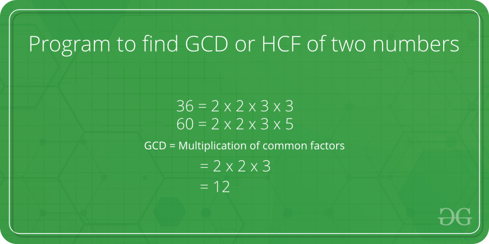

- Function 2: Calculate the absolute value of a number

  - Should take as a parameter a float and return a float
  - Test this function with ints and floats

- Function 3: Compute the square root of a number
  - If a negative argument is passed then a message is display and -1.0 should be returned
  - Should use the absoluteValue function as implementated in the above step

## 51 Challenge of Functions & Arrays: Tic Tac Toe

- Game is played on a 3x3 grid the game is played by two players, who take turns

- You should create an array to represent the board

  - Can be of type char and consist of 10 elements (do not use zero)
  - Each element represents a coordinate on the board that the user can select

- Some functions that you should probably create

  - `checkForWin` - checks to see if a player has won or the game is a draw
  - `drawboard` - redraws the board for each player turn
  - `markBoard` - sets the char array with a selection and check for an invalid selection

  ## 52 Character Strings

  ### 52.1 Strings

  - `char` data type - contains a single character

  - To assign a single character to a `char` variable, the character is enclosed within a pair of single quotation marks

  ```c
  plusSign = 'c';
  ```

  - There is a distinction made between the single quoation and double quotation marks

  ```c
  plusSign = "+"; // incorrect if plusSign is a char
  ```

- A string constant or string is a sequence of characters or symbols between a pair of double quoted characters

  - Anything between a pair of double quotes is interpreted by the compiler as a string
  - Includes any special characters and embedded spaces

- Every time you have displayed a message using the `printf()` function, you have defined the message as a string constant

```c
printf("This is a string.");
printf("This is on\ntwo lines!");
printf("For \" you write \\\".");
```

- Understand the difference between single quotation and double quotation marks

  - Both are used to create two different types of constants in C

- For the third example above, you must specify a double quote within a string as the excape sequence `\"`

  - The compiler will interpret an explicit double quote without a preceding backslash as a string delimeter

- Also, you must also use the excape sequence `\\` when you want to include a backslash in a string
  - A backslash in a string always signals the start of an escape sequence of the compiler

### 52.2 Strings in Memory

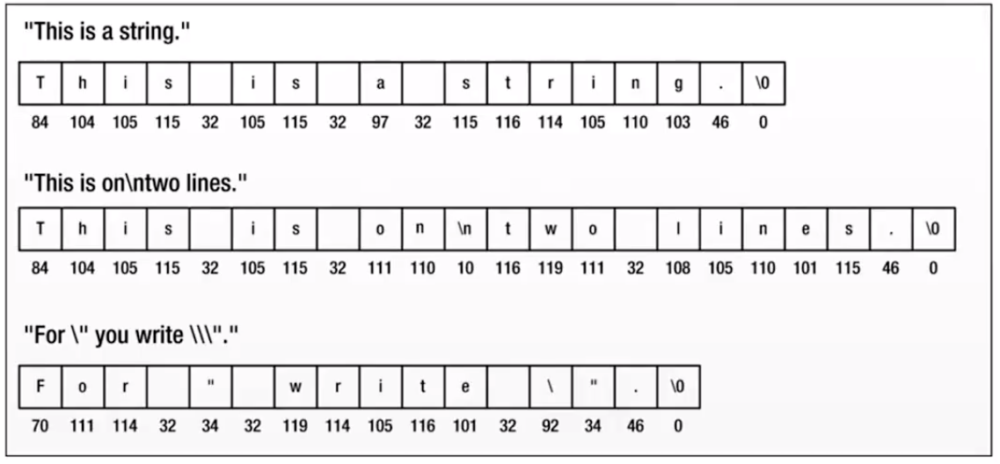

### 52.3 Null Character

- A special character with the code value 0 is added to the end of each string to mark where it ends

  - This character is known as the null character and you write it as `\0`

- Don't confuse the null character with `NULL` (keyword)

  - null character is a string terminator
  - `NULL` is a symbol that represents a memory address that doesn't reference anything

- You can add a `\0` character to the ned of a string explicitly
  - This will create two strings

```c
#include <stdio.h>

int main(void)
{
  printf("The character \0 is used to termniate a string.");
  return 0;
}
```

- If you compile and run this program, you'll get this output:

```
The character
```

- Only the first part of the string has been displayed
- Output ends after the first two words because the function stops outputting the string when it reaches the first null character
- The second `\0` atthe end of string will never be reached

- The first `\0` that's found in a character sequence always marks the end of the string

## 53 Defining a String

### 53.1 Character Strings

- C has no special variable type for strings

  - Tihs means thre are no special operators in the language for processing strings
  - The standard library provides an extensive range of functions to handle strings

- Strings in C are stored in an array of type char

  - Characters in a stirng are stored in adjacent memory cells, one character per cell

- To declare a string in C, simply use the `char` type and the brackets to indicate the size

```c
char myString[20];
```

- This variable can accommondate a string that contains up to 19 characters

  - You must allow one element for the termination character (null character)

- When you specify the dimemsion of an array that you intend to use to store a string, it must be at least one than the number of characters in the string that you want to store
  - The compiler automatically adds `\0` to the end of every string constant

### 53.2 Initializing a String

- You can initialize a string variable when you declare it

```c
char word[] = {'H', 'e', 'l', 'l', 'o', '!'};
```

- To initialize a string, it is the same as any other array initialization

  - In the absence of a particualr array size, the C compiler automatically computes the number of elements in the array
    - Based upon the number of initializers
    - This statement reserves space in memory for exactly seven characters
    - Automatically adds the null terminator

- You can specify the size of the string explicitly, just make sure you leave enough space for the terminating null character

```c
char word[7] = {"Hello!"};
```

- If the size specified is too samll, then the compiler can't fit a terminating null character at the end of the array, and it does't put one there (and it doesn't comlain about it either)

```c
char word[6] = {"Hello!"}; // Will be missed the '!'
```

- You can initialize just part of an array of elements of type char with a string

```c
char str[40] = "To be";
```

- The compiler will initialize the first elements, str[0] to str[4], withthe characters of the string constant
  - str[5] will contain the null character `'\0'`
  - Space is allocated for all elements of the array

### 53.3 Assigning a value to a string after initializing

- Since you can not assign arrays in C, you can not assign strings either

- **_The folowing is an error:_**

```c
s = "hello"; // Initialize - DOESN'T WORK ("lvalue required" error)
```

- You can performing an assignment operation, and you cannot assign one array of characters to another array of character like this
  - You have to use `strcpy()` to assign a value to a char array after it has been declared or initialzied

### 53.4 Displaying a String

- When you want to refer to a string stored in an array, you just use the array name by itself

- To display a string as output using the `printf()` function, you do the following:

```c
printf("\nThe message is: %s", message);
```

- The `%s` format specifier is for outputing a null-terminated string

- The `printf()` function assumes when it encounters the `%s` format characters that the corresponding argument is a character string that is terminiated by a null character

### 53.5 Inputting a String

- To input a string via the keyboard, use the scanf function

```c
char input[10];
printf("Please input your name: ");
scanf("%s", input);
```

- The `%s` format specifier is for inputing string

- No need to use the & (address of operator) on a string

### 53.6 Testing if two strings are equal

- You cannot directly test two strings to see if they are equal with a statement such as `if (string1 == string2)`

- The equality operator can only be applied to simple variable types, sucha as floats, ints, or chars

  - Does not work on sttructuress or arrays

- To determine if two strings are equal, you must explicitly compare the two character strings character by character
  - We will discuss as easier way with the `strcmp()` function

**Reminder:**

- The string constant `"x"` is not the same as the character constant `'x'`
- `'x'` is a basic type(char)
- `"x"` is a derived type, an array of char
- `"x"` really consists of two characters, `'x'` and `'\0'` - the null character

## 54 Constant Strings

### 54.1 `#define`

- The preprocessor lets you define constants

```c
#define TAXRATE 0.015
```

- When your program is compiled, the value 0.015 will be substituted everywhere you have used `TAXRATE`

  - Compile-time substitution

- A define name is not a variable

  - You cannot assign a value to it

- Notice that the `#define` statement has a special syntax

  - No equal sign used to assign the value `0.015` to `TAXRATE`
  - No semicolon

- `#define` statements can appear anywhere in a program

  - No such thing as a local define
  - Most programmers group their `#define` statements at the beginning of the program (or inside an include file)

    - Where they can be quickly referenced and shared by more than one source file

  - The `#define` statement helps to make programs more portable

    - It might be necessary to use constant values that are related to the particular computer on which the program running

  - The `#define` statement can be used for character and string constants

  ```c
  #define BEEP '\a'
  #define TEE 'T'
  #define ESC '\033'
  #define OOPS "Now you have done it!"
  ```

  ### 54.2 `const`

  - C90 added a second way to create symbolic constants
    - Using the `const` keyword to convert a declaration for a varibale into a declaration for a constant

```c
const int MONTHS = 12;
```

- `const` makes `MONTHS` into a read-only value

  - You can display `MONTHS` and use it in calculations
  - You cannot alter the value of `MONTHS`

- `const` is a newer approach and is more flexible than using `#define`

  - It lets you declare a type
  - It allows better control over wihch parts of a program can use the constant

- C has yet a third way to create symbolic constants

  - `enums`

- Intializing a char array and declaring it as constant is a good way of handling standard message

```c
const char message[] = "The end of the world is nigh.";
```

- Because you declare message as `const`, it's protected from being modified explicitly within the program

  - Any attempt to do so will result in an error message from the compiler

- This technique for defining standard messages is particular usefule if they are used in many place
  - Prevents accidental modification of such constants in other parts of the program

## 55 Common String Functions

### 55.1 String Functions

- Some of the more commonly performed operations on character string include
  - Getting the length of string: `strlen()`
  - Copying one character string to another: `strcpy()` and `strncpy()`
  - Combining two character strings together (concatenation): `strcat()` and `strncat()`
  - Determining if two character strings are equal: `strcmp()` and `strncmp()`
- The C library suppliers these string-handling function prototypes in the `string.h` header file

### 55.2 Getting the length of string

- The `strlen()` function finds the length of a string
  - Returned as a `size_t`

```c
#include <stdio.h>
#include <string.h>

int main()
{
  char myString[] = "my string";

  printf("The length of this string is: %d", strlen(myString));

  return 0;
}
```

- This function does change the string
  - The function header does not use `const` in declaring the format parameter string

### 55.3 Copying Strings

- Since you can not assign arrays in C, you can not assign strings either

- You can use the `strcpy()` function to copy a string to an existing string
  - The string equivalent of the assignment operator

```c
char src[50], dest[50];

strcpy(src, "This is source");
strcpy(dest, "This is destination");
```

- The `strcpy()` function does not check to see whether the source string actually fits in the target string

  - Safter way to copy strings is to use `strncpy()`

- `strncpy()` takes a third argument
  - The maximum number of character to copy

```c
char src[40], dest[12];
memset(dest, '\0', sizeof(dest));
strcpy(src, "Hello how are you doing");
strncpy(dest, src, 10);
```

### 55.4 String Concatenation

- The `strcat()` funciton takes two string for arguments

  - A copy of the second string is tacked onto the end of the first
  - This combined version becomes the new first string
  - The second string is not altered

- It returns the value of its first argument
  - The address of the first character of the string to which the second string is appended

```c
char myString[] = "my string";
char input[80];

printf("Enter a string to be concatenated: ");
scanf("%s", input);

printf("\nThe string %s concatenated with %s is::::\n", myString, input);
printf("%s\n", strcat(inpyt, myString));
```

- The `strcat()` funciton does not check to see whether the second string will fit in the first array

  - If you fail to allocate enought space for the first array, you will run into problems as excess characters overflow into adjacent locations

- Use strncat() instead

  - Takes a second argument indicating the maximum number of characters to add

- For example, `strncat(bugs, addon, 13)` will add the contents of the addon string to bugs, stopping when it reaches 13 additional characters or the null character, whichever comes first

```c
char src[50], dest[50];

strcpy(src, "This is source");
strcpy(dest, "This is destination");

strncat(dest, src, 15);
printf("Final destination string: [%s]\n", dest);
```

### 55.5 Comparing Strings

- Suppose you want to compare someone response to a stored string

  - Cannot use `==`, will only check to see if the string has the same address

- There is a function that compares string contents, not string addresses

  - It is the `strcmp()` (for string comparison) function
  - Does not compare arrays, so it can used to compare strings stored in arrays of different sizes
  - Does not compare characters
    - You can use arguments such "apples" and "A", but you cannot use character arguments as 'A'

- This function does for strings what relational operators do for numbers

  - It returns 0 if its two string arguments are the same and nonzero otherwise
  - If return value < 0, then it indicates str1 is less than str2
  - If return value > 0, then it indicates str2 is less than str2

- The `strcmp()` function compares strings until it finds corresponding characters that differ

  - Cound take the search to the end of one of the strings

- The `strcmp()` function compares the strings until they differ or until it has compared a number of characters specified by a third argument

  - If you wanted to search for strings that begin with "astro", you could limit search to the first five characters

  ```c
  if (strncmp("astronomy", "astro", 5) == 0)
    printf("Found astronomy");

  if (strncmp("astounding", "astro", 5) == 0)
    printf("Found astounding");
  ```

## 56 Searching, Tokenizing and Analyzing Strings

### 56.1 Overview

- Searching a string

  - The `string.h` header file declares several string-searching functions for finding a single character or a substring
  - `strchr()` and `strstr()`

- Tokenizing a string

  - A token is a sequence of characters within a string that is bounded by a delimiter (space, comma, period, etc)
  - Breaking a sentence into words is called `tokenizing`
  - `strtok()`

- Analyzing strings
  - `islower()`, `isupper()`, `isalpha()`, `isdigit()`, etc.

### 56.2 Concept of a Pointer

- C provides a remarkably useful type of variable called a pointer
  - A variable that stores an address
  - Its value is the address of another location in memory that can contain a value
  - We have addresses in the past with the `scanf()` funciton

```c
int Number = 25;
int *pNumber = &Number;
```

- Above, we declare a variable, Number, with the value 25

- We declared a pointer, pNumber, which contains the address of Number

  - asterisk used in declaring a pointer

- To get the value of variable pNumber, you can use the asterisk to dereference the pointer
  - `*pNumber = 25`
  - `*` is the dereference operator, and its effect is to access the data stored at the address specified by a pointer

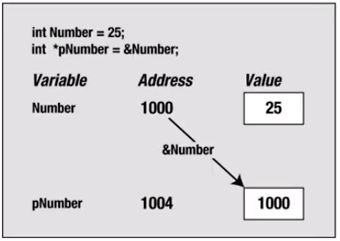

- The value of `&Number` is the adderss where `Number` is located
  - This value is used to initialize `pNumber` in the second statement

### 56.3 Searching a String for a Character

- The `strchr()` funciton searches a given string for a specified character

  - First argument to the function is the string to be searched (whicl will be the address of a char array)
  - Second argument is the character that you are looking for

- The function will search the string starting at the beginning and return a pointer to the first position in the string where the character is found

  - The address of this position in memory
  - Is of type `char*` described as the "pointer to char".

- To store the value that's returned, you must create a variable that can store the address of a charater

- If the character is not found, the function returns a speicial value `NULL`
  - `NULL` is the equivalent of 0 for a pointer and represents a pointer that does not point to anything

### 56.4 `strchr()`

- You can use the `strchr()` function like this

```c
char str[] = "The quick brown fox";     // The string to be searched
char ch = `q`;      // The character we are looking for
char *pGot_char = NULL;     // Pointer initialized to NULL
pGot_char = strchr(str. ch);      // Stores address where ch is found
```

- The first argument `strchr()` is the address of the first locaiton to be searched
  - Second argument is the character that is sought (`ch`, which is of type char)
  - Expects its second argument to be of type `int`, so the compiler will convert the value of `ch` to this type
  - Could just as well define `ch` as type `int` (`int ch = 'q';`)
  - `pGot_char` will point to the value ("quick brown fox")

### 56.5 Searching for a Substring

- The `strstr()` funciton is probably the most useful of all the searching functions

  - Searches one string for the first occurrence of a substring
  - Returns a pointer to the position in the first string where the substring is found
  - If no match, returns `NULL`

- The first argument is the string that is to be searched
- The second argument is the substring you're looking for

```c
char text[] = "Every dog has his day";
char word[] = "dog";
char *pFound = NULL;
pFound = strstr(text, word);
```

- Searches `text` for the first occurrence of the string stored in `word`
  - The string "dog" appears starting at the seventh character in text
  - `pFound` will be set to the address `text` + 6 ("dog has his day")
  - Search is case sensitive, "Dog" will not be found

### 56.7 Tokenizing a String

- A token is a sequence of characters within a string that is bound by delimiter

- A delimiter can be anything, but, should be unique to the string

  - Spaces, commas, and a period are good examples

- Breaking a sentence into words is called tokenizing

- The `strtok()` funciton is used for tokenizing a string

- It requires two arguments
  - String to be tokenized
  - A string contianing all the possible delimiter characters

### 56.8 Analyzing Strings

```c
islower()
isupper()
isalpha()       // Uppercase or lowercase ltter
isalnum()       // Uppercase or lowercase ltter or a digit
iscntrl()       // Control character
isprint()       // Any printing character including space
isgraph()       // Any printing character except space
isdigit()       // Decimal digit ('0' to '9')
isxdigit()      // Hexadecimal digit ('0' to '9', 'A' to 'F', 'a' to 'f')
isblank()       // Standard blank characters (space, '\t')
isspace()       // Whitespace character (space, '\n', '\t', '\v', '\r', '\f')
isspunct()      // Printing character for which isspcae and isalnum() return false
```

- The argument to each of these functons is the character to be tested
- All these functions return a nonzero value of type `int` if the character is within the set that's being tested for
- These return values convert to true and false, respectively, so you can use them as `Boolean` values

## 57 Converting Strings

### 57.1 Overview

- It is very common to convert character case

  - To all upper case or all lower case

- The `toupper()` function converts from lowercase to uppercase
- The `tolower()` function converts from uppercase to lowercase

- Both functions return either the converted character or the same character for characters that are already in the correct case or are not convertible such as punctuation characters

- Tis is how you convert a string to uppercase

```c
for (int i = 0; (buf[i] = (char)toupper(buf[i]))!='\0'; ++i);
```

- This loop will convert the entire string in the buf array to uppercase by stepping through the string one character at a time

  - Loop stops when it reaches the string termination character '\0'
  - The case to type char is there because toupper() returns type int

- You can use the function toupper() in combination with the `strstr()` function to find out whether one string occurs in another, ignore case

### 57.2 Case Conversion Example

```c
char text[100];           // Input buffer for string to be seached
char substring[40];       // Inpyt buffer for string sought

printf("Enter the string to be searched (les than %d characters);\n", 100);
scanf("%s", text);

printf("\nEnter string sought \(less than %d characters\n"\)

// Convert both strings to uppercae
for (i = 0; (text[i] = (char)toupper(text[i])))
for (i = 0; (substring[i] = (substring[i]))  != '\0\' )

printf("The second %found in the first.\n" ((strstr(text, substring) == NULL) ? "was not"; "was"))
```

### 57.3 Converting Strings to Numbers

**_The stdlib.h header declares functions that you can use to convert a string to a numerical value_**

```c
atof();
atoi();
atol();
atoll();
```

- For all functions, leading whitespace is ignored

```c
char value_str[] = "98.4";
double value = atof(value_str)
```

`strtod()`: A value to type `double` is produced from the initial part tof the of the string. Specified by the first argument. The second argument is a pointer to a variable, `ptr` say, of type `char` \* in which the function will store the address of the first character following the subsctring that was converted to the `double` value. If so string was found that could be conveted to type `double` value, if so string was found that could be converted to type `double`, the variable `prt` will contian the address passed as the first argument.

`strof()`: A value of type `float`, in all other respects it works as `strtod()`.

`strtold()`: A value of type `long double`.In all other respects it works as `stdtod`.

## 58 Challenge of Strings: Common String Functions

- Write a program that display a string in reverse order

  - Should read input from the keyboard
  - Need to use the `strlen` string function

- Write a program that sorts the strings of an array using a bubble sort
  - Need to use the `sctcmp` and `strcpy` functions

```
Input number of strings: 3
Input string 3:
zero
one
two

Expected Output:

The strings apperas after sorting:
one
two
zero
```

## 59 Debugging

### 59.1 Overview

- Debugging is the process of finding and fixing errors in a program (usually logic errors, but, can also include compiler/syntax errors)

  - For syntax errors, understand what the compiler is telling you
  - Always focus on fixing the first problem detected

- Can range in complexity from fixing simple errors to collecting large amounts of data for analysis

- The ability to debug by a programmer is an essential skill (problem solving) that can saving you trememdous amounts of time (and money)

- Maintenance phase is the most expensive phase of the software life cycle

- Understand that bugs are unavoidable

### 59.2 Common Problems

- Logic Errors
- Syntax Errors
- Memory Corruption
- Performance / Scalability
- Lack of Cohesion
- Tight Coupling (dependencies)

### 59.3 Debugging Process

- Understand the problem

- Reproduce the program

  - Sometimes very difficult as problems can be intermittent or only happen in vary rare circumstances
  - Parallel processes or threading problems

- Simplify the problem / Divide and conquer / isolate the source

  - Remove parts of the orignal test case
  - Comment out code / back out changes
  - Turn a large program into a lot of small programs (unit testing)

- Identify origin of the problem

  - Using Debugging Tools if neccessary

- Solve the problem
  - Experience and practice
  - Sometimes includes redesign or refactor code

### 59.4 Techniques and Tools

- Tracing / using print statements

  - Output values of variable at certain points of a program
  - Show the flow of execution
    can help isolate the error

- Debuggers - monitor the execution of a program,restart it, set the breakpoints and watch variables in memory

- Log Files - can be used for analysis, add "goom"log state

### 59.5 Common Debugging Tools

- Exception Handing helps a great deal to identify catastrophic errors

- Static Analyzers - analyze soure code for specific set of know problems

  - Semantic checker, does not analyze syntax
  - Can detect things like uninitialized variables, memory leaks, unreachable code, deadlocks or race conditions

- Test Suites - run a set of comprehensive system end-to-end tests

- Debugging the program after it has crashed
  - Analyze the call stack
  - Analyze memory dump (core file)

### 59.7 Preventing Errors

- Write high quality code (follow good design principles and good programming practices)

- Unit Tests - automatically executed when compiling

  - Helps avoid regression
  - Finds errors in new code before it is delivered
  - TDD (Test Driven Development)

- Provide good documentation and proper planning (write down design on paper and untilize pseudocode)

- Work in Steps and constantly test after each step
  - Avoid too many changes at once
  - When making changes, apply them incrementally. Add one change, then test thoroughly before starting the next step
  - Helps reduce the possible sources of bugs, limits prolem set

## 60 Understanding the Call Stack

- A stack trace (call statck) is generated whenever your app craches because of a fatal error

- A statck trace shows a list of the function calls that lead to error

  - Includes the filenames and line numbers of the code that cause the exception or error to occur
  - Top of the stack contains the last call that caused the error (nested calls)
  - Bottom of the stack contains the first call that started the chain of calls to cause the error
  - You need to find the call in your application that is causing the crash

- A programmer can also dump the stack trace

## 61 Common C Mistakes

- missing a semicolon
- confusing the operator `=` with the operator `==`
- omitting prototype declarations

```c
result = squareRoot(2)
```

- failling to include the header file that includes the definition for a C-programing library function being used in the porgram
- confusing a character constant and a character string
- using the wrong bounds of an array

```c
int a[100], i, sum=0;
for (i = 1; i < 100; i++1)
  sum += a[i];
```

- confusing the opeartor `->` with the operator when referencing structure members

  - the operator `.` is used for structure varaibles
  - the operator `->` is uesd for structure pointer variables

- omitting the ampersand before nonpointer variable in a `scanf()` call
- using a pointer variable before it's intialized

```c
char *char_pointer;
*char_pointer = 'X';
```

- omitting the break statement at the end of a case in a switch statement
- inserting a semicolon at the end of a preprocessor definition
- omitting a closing parenthesis or closing quotation marks on any statement

## 62 Understanding Compiler Errors and Warnings

### 62.1 Overview

- It is sometimes very hard to understand what the compiler is complaining about

  - Need to understand compiler errors in order to fix them
  - It is sometimes difficult to identify the true reason behind a compiler error

- The compiler makes decisions about how to translate the code that the programmer has not written in the code

  - It is convenient because the programs can be written more succinctly (only expert programmers take advantage of this feature)

- You should use an option for the compiler to notify all cases where there are implicit decisions

  - This option is `-Wall`

- The compiler shows two types of problems

  - errors

    - A condition that prevents the creation of a final program
    - No executable is obtained until all the errors have been corrected
    - The first errors shown are the most reliable because the translation is finished but thre are some errors that may derive from previous ones
    - Fix the first errors are first, it is recommended to compile again and see if othe rlater errors also disappeared.

  - warings

    - Messages that the compiler shows about 'special" situations in which an anomaly has been detected
    - Non-fatal errors
    - The final executable program may be obtained with any number of warning

  - Compile always with the `-Wall` option and do not consider the program correct until all warning been eliminated

  ### 62.2 Most Common Compiler Messages

- `variable undeclared` (first use in this funciton)

  - This is one of the most common and easier to detect
  - The symbol shown at the beginning of the message is used but has not been declared

- `warning: implicit declaration of function`

  - This waring appears when the compiler finds a function used in the code but no previous information has been given about it
  - Need to declare a function prototype

- `warning: control reaches end of non-void function`

  - This warning appears when a function has been defined as returining a result but no return statement has been included ti return this result
  - Either the funciton is incorrectly defined or the statement is missing

- `warning: unused variable ...`

  - This warning is printed by the compiler when a variable is declared but not used in the code
  - Message disappears if the declaration is removed

- `undefined reference to ... `

  - Appears when there is a function invoked in the code that has not been defined anywhere
  - Compiler is telling us that there is a reference to a function with no definition
  - Check which function is missing and make sure its definition is compiled

- `error: conflicting types for ...`
  - Two definitions of a function prototype have been found
  - One is the prototype, the other is the definition with function body

### 62.3 Runtime Errors

- The execution of C programs may terminate abruptly (crash) when a run-time error is detected
  - C programs only print the succint message Segmentation fault
  - Usually result in a code file depending on the signal that has been thrown
  - Can analyze the core and the call stack

## 63 Pointers Started

### 63.1 Indirection

- Pointers are very similar to the concept of indirection that you employ in your everyday life
- Suppose you need to buy a new ink catridge for your printer
- All purchases are handled by the purchasing department
  - You call Joe in purchasing and ask him to order the new cartridge for you
  - Joe then calls the local supply store to order the cartridge
- You are note ordering the cartridge directly from the supply store yourself (indirection)

- In programming languages, indirection is the ability to reference something using a name, reference, or container, instead of the value itself

- The most common form of indirection is the act of manipulating a value through its memory address

- A pointer provides an indirection is the act of manipulating a value through its memory address

- A pointer provides an indirect means of accessing the value of a particular data item
  - A variable whose value is a memory address
  - Its value is the address of another location in memory that can contain a value

### 63.2 Overview

- Just as there are reasons why it makes sense to go through the purchasing department to order new cartridge
  (you don't have to know which particular store the cartridges are being ordered from)

  - There are good reasons why it makes sense to use pointers in C

- Using pointers in your program is one of the most powerfule tools available in the C language

- Pointers are also one of the most confusing concepts of the C language

  - It is important you get this concept figured out in the beginning and maintain a clear idea of what is happening as you dig deeper

- The compiler must know the type of data stored in the variable to which it points

  - Need to know how much memory is occupied or how to handle the contents of the memory to which it points
  - Every pointer will be associated with a specific variable type
  - It can be used only to point to variables of that type

- Pointers of type "pointer to int" can point only to variables of type int

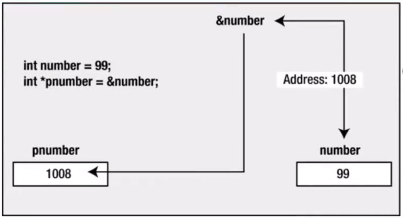

- The value of `&number` is the address where number is located
  - This value is used t oinitialized `pnumber` in the second statement

### 63.3 Why use pointers?

- Accessing dat aby means of only variables is very limiting

  - With pointers, you can access location (you can treat any position of memory as a variable for example) and perform arithmetic with pointers

- Pointers in C make it easier to use arrays and strings

- Pointers allow you to refer to the same space in memory from multiple locations

  - Means that you can update memory in one location and the change can be seen from another location in your program
  - Can also save space by being able to share components in your data structures

- Pointers allow functions to modify data passed to them as variables

  - Pass by reference - passing arguments to function in way they can be changed by function

- Can also be used to optimze a program to run faster or use less memory that in would otherwise

- Pointers allow us to get multiple values from the function

  - A function can return only one value by passing arguments as pointers we can get more than one values from the pointer

- With pointers dynamic memory can be created according to the program use

  - We can save memory from static (compile time) declarations

- Pointer allow us to design and develop complex data structures like a stack, queue, or linked list

- Pointers provide direct memory access

## 64 Defining Pointers

### 64.1 Declaring Pointers

- Pointers are not declared like normal variables

```c
pointer ptr;  // not the way to declare a pointer
```

- It is not enough to say that a variable is a pointer

  - You also have to specify the kind of variable of which the pointer points
  - Different variable types take up different amounts of storage
  - Some pointer operations require knowledge of that storage size

- You declare a pointer to a variable of type `int` with:

```c
int * pnumber;
```

- The type of the variable with the name `pnumber` is `int*`
  - Can store the addres of any variable of type `int`

```c
int * pi;       // pi is a pointer to an integer variable
char * pc;      // pc is a pointer to an character variable
float * pf, pg;      // pf, pg are a pointer to float variables
```

- The space between the `*` and the pointer name is optional

- The value of a pointer is an address, and it is represented internally as an unsigned integer on most systems

  - However, you shouldn't think of a pointer as an integer type
  - Things you can do with integers that you can not do with pointers, and vice versa
  - You can multiply one integer by another, but you can not multiply one pointer by another

- A pointer really is a new type, not an integer type

  - `%p` represents the format specifier for pointers

- The previous declarations creates the varibale but does not initialized it
  - Dangerous when not initialized
  - You should always initialized a pointer when you declare it

### 64.2 NULL Pointers

- You can initialize a pointer so that it does not point to anything:

```c
int *pnumber = NULL;
```

- `NULL` is a constant that is defined in the standard library

- `NULL` is a value that is guaranteed not to point to any location in memory

  - Means that it implicitly prevents the accicental overwriting of memory by using a pointer that does not point to anything specific

- Add an `#include` directive for `<stddef.h>` to your source file

### 64.3 Address of Operator

- If you want to initialize your variable with the address of a variable you have already declared
  - Use the address of operator, `&`

```c
int number = 99;
int *pnumber = $number;
```

- The initial value of `pnumber ` is the address of the variable number
  - The declaration of number must precede the declaration of the pointer that stores its address
  - Compiler must have alrady allocated space and thus an address of number to use it to initialize `pnumber`

### 64.4 Be Careful

- There is nothing special about the declaration of a pointer
  - Can declare regular variables and pointers in the same statement

```c
double value, *pVal, fnum;
```

- Only the second variable `pVal` is a pointer

```c
int *p, q;
```

- The above declares a pointer, `p` of type `int*`, and a variable, q, that is of type int

  - A common mistake to think that both `p` and `q` are pointers

- Also, it is a good idea to use names beginning with `p` as a pointer names

## 65 Accessing Pointers

### 65.1 Accessing Pointer Values

- You use the indirection operator `*` to access the value of the variable pointed to by a pointer
  - Alos referred to as the dereference operator because you use it to "dereference" a pointer

```c
int number = 15;
int *pointer = &number;
int result = 0;
```

- The pointer variable contains the address of the variable number

  - You can use this in an expression to calculate a new value for result

  ```c
  result = *pointer + 5;
  ```

- The expression \*pointer will evaluate to the value stored at the address contained in the pointer

  - The value stored in number, `15`, so result will be set to `15 + 5`, which is `20`

- The indirection operator `*`, is also the symbol for multiplication, and it is used to specify pointer types
  - Depending on where the asterisk apperas, the compiler will understand whether it should interpret it as an indirection operator, as multiplication sign, or as part of a type specification
  - Context determines what it means in any instance

```c
int main(void)
{
  int count = 10, x;
  int *int_pointer;

  int_pointer = &count;
  x = *int_pointer;

  printf("count = %i, x = %i\n", count, x);

  return 0;
}
```

### 65.2 Displaying Pointers Value

- To output the address of a variable, you use the output format specifier `%p`

  - Outputs a pointer value as a memory address in hexadecimal form

  ```c
  int number = 0; // A variable of type int initizalized to 0
  int *pnumber = NULL; // A pointer that can point to type int

  number = 10;
  pnumber = &number;
  printf("pnumber's value: %p\n", pnumber); // Output the value (an address)
  ```

  - Pointers occupy 8 bytes and the address have 16 hexadecimal digits
    - If a machine has 64-bit operating system and my compiler supports 64-bit address
    - Some compilers only support 32-bit address, in which cas addresses will be 32bit address

### 65.3 Displaying Pointers Address

```c
printf("number's address: %p\n, &number");
printf("number's address:%p\n", (void*)&pnumber); // Output address
```

- Remembera pointer itself has address, just like any other variable

  - You use `%p` as the conversion specifier to display an address

- You use the `&` (address of) operator to reference the address that the number variable occupies

- The cast to `void*` is to prevent a possible warning from the compiler
  - The `*p` spcification expects the value to be some kind pointer type, but the type of `&number` is pointer to pointer to `int`

### 65.4 Displaying the number of bytes a pointer is using

- You use the `sizeof` operator to obtain the number of bytes a pointer occupies

  - A memory address on my machine is 64 bits
  - A memory address on my machine is 64 bits

- You may get a compiler warning when using sizeof this way
  - `size_t` is an implementation-defined integer type
  - To prevent the warning, you could cast the argument to type int like this:

```c
printf("pnumber's size: %d bytes\n", (int)sizeof(pnumber)); // Output the size
```

### 65.5 Example

```c
int main(void)
{
  int number = 0; // A variable of type int initialized to 0
  int *pnumber = NULL;   // A pointer that can point to type int

  number = 10;
  printf("number's address: %p\n, &number");
  printf("value's address: %p\n, &value");

  pnumber = &number;  // Store the address of number in pnumber

  printf("pnumber's address": (void*)&pnumber);  //Output the address
  printf("pnumber's size: %zd byptes\n", sizeof(pnumber));
  printf("pnumber's address: %p\n", (void *)pnumber);
  printf("pnumber's value: %p\n", pnumber);
  printf("pnumber's address: %p\n", (void*)&pnumber);
  printf("pnumber's value: %p\n", pnumber);
  printf("pnumber's value: pnumber");
  printf("value pointed to: %d\n");
}
```

## 66 Using Pointers

### 66.1 Overview

- C offers several basic operations you can perform on pointers

- You can assign an address to a pointer

  - Assigned value can be an array name, a variable preceded by address operator (&), or another second pointer

- You can dereference a pointer

  - The `*` opertor tells you where the pointer itself is stored

- You can take a pointer address

  - The `&` operater tells you where the pointer itself is stored

- You can perform pointe rarithmetic

  - Use the `+` operator to add an integer to a pointe or a pointer to an integer (integer is multiplied by the number of bytes in the pointed-to type and added to the orignal address)
  - Increment a pointer by one (useful in arrays when moving to the next element)
  - Use the `-` operator to subtract an integer from a pointer (integer is multiplied by the number pointed-to type and subtracted from the orignal address)
  - Decrementig a pointer by one (useful in arrays when going back to the previous element)

- You can find the difference between two pointers

  - You do this for two pointers to elements that are in the same array to find out how far apart the elements are

- You can use the relational operators to compare the values of two pointer

  - Pointers must be the same type

- Remember, there are two forms of subtraction

  - You can subtract one pointer from another to get an integer
  - You can subtract an integer from a pointer and get a pointer

- Be careful when incrementing or decrementing pointers and causing an array "out of bounds" error

  - Computer does not keep track of whether a pointer still points to an array element

  ### 66.2 Pointers used in expressions

  - The value referenced by a pointer can be used in an arithmetic expressions
    - If a variable is defined to be of type "pointer to pointer" then it is evaluated using the rules of integer arithmetic

```c
int number = 0; // A variable of type int intialized to 0
int *pnumber = NULL; // A pointer that can point to type int
number = 10;
pnumber = &number; // Store the address of number in pnumber
*pnumber += 25;
```

- Increments the value of the number variable by 25
- Indicates you are accessing the contents to which the variable called pnumber is pointing to

- If a pointer points to a variable x

  - That pointer has been defined to be a pointer to the same data type as is x
  - Use of `*pointer` in an expression is identical to the use of x in the same expression

- A variable defined as a "pointer to int" can store the address of any variable of type `int`

```c
int value = 999;
pnumber = &value;
*pnumber += 25;
```

- The statement will operate with the new variable, value

  - The new contents of value will be 1024

- A pointer can contain the address of any variable of the appropriate type
  - You can use one pointer variable to change the values of many different variables
  - As long as they are of a type compatible with the pointer type

### 66.3 When Receiving Input

- When we have used `scanf()` to input values, we hvae used the `&` operator to obtain the address of a variable

  - On the variable that is to store the input (second argument)

- When you have a pointer that already contains an address, you can use the pointer name as an argument for `scanf()`

```c
int value = 0;
int *pvalue = &value;   // Set pointer to refer to value

printf("Input an integer:");
scanf("%d", pvalue);    // Read into value via the pointer

printf("You entered %d.\n", value);
```

### 66.4 Testing for NULL

- There is one rule you should burn into your memory

  - Do not dereference an uninitialized pointer

  ```c
  int *pt;  // An uninitialized pointer
  *pt = 5;  // A terriable error
  ```

- Second line means store that value in the location to which `pt` pointer

  - `pt` has a random value, there is no knowing where the 5 will be placed

- It might go somewhere harmless, it might overwrite data or code, or it might cause the program to crash

- Creating a pointer only allocates memory to store the pointer itself

  - It does not allocate memory to store data
  - Before you use pointer, it should be assigned a memoty location that has already been allocated
  - Assign the address of an existing variable to the pointer
  - Or you can use the `malloc()` function to allocate war memory first

- We already know that when declaring a pointer that does not pointer to anythoing, we shold intialize it to `NULL`

```c
int *pvalue = NULL;
```

- `NULL` is a special symbol in C that represents the pointer equivalent to 0 with ordinary numbers
  - The below also sets a pointer to null using 0

```c
int *pvalue = 0;
```

- Because `NULL` is the equivalent of zero, if you want to test whether pvalue is `NULL`, you can do this:
  - Or you can do it explicitly by using `==NULL`

```c
if(!pvalue)
```

- You want to check for `NULL` before you dereference 3 pointer
  - Ofter when pointers are passed to functions

## 67 Ponters and Const

### 67.1 Overview

- When we use the `const` modifier on a variable or an array, it tells the compiler that the contents of the variable/array will not be changed by the program

- With pointers, we have to consider two things when using the const modifier

  - Whether the pointer will be changed
  - Whether the value that the pointer points to will be changed

- You can use the `const` keyword when you declare a pointer to indicate that the value pointed to must not be changed

```c
long value = 9999L;
const long *pvalue = &value;  // defines a pointer to a constant
```

- You have declared the value pointed to by `pvalue` to be const
  - The compiler will check for any statements that attempt to modify the value pointed to by `pvalue` and flag such statement as an error

```c
*pvalue = 8888L;  // Error - attemp to change const location
```

### 67.2 Pointers to Constants

- You can still modify `value` (you have only applied `const` to the pointer)

```c
value = 7777L;
```

- The `value` pointed to has changed, but you did not use the pointer to make the change

- The pointer itself is not constant, so you can still change what it points to:

```c
long number = 8888L;
pvalue = &number; // OK - changing the address in pvalue
```

- Will change the address stored in `pvalue` to point to number
  - Still canot use the pointer to change the value that is stored
  - You can change the address stored in the pointer as much as like
  - Using the pointer to change the value pointer to is not allowed, even after you have the changed the address stored in the pointer

```c
*pvalue = 6666L;  // Error again - attemp to change const location
```

### 67.3 Constant Pointers

- You might also want to ensure that the address stored in pointer cannot be changed

- You can do this by using the `const` keyword in the declaration of the pointer

```c
int count = 43;
int *const pcount = &count; // Defines a const pointer
```

- The above ensures that a pointer always points to the same thing
  - Indicates that the address stored must not be changed
  - Compiler will check that you do not inadvertently attempt to change what the pointer points to elsewhere in your code

```c
int item = 34;
pcount = &item; // Error - attempt to change a constant pointer
```

- It is all about where you place the `const` keyword, either before type or after the type

```c
const int * pointToConstant // Value can not be changed
int * const constantPointer // Pointer address cannot be changed
```

- You can still change the value that `pcount` points to

```c
*pcount = 345;   // OK - changes the value of count
```

- References the value stored in count through the pointer and changes its value to 345

```c
int item = 25;
const int *const pitem = &item;
```

- The `pitem` is a constant pointer to a constant so everything is fixed

  - Cannot change the address stored in `pitem`
  - Cannot use `pitem` to modify what it points to

- You can still change the value of item directly
  - If you wanted to make everything not change, you could specify item as const as well

## 68 Void Pointers

### 68.1 Overview

- The type name `void` means absense of any type
- A pointer of type `void*` can contain the address of a data item of any type
- `void*` is often used as a parameter type of return value type with functions that deal with data in a type-indpendent way
- Any kind of pointer can be passed around as a value of type `void*`

  - The void pointer does not know what type of object it is pointing to, so, it cannnot be dereferenced directly
  - The `void` pointer must first be explicitly cast to another pointer type before it is dereference

- The address of a variable of type `int` cna be stored in a pointer variable of type `void*`

- When you want to access the integer value at the address stored in the `void*` pointer must first cast pointerto type `int*`

### 68.2 Example

```c
int i = 10;
float f = 2.34;
char ch = 'k';

void *vptr;

vptr = &i;
printf("Value of i = %d\n", *(int*)vptr);

vptr = &f;
printf("Value of f = %d\n", *(float*)vptr);

vptr = &ch;
printf("Value of ch = %d\n", *(char*)vptr);
```

## 69 Pointers and Arrays

### 69.1 Overview

- An array is a collection of objects of the same type that you can refer to using a single name

- A pointer is variable that has as its value a memory address that can reference another variable or constant of a given type

  - You can use a pointer to hold the address of different variables at different times (must be same type)

- Arrays and pointers seem quite different, but, they are very closely related and can sometimes be used interchageably

- One of the most common uses of pointers in C is as pointers to arrays

- The main reasons of using pointers arrays are ones of national convenience and of program efficiency

- Pointers to arrays generally result in code that uses less memory and executes faster

### Arrays and Pointers

- If you have array of 100 integers

```c
int values[100];
```

- You can define a pointer called valuePtr, which can be used to access the integers contained this array

```c
int *valuesPtr;
```

- When you defined a pointer that is used to point to the elements of an array, you do not designed the pointer as type `*pointer` to array

  - You designate the pointer as pointing to the type of element taht is contained in the array

  - To set `valuePtr` to point to the first element in the values array, you write

  ```c
  valuesPtr = values;
  ```

- The address operator is not used

  - The C compiler treats the appearance of an array name without a subscript as a pointer to the array
  - Specifying values without a subscript has the effect of producing a pointer to the first element of values

- An equivalent way of producing a pointer to the start of values is to apply the address operator to the first element of the array

```c
valuePtr = &values[0];
```

### 69.3 Summary

- The two expressions `ar[i]` and \*`(ar+i)` are equivalent in meaning
  - Both work if `ar` is the name of an array, and both work if `ar` is a pointer variable
  - Using an expression such as `ar++` only works if `ar` is a pointer variable

## 70 Pointer Arithmetic

### 70.1 Pointer Arithmetic

- The real power of using pointers to arrays comes into play when you want to sequence through the element of an array

```c
*valuePtr // can be used to access the first integer of the values array, that is, values[0]
```

- To reference values[3] through the `valuesPtr` variable, you can add 3 to `valuesPtr` and then apply the indrection operator

```c
*(valuesPtr + 3)
```

- The expresiion, `*(valuesPtr + i)` can be used to access the value contained in `values[i]`

```c
values[10] = 27;
```

- or, using `valuesPtr`, you could

```c
*(valuesPtr + 10) = 27;
```

- To set `valuesPtr` to point to the second element of the values array, you can apply the address operator to `values[1]` and assign the result to `valuesPtr`

```c
valuesPtr = &values[1]
```

- If `valuesPtr` points to `values[0]`, you can set it to point to values[1] by simply adding 1 to the value of `valuesPtr`

```c
valuesPtr + 1;
```

- This is a perfectly valid expression in C and can be used for pointers to any data type

- The increment and decrement operators `++` and `--` are particularly useful when dealing with pointers

```c
++valuesPtr;
```

- Sets `valuesPtr` pointing to the next integer in the values array (values[1])

```c
--textPtr;
```

- Sets `valuesPtr` pointing to the previous integer in the values array, assuming the `valuesPtr` was not pointing to the begening of the values array

### 70.2 Example

```c
#include <stdio.h>

int arraySum(int array[], const int n)
{
    int sum = 0, *ptr;
    int * const arrayEnd = array + n;

    for ( ptr = array; ptr < arrayEnd; ++ptr)
        sum += *ptr;

    return sum;
}

void main(void)
{
    int arraySum(int array[], const int n);
    int values[10] = {0, 1, 2, 3, 4, 5, 6, 7, 8, 9};

    printf("The sume is %i\n", arraySum(values, 10));
}
```

- To pass an arry to a funciton, you simply specify the name of the array
- To produce a pointer to an array, you need only specify the name of the array

- This implies that in the call to the `arraySum()` function, what was passed to the function was actually a pointer to the array values

  - Explains why you are able to change the elements of an array from within a function

- So, you might wonder why the formal parameter inside the function is not declared to be a pointer

```c
int arraySum(int *array, const int n)
```

- The above is perfectly valid

  - Pointers and arrays are intimately related in C
  - This is why you can declare array to be of type "array of ints" inside the `arraySum` function or to be of type "pointer to int"

- If you are going to be using index numbers to reference the elements of an array that is passed to a function, declare the corresponding formal parameter to be an arry

  - More correctly reflects the use of the array by the function

- If you ar eusing the argument as a pointer to the array, declare it to be of type pointer

### 70.3 Example with Pointer Notation

```c
#include <stdio.h>

// int arraySum(int array[], const int n)
int arraySum(int *array, const int n)
{
    int sum = 0;
    int * const arrayEnd = array + n;

    for ( ; array < arrayEnd; ++array)
        sum += *array;

    return sum;
}

void main(void)
{
    // int arraySum(int array[], const int n);
    int values[10] = {0, 1, 2, 3, 4, 5, 6, 7, 8, 9};

    printf("The sume is %i\n", arraySum(values, 10));
}
```

### 70.4 Summary

```c
int urn[3];
int * ptr1, * ptr2;
```

| **Valid**          | **Invalid**           |
| ------------------ | --------------------- |
| `ptr1++;`          | `urn++;`              |
| `ptr2 = ptr1 + 2;` | `ptr2 = ptr2 + ptr1;` |
| `ptr2 = urn + 1;`  | `ptr2 = urn + ptr1;`  |

- Functions that process arrays actually use pointers as argument

- You have a choice between array notation and pointer notation for writing array-processing functions

- Using array notation makes it more obvious that the funciton is working with arrays

  - Array notation has a more familiar look to programmers versed in `FORTRAN`, `PASCAL`, `Modula-2`, or `BASIC`

- Other programmers might be more accustomed to working with pointers and might find the pointer notation more natural
  - Closer to machine language and ,with some compiliers, leads to more efficient code

## 71 Pointers and Strings

### 71.1 Overview

- One of the most common applications of using a pointer to an array is as a pointer to a character string
  - The reasons are one notational convenience and efficiency
  - Using a variable of type pointer to `char` to reference a `string` gives you a lot of flexibility

### 71.2 Example - array paramter vs char parameter

```c
void copyString(char to[], char from[])
{
  int i;
  for (i = 0; from[i] != '\0'; ++i)
    to[i] = from[i];
  to[i] = '\0';
}

void copyString(char *to, char *from)
{
  for (; *from != '\0'; ++from, ++to)
    *to = *from;
  *to = '\0';
}
```

### 71.3 char arrays as pointers

- If you have an array of characters called text, ycould similarly define a pointer to be used to point to elements in text

```c
char *textPtr;
```

- If `textPtr` is set pointing to the beginning of an array of chars called text

```c
++textPtr;
```

- The above sets `textPtr` pointing to the next character in text, which is `text[1]`

```c
--textPtr;
```

- The above sets `textPtr` pointing to the previous character in text, assuming that `textPtr` was not pointing to the beginning of text prior to the execution of this statement

## 72 Pass by Reference

### 72.1 Pass by Value

- There are a few different ways you can pass data to a function

  - Pass by value
  - Pass by reference

- Pass by value is when a function copies the actual value of an argument into the formal parameter of the function

  - Changes made to the parameter inside the function have no effect on the argument

- C programming uses call by value to pass arguments
  - Means the code within a funciton cannot alter the arguments used to call the function
  - There are no changes in the values, though they had been changed inside the function

### 72.2 Passing data using copies of pointers

- Pointers and functions get along quite well together

  - You can pass a pointer as an argument to a funciton and you can also have a function return a pointer as its result

- Pass by reference copies the address of an argument into the formal parameter

  - The address is used to access the actual argument used in the call
  - Means the changes made to the parameter affect the passed argument

- To pass a value by reference, argument pointers are passed to the functions just like any other value
  - You need to declare the function parameters as pointers types
  - Changes inside the function are reflected outside the function as well
  - Unlike call by value where the changes do not reflect outside the function

### 72.3 Example of Swap Integers

```c
#include <stdio.h>

void swap(int *x, int *y)
{
    int temp;
    temp = *x;  /* save the value at address x in temp*/
    *x = *y;    /* put y to x */
    *y = temp;  /* put temp to y */

    return;
}

int main()
{
    /* local variable definition */
    int a = 100;
    int b = 200;

    printf("Before swap, value of a: %d\n", a);
    printf("Before swap, value of b: %d\n", b);

    swap(&a, &b);

    printf("Aftere swap, value of a: %d\n", a);
    printf("After swap, value of b: %d\n", b);

    return 0;
}
```

### 72.4 Summary of Syntax

- You can communicate two kinds of information about a variable to a function

```c
function1(x);
```

- You transmit the value of `x` and the function must be declared with the same type as `x`

```c
int function1(int num)
```

- You transmit the address of x and requires the function definition to include a pointer to the correct type

```c
function2(&x);
int function2(int *ptr);
```

### 72.5 Const Pointer Parameters

- You can qualify a function parameter using the `const` keyword

  - Indicates that the function will treat the argument that is passed for the parameter as a constant
  - Only usefule when the parameter is a pointer

- You apply the `const` keyword to a parameter that is a pointer to specify that a function will not change the value to which the argument points

```c
bool sendMessage(const char* pmessage)
{
  // Code to send the message
  return true;
}
```

- The typf of the parameter, is a pointer to a `const char`

  - It is the `char` value that's const, not its address
  - You could specify the pointer itself as `const` too, but this makes the little sense because the address is passed by value
    - You cannot change the original pointer in the calling function

- The compiler knows that an argument that is a pointer to constant data will be safe

- If you pass a pointer to constant data as the argument for a parameter then the parameter must be a use athe above

### 72.6 Returning Pointers from a Function

- Returning a pointer from a function is a particularly powerful capability

  - It provides a way for you to return not just a single value, but a whole set of values

- You would have to declare a function returning a pointer

```c
int *myFunction()
{
  ...
  ...
  ...
}
```

- Be carefule though, there are specific hazards related to returning a pointer
  - Use local variables to avoid interfering with the variable that the argument points to

## 73 Dynamic Memory Allocation

### 73.1 Overview

- Whenever you define a variable in C, the compiler automatically allocates the correct amount of storage for you based on the data type

- It is frequently desirable to be able to dynamically allocate to storage while a program is running

- If you have a program that is designed to read in a set of data from a file into an array in memory, you have three choices
  - Define the array to contian the maximum number of possible elements at compile time
  - Use a variable-length aray to dimension the size of the array at runtime
  - Allocate the array dynamically using one of C's memory allocation routines

### 73.2 Dynamic Memory Allocation

- With the first approach, you have to define your array to contain the maximum number of elements that would be read into the array

```c
int dataArray[1000];
```

- The data file cannot contain more that 1000 elenenbts, if it does, your program will not work

  - If it is larger than 1000 you must go back to the program, change the size to be larger and recompile it
  - No matter what value you select, you always have the chances of running into the same problem aain in the future

- Using the dynamic memory allocation functions, you can get storage as you need it

  - This approach enables you to allocate memory as the program is executing

- Dynamic memory allocation depends on the concept of a pointer and provides a strong incentive to use pointers in you code

- Dynamic memory allocation allows memory for storing data to be allocated dynamically when your program executes

  - Allocating memory dynamically is possible only because you have pointers available

- The majority of production programs will use dynamic memory allocation

- Allocating data dynamic allows you to create pointers at runtime that are just large enough to hold the amount of data you require for the task

### 73.3 Heap vs. Stack

- Dynamic memory allocation reserves space in memory area called the heap

- The stack is another place where memory is allocated

  - Function arguments and local variables in a function are store here
  - When the execution of a functions ends, the space allocated store arugments and local variables is freed

- The memory in the heap is different in that it is controlled by you
  - When you allocate memory on the heap, it is up to you to keep track of when the memory you have allocated is no longer required
  - You must free the space you have allocated to allow it to be reused

### 73.4 `malloc`

- The simplest standard library function that allocates memory at runtime a called `malloc()`
  - Need to include the `stdlib.h` header file
  - You specify the number of bytes that you want allocated as the argument
  - Returns the address of the first byte of memory that it allocated
  - Because you get an address returned, a pointer is the only place to put it

```c
int *pNumber = (int*)malloc(100);
```

- In the above you have requested 100 bytes of memory and assigned the address of this memory block to `pNumber`
- Can hold 25 `int` values on my computer, because require 4 bytes each
- Assumes that type `int` requires 4 bytes

- It would be better to remove the assumption that `ints` are 4 bytes

```c
int *pNumber = (int*)malloc(25*sizeof(int));
```

- The argument to `malloc()` above is clearly indicating that sufficient bytes for accommodating 25 values of type `int` should be made available

- Alos notice the cast `(int*)` wihich converts the address returned by the function to the type pointer to `int`

  - `malloc` returns a pointer of type pointer to `void`, so you have to cast

- You can request any number of bytes

- If the memory that you requested can not be allocated for any reason
  - `malloc` returns a pointer with the value `NULL`
  - It is always a good idea to check any dynamic memory request immediately using an `if` statement to make sure the memory is actually there before you try to use it

```c
int *pNumber = (int*)malloc(25*sizeof(int));

if(!pNumber)
{
  // code to deal with memory allocation failure...
}
```

- You can at least display a message and terminate the program
  - Much better than allowing the program to continue and crash when it uses a `NULL` address to store something

### 73.5 Releasing Memory

- When you allocate memory dynamically, you should always release the memory when it is no longer required

- Memory that you allocate on the heap will be automatically releae when your program ends

  - Better to explicitly release the memory when you are done with it, even if it's just before you exit from the program

- A memory leaks occurs when you allocate some memory dynamically and you do not retian the reference to it, so you are unable to release the memory

  - Often occurs within a loop
  - Because you do not release the memroy when it is no longer required, your program consums more and omre of the available memory on each loop iteration and eventually may occupy it

- To free memory that you have allocate dynamically, you must still have access to address that references the block of memory

- To release the memory for a block dynamially allocated memory whose address you have stored in a pointer

```c
free(pNumber);
pNumber = NULL;
```

- The `free()` function has a formal parameter of type `void*`

  - You can pass a pointer of any type as the argument

- As long as `pNumber` contians the address that was returned when the memory was allocated, the entire block of memory will be freed for further use

- You should always set the pointer to `NULL` after the memory that it points to has been free

### 73.6 `calloc`

- The `calloc()` function offers a coupe of advantages ove `malloc()`

  - It allocates memory as a number of elements of a given size
  - It initializes the memory that is allocated so that all bytes are zero

- `calloc()` function requires two argument values

  - Number of data items for which space is required
  - Size of each data item

- Is declared in the `stdlib.h` header

```c
int *pNumber = (int*)calloc(75, sizeof(int));
```

- The return value will be `NULL` if it was not possible to allocate the memory requested
  - Very similar to using `malloc()`, but the big plus is that you know the memory area will be initialize to 0

### 73.7 `realloc`

- The `realloc()` function enables you to reuse or extend memory that you previously allocated using `malloc()` or `calloc()`

- Expects two argument values

  - A pointer containing an address that was previously returned by a call to `malloc()`, `calloc()`
  - The size in bytes of the new memory that you want to allocated

- Allocates the amount of memory you specify by the second argument

  - Transfer the contents of the previously allocated memory referenced by the pointer that you supply as the first argument to the newly allocated memory
  - Returns a `void*` pointer to the new memory or `NULL` if the operation fails for some reason

  - The most important feature of this operation is that `realloc()` preserves the contents of the original memory area

```c
#include <stdio.h>
#include <stdlib.h>
#include <string.h>

int main()
{
    char *str = NULL;

    /* Inital memroy allocation */

    str = (char*)malloc(15);
    strcpy(str, "Jason");
    printf("String = %s, Address = %p\n", str, str);

    /* Reallocating memory */
    str = (char*)realloc(str, 25);
    strcat(str, ".com");
    printf("String = %s, Address = %p\n", str, str);

    free(str);

    return(0);
}
```

### 73.8 Guidelines

- Avoid allocating lots of small amounts of memory

  - Allocating memory on the heap carries some overhead with it
  - Allocating mamy small blocks of memory will carry much more overhead allocating fewer larger blocks

- Only hang on to the memory as long as you need it

  - As soon as you are finished with a block memory on the heap, release the memory

- Always ensure that you provide for releasing memory that you have allocated

  - Decide where in your code you will release the memory when you write the code that allocate

- Make sure you do not inadvertently overwrite the address of memory you have allocated on the heap before you have release it
  - Will cause a memory leak
  - Be especially careful when allocating memory within a loop

## 74 Creating and Using Structures

### 74.1 Overview

- Structures in C provide another tool for grouping elements together

  - A powerful concept that you will use in many C programs that you develop

- Suppose you want to store a date inside a program

  - We could create variables for month, day, and year to store the date

  ```c
  int month = 9, day = 25, year = 2015;
  ```

- Suppose your program also needs to store the date of purchase of a particular item

  - You must keep track of three separate variables for each date that you use in the program
  - These variables are logically related and should be grouped together

- It would be much better if you could somehow group these sets of three variables
  - This is precisely what the structure in C allows you to do

### 74.2 Creating a Structure

- A structure declaration describes how a structure is put together

  - What elements are inside the structure

- The `struct` keyword enables you to define a collection of variables of various types called a structure you can treat as single unit

```c
struct date
{
  int month;
  int day;
  int year;
}
```

- The above statement defines what a date structure looks like to the C compiler

  - There is no memory allocation for this declaration

- The variable names within the date structure, `momth`, `day` and `year`, are called members or fields
  - Members of the structure appear between the braces that follow the `struct` tag name `date`

### 74.3 Using a Structure

- The definition of date defines a new type in the language
  - Variables can now be declared to be of type struct date

```c
struct date today;
```

- You can now declare more variables of type struct date

```c
struct date purchaseDate;
```

- The above statement declares a variable to be of type struct date

  - Memory is now allocated for the variables above
  - Memory is allocated for three integer values for each variable

- Be certain you understand the difference between defining a structure and declaring variables of the particular structure type

### 74.4 Accessing Members in a Struct

- A structure variable name is not a pointer

  - You need a special syntax to access the member

- You refer a member of a structure by writing the variable followed by a period, followed by the member

  - The period between the structure variable name and the member name is called the member selection operation
  - There are no spaces permitted between the variable name, the period, and the member name

- To set the value of day in the variable today to 25:

```c
today.day = 25;
today.year = 2015;
```

- To test the value of month to see if it is equal to 12

```c
if (today.momth == 12)
  nextMonth = 1;
```

### 74.5 Structures in Expressions

- WHen it comes to the evaluation of expressions, structure members follow the same ordinary variables do
  - Division of an integer structure member by another integer is performed as an integer devision

```c
century = today.year / 100 + 1;
```

### 74.6 Defining the Structure and Variable at the Same Time

- You do have some flexibility in defining a structure
  - It is valid to declare a variable to be of a particular structure type at the same time that the structure is defined
  - Include the variable name (or names) before the terminating semicolon of the structure definition
  - You can also assign initial values to the variables in the normal fashion

```c
strcut date
{
  int month;
  int day;
  int year;
} today;
```

- In the above, an instance of the structure, called today, is declared at the same time that the structure is defined
  - Today is a variable of type date

### 74.7 Un-named Structures

- You also do not have to give a structure a tag name

  - If all of the variables of a particular structure type are defined when the structure is define, the structure name can be ommited

  ```c
  struct
  {
    int day;
    int year;
    int momth;
  } today;
  ```

  - A disadvantage of the above is that you can no longer define further instances of the structure in another statement
    - All the variables of this structure type that you want to in your program must be defined in the one statement

### 74.8 Initializing Structures

- Initializing structures is similar to initializing arrays

  - The elements are listed inside a pair of braces, with each element separatednu

```c
struct date today = { 7, 2, 2015 };
```

- Just like an array initialization, fewer values might be listed than are contianed in the structure

```c
struct date date1 = { 12, 10 };
```

- Sets date1.momth t0 12 and date1.day to 10 but gives no initial value to date.year

- You can also specify the member names in the initialization list
  - enables you to initialize the members in any order, or to only initialize specification
    `.member - value`

```c
struct date date1 = {.month = 12, day = 10 };
```

- Set just the year member of the date structure variable today to 2015 = `{.year = 25};`

### 74.9 Assignment with Compoud Literals

- You can assign one or more values to a structure a single statement using what is known literals

```c
today = (struct date) { 9, 25, 2015 };
```

- This statement can appear anywhere in the program

  - It is not a declaration statement
  - The type cast operator is used to tell the compiler the type of the expression
  - The list of values follows the cast and are to be assigned to the members of the structure
  - Listed in the same way as if you were initializing a structure variable

- You can also specify values using the `.member` notation

```c
today = (struct date){.month = 9, .day = 25, .year = 2015};
```

- The advantage of using this approach is that the arguments an appear in any order

## 75 Structure and Arrays

### 75.1 Arrays of Structures

- You have seen how useful a structure is in enabling you to logically group related elements together

  - For example, it is only necessary to keep track of one variable, instead of three, for each date that is used
  - To handle 10 different dates in a program, you only have to keep track of 10 different variables, instead of 30

- A better method for handling the 10 different dates involes the combination of two powerful features of the C programming language

  - Structure and arrays
  - It is perfectly valid to define an array of structures
  - The cocept of an array of structures is a very powerful and important one in C

- Declaring an array of structures is like declaring any other kind of array

```c
struct date myDates[10];
```

- Defines an array myDates, which consists of 10 elements

  - Each element inside the array is defined to be of type `struct date`

- To identify members of an array of structures, you apply the same rule used for individual structures

  - Follow the structure name with the dot operator and then with the member name

- Referencing a particular structure element inside the array is quite natural

  - To set the second date inside the `myDate` array to May 12, 1985

  ```c
  myDates[1].month = 5;
  myDates[1].day = 12;
  myDates[1].year = 1985;
  ```

### 75.1

```c
struct date = myDates[5] = { {5, 12, 1985}, {11, 8, 1985}, {1, 11, 2015} };

// The inner pairs of braces are optional
struct date = myDates[5] = { 5, 12, 1985, 11, 8, 1985, 1, 11, 2015 };

// Initialize just the third element of array to be the specified value
struct date myDates[5] = { [2] = {11, 8, 1985} };

struct date myDates[5] = { [1].month = 12, [1].day = 30 };
```

### 75.2 Structures Containing Arrays

- It is alos possible to define structures that contain arrays as members

  - Most common use to set up an array of characters inside a structure

- Suppose you want to define a structure called month that contians as its members the number of days in the month as well as a three-character abbreviation for the month

```c
struct month
{
  int numberOfDays;
  char name[3];
};
```

- This sets up a month structure that contians an integer member called `numberOfDays` character member called `name`

  - Member name is actually an array of three characters

- You can now define a variable to be of type struct month and set the proper fields inside `aMonth`

```c
struct month aMonth;
aMonth.numberOfDays = 31;
aMonth.name[0] = 'J';
aMonth.name[1] = 'a';
aMonth.name[2] = 'n';
```

- You can set up 12-month structures inside an array to represent each month of the year

```c
struct month months[12];
```

## 76 Nested Structures

### 76.1 Overview

- C allows you to define a strcuture that itself contains other structures as one or more of its members

- You have seen how it is possible to logically group the month, day, and year into a structure

  - How about gourping the hours, minutes, and seconds into a strcuture called time

  ```c
  strcut time
  {
    int hours;
    int minutes;
    int seconds;
  };

  - In some applications, you might have the need to group both a date and a time together
    - You might need to set up a list of events that are to occur at a particular date and time
  ```

  - You want to have a convenient way to associate both the date and time together
    - Deinfe a new strcuture, called, for example, dateAndTime, which contains as its members two elements
    - `date` and `time`

  ```c
  struct dateAndTime
  {
    struct date sdate;
    struct time stime;
  };
  ```

  - Variabls can now be defined to be of type struct `dateAndTime`

  ```c
  struct dateAndTime event;
  ```

### 76.2 Accessing Members in a Nested Structure

- To reference the date structure of the variable event, the syntax is the same as referencing any member `event.sdate`

- To reference a particular member inside one of these structures, a period followed by the member name is tacked on the end
  - The below statement sets the month of the date structure contained within event to October, and adds one to the seconds contained within the time structure

```c
event.sdate.month = 10;
++event.stime.seconds;
```

- The `event` variable can be initalized just like normal structures

```c
struct dateAndTime event = { {2, 1, 2015}, {3, 30, 0} };
```

- You can use member's names in the initialization

```c
struct dateAndTime event =
{
  { .month = 2, .day = 1, .year = 2015},
  { .hour = 3, .minutes = 30, .seconds = 0}
};
```

### 76.3 An Array of Nested Structures

- It is also possible to set up an array of dateAndTime structures

```c
struct dateAndTime events[100];
```

- The array events is delcared to contain 100 elements of `type struct dateAndTime`

  - The fourth dateAndTime contained within the array is referenced in the usual way events[3];

- To set the first time in the array to noon

```c
events[0].stime.hour = 12;
events[0].stime.minutes = 0;
events[0].stime.seconds = 0;
```

### 76.4 Declaring a Structure within a Structure

- You can define the `Date` structure within the `Time` structure definition

```c
struct Time
{
  struct Date
  {
    int day;
    int month;
    int year;
  } dob;

  int hour;
  int minutes;
  int seconds;
};
```

- The declaration is enclosded within the scope of the `Time` structure definition
  - It does not exist outside it
  - It becomes impossible to declare a `Date` variable external to the `Time` structure

## 77 Structures and Pointers

### 77.1 Overview

- C allows for pointers to structures

- Pointers to structures are easier to manipulate than structures themselves

- In some older implementations, a structure cannot passed as an argument to a function, but a pointer to a structure can.

- Even if you can pass a structure as an argument, passing a pointer is more efficient

- Many data representations use structures containing pointers to other structures

### 77.2 Delcaring a struct as a pointer

- You can define a variable to be a pointer to a struct

```c
struct date *datePtr;
```

- The variable `datePtr` can be assigned just like other pointers
  - You can set it to point todaysDate with assignment statement

```c
datePtr = &todaysDate;
```

- You can then indirectly access any of members of the date structure pointed to by datePrt;

```c
(*datePtr).day = 21;
```

- The above has the effect of setting the day of the date structure pointed to by `datePtr` to 21
  - Parentheses are required because the structure member operator, has higher precedence than the indirection operator `*`

### 77.3 Using Structs as Pointers

- To test the value of month stored in the date structure pointed to by `datePtr`

```c
if ( (*datePtr).month == 12 )
  ...
```

- Pointers to structures are so often used in C that a special operator exits
  - The structure pointer operator `->`, which is the dash follow by the greater than sign, permits

```c
(*x).y;
x->y;
```

- The previous if statement can be conveniently written as

```c
if (datePtr->month == 12)
  ...
```

```c
#include <stdio.h>

struct date
{
    int month;
    int day;
    int year;
};

int main()
{
    struct date today, *datePtr;

    datePtr = &today;

    datePtr->month = 9;
    datePtr->day = 25;
    datePtr->year = 2024;

    print("Today's date is %i/%i/%.2i.\n", datePtr->month, datePtr->day. datePtr->2015);

    return 0;
}
```

### 77.4 Structures Containing Pointers

- A pointer also can be a member of a structure

```c
struct intPtrs;
{
  int *p1;
  int *p2;
};
```

- A structure called `intPtrs` is defined to contain two integer pointers

  - The first one called p1;
  - The second one called p2;

- You can define a variable of type struct `intPtrs`

```c
struct intPtrs pointers;
```

- The variable pointers can now be used just like other structs
  - Pointers itself is not a pointer, but a structure variable that has two pointers as its members

### 77.5 Characters Arrays or Character Pointers??

```c
struct names{
  char first[20];
  char last[20];
};
```

**OR**

```c
struct pnames{
  char * first;
  char * last;
};
```

```c
struct name veep = {"Talia", "Summers"};
struct pnames treas = {"Brad", "Fallingjaw"};
printf("%s and %s\n", veep.first, treas.first);
```

- The struct `names` variable `veep`

  - Strings are stored inside the structure
  - Structure has allocated a total of 40 bytes to hold two names

- The struct `pnames` variable `treas`

  - Strings are stored wherever the compiler stores string constants
  - The structure holds the two addresses, which takes a total of 16 bytes on our system
  - The struct `pnames` structure allocates no space to store strings
  - It can be used only with strings that have had space allocated for them elsewhere
    - Such as string constants or strings in arrays

- The pointers in a `pnames` structure should be used only to manage strings that were created and allocated elsewhere in the program

- One instance in which it does make sense to use a pointer in a structure to handle a string is if you are dynamicaly allocating that memory
  - Use a pointer to store the address
  - Has the advantage that you can ask `malloc()` to allocate just the amount of space that is needed for a string

```c
struct namect{
  char *fname;  // using pointers instead of arrays
  char *lname;
  int letters;
};
```

- Understand that the two strings are not stored in the structure
  - Stored in the chunk of memory managed by `malloc()`
  - The addresses of the two strings are stored in the strucure
  - Addresses are what string-handling functions typically work with

```c
void getinfo(struct namect *pst)
{
  char temp[SLEN];
  printf("Please enter your first name.\n");
  s_gets(temp, SLEN);

  // allocate memory to hold name
  pst->fname = (char*) malloc(strlen(temp) +1);

  // copy name to allocate memory
  strcpy(pst->fname, tmep);
  printf("Please enter your last name.\n");
  s_gets(temp, SLEN);
  pst->lname = (char *) malloc(strlen(temp) + 1);
  strcpy(pst->lname, temp);
}
```

## 78 Structures and Functions

### 78.1 Structures as arguments to functions

- After declaring a structure named `Family`, how do we pass this strcuture as an argument to a function?

```c
struct Family
{
  char name[20];
  int age;
  char father[20];
  char mother[20];
};

bool siblings(struct Family member1, struct Family member2)
{
  if(strcmp(member1.mother, member2.mother2) == 0)
    return true;
  else
    return false;
}
```

- This function has two parameters, each of which is a structure

- You should use a pointer to a structure as an argument
  - It can take quite a bit of time to copy large structures as arguments, as well as requiring whatever amount of memory to store the copy of the structure
  - Pointers strucures avoid the memory consumption and the copying time (only a copy of the pointer argument is made)

```c
bool siblings(strcut Family *pmember1, struct Family *pmember2)
{
  if(strcmp(pmember1->mother, pmember2->mother) == 0)
    return true;
  else
    return false;
}
```

- You can also use the const modifier to not allow any modification of the members of the struct (what the struct is pointing to)

```c
bool siblings(strcut Family  const *pmember1, struct Family const *pmember2)
{
  if(strcmp(pmember1->mother, pmember2->mother) == 0)
    return true;
  else
    return false;
}
```

- You can also use the const modifier to not allow any modification of the pointers addresses
  - Very rare to use

```c
bool siblings(strcut Family * const pmember1, struct Family * const pmember2)
{
  if(strcmp(pmember1->mother, pmember2->mother) == 0)
    return true;
  else
    return false;
}
```

- The indirection operator in each parameter definition is now in front of the `const` keyword
  - Not in front of the parameter name
  - You cannot modify the addresses stored in the pointers
  - Its the pointers that are protected here, not the structure to which they point

### 78.2 Returning a structue from a function

- The function prototype has to indicate this return value in the normal way

```c
struct Date my_fun(void);
```

- This prototype for a function taking no arguments that returns a structure of type `Date`

- If is often more convenient to return a pointer to a structure
  - When returning a pointer to a structure, it should be created on the heap

### 78.3

- Always use pointers when passing structures to a funciton

  - It works on older as well as new C implementation and that it is quick (you just pass a single address)

- However, you have less protection for your data

  - Some operation in the called function could inadvertently affect data in the original structure
  - Use const qualifier solves the probem

- Advantage of passing structures as argument

  - The function works with copies of the original data, which is safer than working with the origina data
  - The programming style tends to be clear

- Main disadvantages to pasing structures as arguments

  - Older implementations might not handle the code
  - Wastes time and space
  - Especially wastefule to pass structures to a function that use only one or two members of the structure

- Programmers use structure pointers as function arguments for reasons of efficiency and use `const` when neccessary

- Passing structures by value is most often done for structure that are small

## 79 File Input and Output

### 79.1 Overview

- Up until this point, all data that our program accesses is via memory

  - Scope and variety of applications you can create is limited

- All serious business applications require more data than would fit into main memory

  - Also depend on the ability to process data that i persistent and stored on an external device such as a disk drive

- C provides many functions in the header file `stdio.h` for writing to and reading from external devices

  - The externel device you would use for storing and retrieving data is typically a disk drive
  - However, the library will work with virtually any external storage device

- With all the examples up to now, any data that the user enters is lost once the program ends
  - If the user wants to run the program with the same data, he or she must enter it again each time
  - Very inconvenient and limits programming
  - Referred to as volatile memory

### 79.2 Files

- Programs need to store data on permanent storage
  - Non-volatile
  - Continues to be maintained after your computer is turned off
- A file can stored non-volatile data and is usually stored on a disk or a solid-state device
  - A named section of storage
  - `stdio.h` is a file containing useful information
- C views a file as a continous sequence of bytes
  - Each byte can be read individually
  - Corresponds to the file structure in the Unix environment

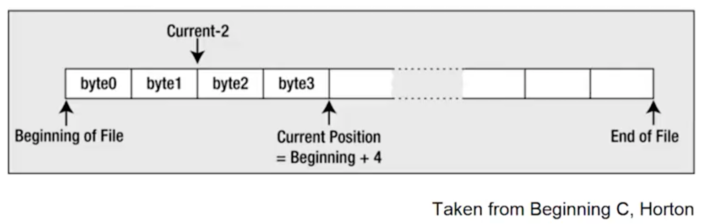

- A file has a beginning and an end a current position (defined as so many bytes from the beginning)

- The current position is where any file action (read/write) will take place
  - You can move the current position to any point in the file (even the end)

### 79.3 Text and Binary Files

- There are two ways of writing data to a stream that represents a file

  - text
  - binary

- Text data is written as a sequence of characters organized as lines (each line ends with a newline)

- Binary data is written as a series of bytes exactly as they appear in memory

  - image data, music encoding - not readable

- You can write any data you like to a file

  - Once a file has been written, it just consists of a series of bytes

- You have to understand the format of the file in order to read it
  - A sequence of 12 bytes in a binary file could be 12 characters, 12 8-bit signed integers, 12 8-bit unsigned integers, etc.
  - In binary mode, each and every byte of the file is accessible

### 79.4 Streams

- C programs automatically open three files on your behalf

  - Standard input - the normal input device for your system, usually your keyboard
  - Standard output - usually your display screen
  - Standard error - usually your display screen

- Standard input is the file that is read by `getchar()` and `scanf()`
- Standard output is used by `puthcar()`, `puts()`, and `printf()`

  - Redirection causes other files to be recongnized as the standard input or standard output.

- The purpose of the standard error output file is to provide a logically distinct place to send error messages

- A stream is an abstract representation of any external soure or destination for data
  - The keyboard, the commmand line on your display, and files on a disk are all examples of things you can work with as streams
  - The C library provides functions for reading and writing to or form data streams
    - You use the same input/output functions for reading and writing any external device that is mapped to a stream

## 80 Accessing Files

### 80.1 Overvieww

- Files on disk have a name and the rules for naming files are determined by your operating system

  - You may have to adjust the names depending on what OS your program is running

- A program references a file through a file pointer (or stream pointer, since it works on more than a file)

  - You associate a file pointer with a file programmatially when the program is run
  - Pointers can be reused to point to different files on different occasions

- A file pointer points to a struct of type `FILE` that represents a stream

  - Contains infomraiton about the file
    - Whether you want to read or write or update the file
    - The address of the buffer in memory to be used for data
    - A pointer to the currnet position in the file for the next operation
  - The above is all set via input/output file operations

- If you want to use several files simultaneously in a program, you need a separate file poiter for each file
  - There is a limit to the number of files you can have open at one time
    - Defined as `FOPEN_MAX` in `stdio.h`

### 80.2 Opening a File

- You associate a specific external file name with an internal file pointer variable through a process referred to as opening a file

  - Via the `fopen()` function
    - Returns the file pointer for a speiific external file

- The `fopen()` function is defined in `stdio.h`

```c
FILE *fopen(const char* restrict name, const char * restrict mode);
```

- The first argument to the function is a pointer to a string that is the name of the external file you want to process

  - You can specify the name explicitly or use a char pointer that contains the address of the character string that defines the file name
  - You can obtain the file name through the command line, as input from the user, or defined as a constant in your program

- The second argument to the `fopen()` function is a character string that represents the file mode

  - Specifies what you want to do with the file
  - A file mode speficication is a character string between double quotes

- Assuming the call to `fopen()` is successful, the function returns a pointer of type `FILE*` that you can use to reference the file in further

- If the file cannot be opened for some reason, `fopen()` returns `NULL`

### 80.3 File Modes (only apply to text files)

| Mode | Description                                                                                                                                       |
| ---- | ------------------------------------------------------------------------------------------------------------------------------------------------- |
| "w"  | Open a text file for write operations. if the file exists, its current cotents are discarded.                                                     |
| "a"  | Open a text file for append operations. All writes are to the end of the file.                                                                    |
| "r"  | Open a text file for read operations.                                                                                                             |
|      |                                                                                                                                                   |
| "w+" | Open a text file for update (reading and writing), first truncating the file to zero lenght if it exists or creating the file if it does not exit |
| "a+" | Open a text file for update (reading and writing) appending to the end of the existing file, or creating the file if it does not yet exist        |
| "r+" | Open a text file for update (for both reading and writing)                                                                                        |

### 80.4 Write Mode

- If you want to write to an existing text file with the name `myfile.txt`

```c
FILE *pfile = NULL;
char *filename = "myfile.txt";
pfile = fopen(filename, "w"); // Open myfile.txt to write it
if(pfile != NULL)
  printf("Failed to ioen %s.\n", filename);
```

- Opens the file and associate the file with name `myfile.txt` with your file pointer file

  - The mode as "w" means you can only write to the file
  - You cannot read it

- If a file with the name `myfile.txt` does not exist, the call to `fopen()` will create a new file with this name

- If you a only provide the file name without any path specification, the file is assumed to be in the current directory

  - You can also specify a string that is the full path and name for the file

- On opening a file for writing, the file length is truncated to zero and the position will be at the beginning of any existing data for the first operation
  - Any data that was previously written to the file will be lost and overwritten by any write operations.

### 80.5 Append Mode

- If you want to add to an existing text file rather than overwrite it

  - Specify mode "a"
  - The append mode of operation

- This positions the file at the end of any previously written data
  - If the file does not exist, a new file will be created

```c
pFile = fopen("myfile.txt", "a"); // Open myfile.txt to add to it
```

- Do not forget that you should test the return value for null each time

- When you open a file in append mode
  - All write operations will be at the end of the data in the file on each write operation
  - All write operations append data to the file and you cannot update the existing contents in this mode

### 80.6 Read Mode

- If you want to read a file
  - Open it with mode arguments as "r"
  - You can not write to this file

```c
pFile = fopen("myfile.txt", "r");
```

- This positions the file to the beginning of the data
- If you are going to read the file

  - It must already exist

- If you try to open a file for reading that does not exist, `fopen()` will return a file pointer of `NULL`

- You always want to check the value returned from `fopen`

### 80.7 Renaming a File

- Renaming a file is very easy
  - Use the `rename()` function

```c
int rename(const char *oldname, const char *newname);
```

- The integer that is returned wlll be 0 if the name change was successful and nonzero otherwise

- The file must not be open when you call `rename()`, otherwise the operation will fail

```c
if(rename("myfile.txt", "myfile_copy.txt"))
  printf("Failed to rename file.");
else
  printf("File renamed successfully.");
```

### 80.8 Closing a File

- When you have finished with a file, you need to tell the operating system so that it can free up the file

  - You can do this by calling `fclose()` function

- `fclose()` accepts a file pointer as an argument
  - returns `EOF (int)` if an error occurs
  - Defined in `stdio.h` as a negtative that is usually euqivalent to the value `-1`
  - 0 if successful

```c
fclose(pfile);
pfile = NULL;
```

- The result of calling `fclose()` is that the connection between pointer, `pfile`, and teh physical file is broken

  - `pfile` can no longer be used to access the file

- If the file was being written, the current contents of the output buffer are written to the file to ensure that data is not lost

- It is good programming practice to close a file as sson as you have finished with it

  - Protects against output data loss

- You must also cloee a file before attempting to rename it or remove it

### 80.9 Deleting a File

- You can delete a file by invoking the `remove()` function
  - Declared in `stdio.h`

```c
remove("myfile.txt");
```

- Will delete the file that has the name `myfile.txt` from the current directory

- The file cannot be oeen when you try to delete it

- You should always double check with operations that delete files
  - You could wreck your system if you do not

## 81 Reading from a File

### 81.1 Reading characters from a text file

- The `fgetc()` function reads a character from a text file that has been opened for reading

- Takes a file pointer as its only argument and returns the character read as type int

```c
// Reads a character into mchar with pfile a File pointer
int mchar = fgetc(pfile);
```

- The mchar is type `int` because `EOF` will be returned if the end of the file has been reached

- The function `getc()`, which is equivalent to `fgetc()`, is also available

  - Requires an argument of type `FILE*` and returns the character read as type `int`
  - Virtually identical to `fgetc()`
  - Only different between them is that `getc()` may be implemented as a `macro`, whereas `fgetc()` is a function

- You can read the contents of a file again when necessary
  - The `rewind()` function positions the file that is specified by the file pointer argument at the beginning

```c
rewind(pfile);
```

### 81.2 Example of `fgetc()`

```c
#include <stdio.h>

int main()
{
  FILE *fp;
  int c;

  fp = fopen("file.txt", "r");

  if (fp == NULL)
  {
    perror("Error in opening file");
    return(-1);
  }

  // Read a single char
  while((c = fgetc(fp) != EOF))
    printf("%c", c);

  fclose(fp);
  fp = NULL;

  return 0;
}
```

### 81.3 Reading a string from a text file

- You can use the `fgets()` function to read from any file or stream

```c
char *fgets(char *str, int nchars, FILE *stream)
```

- The function reads a string into the memory area pointed to by `str`, from the file specified by stream
  - Characters are read until either a `\n` is read or `nchars-1` characters have been read from the stream, whichever occurs first
  - If a newline character is read, it's retaining in the string
    - A `'\0'` character will be appended to the end of the string
  - If there is no error, `fgets()` returns the pointer, `str`
  - If there is an error, `NULL` is returned
  - Reading `EOF` causes `NULL` to be returned

### 81.4 Example of `fgets()`

```c
#include <stdio.h>

int main()
{
  FILE *fp;
  char str[60];

  fp = fopen("file.txt", "r");

  if (fp == NULL)
  {
    perror("Error in opening file");
    return(-1);
  }

  if (fgets(str, 60, fp) != NULL)
  {
    /* Writing content to stdout */
    printf("%s", str);
  }

  fclose(fp);
  fp = NULL;

  return 0;
}
```

### 81.5 Reading formatted input from a file

- You can get formatted input from a file by using the standard `fscanf()` function

```c
int fscanf(FILE *stream, const char *format, ...)
```

- The first argument to this function is the pointer to a `FILE` object that identifies the stream

- The second argument to this function is the format

  - A C string that contians one or more of the following items
    - Whitespace character
    - Non-whitespace character
    - Format specifiers
    - Usage is similar to `scanf()`, but from a file

- Function returns the number of input items successfully matched and assigned

### 81.6 Example of `fscanf()`

```c
#include <stdio.h>
#include <stdlib.h>

int main()
{
    char str1[10], str2[10], str3[10];
    int year;
    FILE *fp;

    fp = fopen("file.txt", "w+");
    if (fp != NULL)
        fputs("Hello how are you", fp);

    rewind(fp);
    fscanf(fp, "%s %s %s %d", str1, str2, str3, &year);

    printf("Reading string1 |%s|\n", str1);
    printf("Reading string2 |%s|\n", str2);
    printf("Reading string3 |%s|\n", str3);
    printf("Reading integer |%d|\n", year);

    fclose(fp);

    return 0;
}
```

## 82 Writing to a File

### 82.1 Writing characters to a text file

- The simplest write operation is provided by the functon `fputc()`
  - Writes a single character to a text file

```c
int fputc(int ch, FILE *pfile);
```

- The function writes the character specified by the first argument to the file identified by the second argument (file pointer)

  - Returns the character that was writtent if successful
  - Return `EOF` if failure

- In practice, characters are not usually written to a physical file one by one

  - Extremely inefficient

- The `putc()` function is equivalet to `fputc()`
  - Requires the same arguments and the return type is the same
  - Different between them is that `putc()` may be implemented in the standard library as a macro, whereas `fputc()` is a function

### 82.2 Example of `fputc`

```c
#include <stdio.h>

int main()
{
  FILE *fp;
  int ch;

  fp = fopen("file.txt", "w+");

  for (ch = 33; ch <= 100; ch++)
  {
    fputc(ch, fp);
  }

  fclose(fp);
  return 0;
}
```

### 82.3 Writing a string to a text file

- You can use `fputs()` function to write to any file or stream

```c
int fputs(const char *str, FILE *pfile);
```

- The first argument is a pointer to the character string that is to be written to the file

- The second argument is the file pointer

- This function will write characters from a string until it reaches a `'\0'` character
  - Does not write the null terminator character to the file
    - Can complicate reading back variable-length strings from a file that have been written by `fputs()`
    - Expecting to write a line of text that has a newline character at the end

### 82.4 Example of `fputs()`

```c
#include <stdio.h>

int main()
{
  FILE *fp;

  fp = fopen("file.txt", "w+");

  fputs("This is c programming.", fp);
  fputs("This is a system programming language.", fp);

  fclose(fp);

  return 0;
}
```

### 82.5 Writing formatted output to a file

- You can get formatted input from a file by using the standard `fprintf()` function

```c
int fprintf(FILE *stream, const char *format, ...)
```

- The first argument to this function is the pointer to a `FILE` object that identifies the stream

- The second argument to this function is the format

  - A C string that contians one or more of the following items
    - Whitespace character
    - Non-whitespace character
    - Format specifiers
    - Usage is similar to `printf()`, but from a file

- If successful, the total number of characters written is returned otherwise, a negative number is returned

### 82.6 Example of `fprintf()`

```c
#include <stdio.h>
#include <stdlib.h>

int main()
{
  FILE *fp = NULL;

  fp = fopen("file.txt", "w+");
  fprintf(fp, "%s %s %s %s %d", "Hello", "my", "number", "is", 888);

  fclose(fp);
  return 0;
}

```

## 83 Finding the Postion in Your File

### 83.1 File Positioning

- For many applications, you need to be able to access data in a file other than sequential order

- There are various functions that you can use to access data in random sequence

- There are two aspects to file positioning

  - Finding out where you are in a file
  - Moving to a given point in a file

- You can access a file at a random position regardless of whether you opened the file

### 83.2 Finding out where you are

- You have two functions to tell you where you are in a file
  - `ftell()`
  - `fgetpos()`

```c
long ftell(FILE *pfile);
```

- This function accepts a file pointer as an argument and returns a long integer value that specifies the current posistion in the file

```c
long fpos = ftell(pfile);
```

- The `fpos` variable now holds the current position in the file and you can use this to return to this position at any subsquenct time
  - Value is the offset in bytes from the beginning of the file

### 83.3 Example of `ftell()`

```c
FILE *fp;
int len;

fp = fopen("file.txt", "r");
if (fp == NULL)
{
  perror("Error opening file");
  return(-1);
}

fseek(fp, 0, SEEK_END); // Go to the end of file

len = ftell(fp);
fclose(fp);

printf("Total size of file.txt = %d bytes\n.", len);
```

### 83.4 `fgetpos()`

```c
int fgetpos(FILE *pfile, fpos_t *position);
```

- The first parameter is a file pointer
- The second parameter is a pointer to a type that is defined in `stdio.h`

  - `fpos_t` is a type that is able to record every position within a file

- The `fgetpos()` function is designed to be used with the positioning function `fsetpos()`

- The `fgetpos()` function stores the current position and file state information for the file in position and returns 0 if the operation is successful
  - Returns a nonzero integer value for failure

```c
fpos_t here;
fgetpos(pfile, &here);
```

- The above records the current file position in the variable here

- You must declare a variable of type `fpos_t`
  - Cannot declare a pointer of type `fpos_t*` because there will not be any memory allocated to store the position data

### 83.5 Example of `fgetpos()`

```c
FILE *fp;
fpos_t position;

fp = fopen("file.txt", "w+");
fgetpos(fp, &position);
fputs("Hello, World!", fp);

fclose(fp);
```

### 83.6 Setting a position in a file

- As a complement to `ftell()`, you have the `fseek()` function

```c
int fseek(FILE *pfile, long offset, int origin);
```

- The first parameter is a pointer to the file you are repositioning

- The second and third parameters define where you want to go in the file

  - Second parameter is an offset from a reference point specified by the third parameter
  - Reference point can be one of three values are specified by the predefined names

    - `SEEK_SET` - defines the beginning of the file
    - `SEEK_CUR` - defines the current position in the file
    - `SEEK_END` - defines the end of the file

  - For a text mode file, the second argument must be a value returned by `ftell()`

  - The third argument for text mode files must be `SEEK_SET`
    - For text files, all operations with `fseek()` are performed with reference to the beginning of the file
    - For binary file, the offset argument is simply a relative byte count
      - Can therefore supply position or negative values for the offset when the reference point is specified as `SEEK_CUR`

### 83.7 Example of `fseek()`

```c
#include <stdio.h>

int main()
{
    FILE *fp = NULL;

    fp = fopen("file.txt", "w+");
    fputs("This is JunLuo.", fp);

    fseek(fp, 8, SEEK_SET);
    fputs("Hello how are you", fp);

    fclose(fp);

    return(0);
}
```

### 83.8 `fsetpos()`

- You have the `fsetpos()` function to go with `fgetpos()`

```c
int fsetpos(FILE *pfile, const fpos_t *position);
```

- The first parameter is a pointer to the open file
- The second is a pointer of the `fpos_t` type
  - The position that is stored at the address was obtained by calling `fgetpos()`

```c
fsetpos(pfile, &here);
```

- The variable here was previously set by a call to `fgetpos()`

- The `fsetpos()` returns a nonzero value on error or 0 when it succeeds

- This function is designed to work with a value that is returned by `fgetpos()`
  - You can only use it to get a place in a file that you have been before
  - `fseek()` allows you to go to any position just by specifying the appropriate offset

### 83.9 Example of `fgetpos()`

```c
#include <stdio.h>

int main()
{
    FILE *fp;
    fpos_t position;

    fp = fopen("file.txt", "w+");
    fgetpos(fp, &position);
    fputs("Hello, world!", fp);

    fsetpos(fp, &position);
    fputs("This is going to override previous contnet.", fp);
    fclose(fp);

    return 0;
}
```

## 84 Challenge of File Input and Output: Find the Number

### 84.1 Requirements

- Write a program to find the total number of lines in a text file

- Create a file that contains some lines of text

- Open your test file

- Use the `fgetc()` function to parse characters in a file until you get to the `EOF`

  - If `EOF` increment counter

- Display as output the total number of lines in the file

## 85 Challenge of ile Input and Output: Convert characters in a File to Uppercase

### 85.1 Requirements

- Write a program that converts characters of a file to uppercae and write the results out a temporary file. Then rename the temporary file to the original filename and remove the temporary filename.

- Use the `fgetc()` and `fputc()` functions

- Use the `rename()` and `remove()` functions

- Use the `islower()` function

  - Can convert a character to upper case by subtracting 32 from it

- Display the contents of the original file to standard output
  - In uppercase

## 86 hallenge of ile Input and Output: Print the Contents of a file in Reverse Order

### 86.1 Requirements

- Write a program that will print the contents of a file in reverse order

- Use the `fseek()` functio nto seek to the end of the file

- Use the `ftell()` function to get the position of the file pointer

- Display as output the file in reverse order

## 87 Standard C Library

### 87.1 Standard Header Files

#### 87.1.1 `<stddef.h>`

The `<stddef.h>` header defines various variable types and macros. Many of these definitions also appear in other headers.

**Library Variables**

| **Definition** | **Description**                                                                 |
| -------------- | ------------------------------------------------------------------------------- |
| `ptrdiff_t`    | This is the signed integral type and is the result of subtracting two pointers. |
| `size_t`       | This is the unsigned integral type and is the result of the `sizeof` keyword.   |
| `wchar_t`      | This is an integral type of the size of a wide character constant.              |

**Library Macros**

| **Definition**                      | **Description**                                                                                                                                                                                                                     |
| ----------------------------------- | ----------------------------------------------------------------------------------------------------------------------------------------------------------------------------------------------------------------------------------- |
| `NULL`                              | This macro is the value of a null pointer constant.                                                                                                                                                                                 |
| `offsetof(type, member-designator)` | This results in a constant integer of type size_t which is the offset in bytes of a structure member from the beginning of the structure. The member is given by member-designator, and the name of the structure is given in type. |

#### 87.1.2 `<limits.h>`

The `<limits.h>` header determines various properties of the various variable types. The macros defined in this header, limits the values of various variable types like char, int and long.

These limits specify that a variable cannot store any value beyond these limits, for example an unsigned character can store up to a maximum value of 255.

| **Macro**    | **Value**            | **Description**                                                                                                                      |
| ------------ | -------------------- | ------------------------------------------------------------------------------------------------------------------------------------ |
| `CHAR_BIT`   | 8                    | Defines the number of bits in a byte.                                                                                                |
| `SCHAR_MIN`  | -128                 | Defines the minimum value for a signed char.                                                                                         |
| `SCHAR_MAX`  | +127                 | Defines the maximum value for a signed char.                                                                                         |
| `UCHAR_MAX`  | 255                  | Defines the maximum value for an unsigned char.                                                                                      |
| `CHAR_MIN`   | -128                 | Defines the minimum value for type char and its value will be equal to SCHAR_MIN if char represents negative values, otherwise zero. |
| `CHAR_MAX`   | +127                 | SCHAR_MAX if char represents negative values, otherwise UCHAR_MAX.                                                                   |
| `MB_LEN_MAX` | 16                   | Defines the maximum number of bytes in a multi-byte character.                                                                       |
| `SHRT_MIN`   | -32768               | Defines the minimum value for a short int.                                                                                           |
| `SHRT_MAX`   | +32767               | Defines the maximum value for a short int.                                                                                           |
| `USHRT_MAX`  | 65535                | Defines the maximum value for an unsigned short int.                                                                                 |
| `INT_MIN	`    | -2147483648          | Defines the minimum value for an int.                                                                                                |
| `INT_MAX`    | +2147483647          | Defines the maximum value for an int.                                                                                                |
| `UINT_MAX`   | 4294967295           | Defines the maximum value for an unsigned int.                                                                                       |
| `LONG_MIN`   | -9223372036854775808 | Defines the minimum value for a long int.                                                                                            |
| `LONG_MAX`   | +9223372036854775807 | Defines the maximum value for a long int.                                                                                            |
| `ULONG_MAX`  | 18446744073709551615 | Defines the maximum value for an unsigned long int.                                                                                  |

```c
#include <stdio.h>
#include <limits.h>

int main() {

   printf("The number of bits in a byte %d\n", CHAR_BIT);

   printf("The minimum value of SIGNED CHAR = %d\n", SCHAR_MIN);
   printf("The maximum value of SIGNED CHAR = %d\n", SCHAR_MAX);
   printf("The maximum value of UNSIGNED CHAR = %d\n", UCHAR_MAX);

   printf("The minimum value of SHORT INT = %d\n", SHRT_MIN);
   printf("The maximum value of SHORT INT = %d\n", SHRT_MAX);

   printf("The minimum value of INT = %d\n", INT_MIN);
   printf("The maximum value of INT = %d\n", INT_MAX);

   printf("The minimum value of CHAR = %d\n", CHAR_MIN);
   printf("The maximum value of CHAR = %d\n", CHAR_MAX);

   printf("The minimum value of LONG = %ld\n", LONG_MIN);
   printf("The maximum value of LONG = %ld\n", LONG_MAX);

   return(0);
}
```

#### 87.1.3 `<stdbool.h>`

`<stdbool.h>` - file contains definitions for working with Boolean variables (`type _Bool`)

| **Define** | **Meaning**                                 |
| ---------- | ------------------------------------------- |
| `bool`     | Substitute name for basic `_Bool` data type |
| `true`     | Defined as 1                                |
| `false`    | Defined as 0                                |

### 87.2 Various Functions

#### 87.2.1 String Functions

- To use any of these functions, you need to include the header file `<string.h>`

- `char *strcat(s1, s2)`

  - Concatenates the character string `s2` to the end of `s1`, placing a null character at the end of the final string. The function returns s1.

- `char *strchr(s, c)`

  - Searchs the string `s` for the first occurrence of the character `c`. If it is found, a pointer to the character is returned; otherwise, a null pointer is returned.

- `int strcmp(s1, s2)`

  - Compares strings `s1` and `s2` and returns a value less than zero if `s1` is less than `s2`, equal to zero if `s1` is equal to `s2`, and greater than zero i f`s1` is greater than `s2`.

- `char *strcpy(s1, s2)`

  - Copies the string `s2` to `s1`, returning `s1`

- `size_t strlen(s)`

  - Returns the number of characters in `s`, excluding the null character

- `char *strncat(s1, s2, n)`

  - Copies `s2` to the end of `s1` until either the null chracter is reached or `n` characters have been copied, whichever occurs first. Return `s1`.

- `int strncmp(s1, s2, n)`

  - Performs the same function as `strcmp()`, except that at most n characters from the string are compared.

- `char *strrchr(s, c)`

  - Searches the string `s` for the last occurrence of teh character `c`. if found, a pointer to the character in `s` is returned; otherwise, the null pointer is returned.

- `char *strstr(s1, s2)`

  - Searches the string `s1` for the first occurrence of the string `s2`. If found, a pointer to the start of where `s2` is located inside `s1` is returned, otherwise, if `s2` is not located inside `s1`, the null pointer is returned.

  - `char *strtok(s1, s2)`
    - Breaks the string `s1` into tokens based on delimiter characgters in `s2`

#### 87.2.2 Character Functions

- To use these character functions, you must include the file `<ctype.h>`

- `isalnum()`, `isalpha()`, `isblank()`, `iscntrl()`, `isdigit()`, `isgraph()`, `islower()`, `isspace()`, `ispunct()`, `isupper()`, `isxdigit()`

#### 87.2.3 I/O Functions

- To use the most common I/O functions from the C library you should include the header file `<stdio.h>`

- Included in this file are declarations for the I/O functions and definitions for the names `EOF`, `NULL`, `stdin`, `stdout`, `stderr` (all constant values), and `FILE`

- `int fclose(filePtr)`

  - Closes the file identified by `filePtr` and returns zero if the close is successful, or returns `EOF` if an error occurs.

- `int feof(filePtr)`

  - Return nonzero if the identified file has reached the end of the file and returns zero otherwise

- `int fflush(filePtr)`

  - Flushes (writes) any data forom internal buffers to the indicated file, returnning zero on success and the value `EOF` if an error occurs.

- `int fgetc(filePtr)`

  - Returns te next character from the file identified by `filePtr`, or the value `EOF` if an end-of-file condition occurs.
  - Remember that this function returns an int

- `int fgetpos(filePtr, fpos)`

  - Gets the current file position for the file associated with `filePtr`, storing it into the `fpos_t` (defined in `<stdio.h>`) variable pointed to by `fpos`, `fgetpos` returns zero on success, and returns nonzero on failure.

- `char *fgets(buffer, i, filePtr)`

  - Reads characters from the indicated file, until either i - 1 characters are read or a newline character is read, whichever occurs first.

- `FILE *fopen(fileName, accessMode)`

  - Opens the specified file with the indicated access mode.

- `int fprintf(filePtr, format, arg1, arg2, ..., argn)`

  - Writes the specified arguments to the file identifed by `filePtr`, according to the format specified by the character string format.

- `int fputc(c, filePtr)`

  - Writes the value of c to the file identified by `filePtr`, returning c if the write is successful, and the value `EOF` otherwise

- `int fputs(buffer, filePtr)`

  - Writes the characters in the array pointed to by buffer to the indicated file until the terminating null character in buffer is reached.

- `int fscanf(filePtr, format, arg1, arg2, ..., argn)`

  - Reads data items from the file identified by `filePtr`, according to the format specified by the character string format

- `int fseek(filePtr, offseet, mode)`

  - Positions the indicated file to a point that is offset (a long int) bytes from the beginning of the file, from the current postion in the file, or from theend of the file, depending upon the valide of mode (an integer).

- `int fsetpos(filePtr, fpos)`

  - Sets the current file position for the file associated with filePtr to the value pointed to by `fpos`, which is of type `fpos_t` (defined in `<stdio.h>`). Returns zero on success, and nonzero on failure.

- `long ftell(filePtr)`

  - Returns the relative offset in bytes of the current position in the file identified by `filePtr`, or -1L on error.

  - `int printf(format, arg1, arg2, ..., argn)`

    - Writes the specified arguments to `stdout`, according to the format specified by the character string.
    - Returns the number of characters written.

  - `int remove(fileName)`

    - Removes the specified file. A nonzero value is returned on failure.

  - `int rename(fileName1, fileName2)`

    - Renames the file `fileName1` to `fileName2`, returning a nonzero result on failure.

  - `int scanf(format, arg1, arg2, ..., argn)`
    - Reads items from `stdin` according to the format specified by the string format.

#### 87.2.4 Conversion Functions

- To use these functions convert character strings to numbres you must include the header file `<stdlib.h>`

- `double atof(s)`
  Converts the string pointed to by `s` into a floating-point number, returning the result.

- `int atoi(s)`

  - Converts the string pointed by `s` into an int, returning the result

- `int atol(s)`

  - Converts the string pointed to by `s` into a long int, returning the result.

- `int atoll(s)`
  - Converts the string pointed to by `s` into long long int, returning the result.

#### 87.2.5 Dynamic Memory Functions

- To use these functions that allocate and free memory dynamically you must include the `<stdlib.h>` header file

- `void *calloc(n, size)`

  - Allocates contiguous space for n items of data, where each item is size bytes in length. The allocated space is initially set to all zeros. On success, a pointer to the allocated space is returned; on failure, the null pointer is returned.

- `void free(pointer)`

  - Returns a block of memory pointed to by pointer that was previously allocated by a `calloc()`, `malloc()`, or `realloc()` call

- `void *malloc(size)`

  - Allocates contiguous space of size bytes, returning a pointer to the beginning of teh allocated block if successful, and the null pointer otherwise

- `void *realloc(pointer, size)`
  - Changes the size of a previously allocated block to size bytes, returning a pointer to the new block (which might have moved). Or a null pointer if an error occurs.
