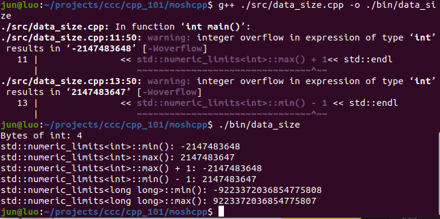

# CodeWithMosh C++ - Part 1

## 1 The Basics

### 1.1 Variables

### 1.2 Constants

### 1.3 Naming Conventions

```cpp
int file_size;      // Snake Case
int FileSize;       // Pascal Case
int fileSize;       // Camel Case
int iFileSize;      // Hungarian Notation - Old days
```

### 1.4 Mathematical Expressions

### 1.5 Order of Operators

### 1.6 Writing Output to the Console

### 1.7 Reading from the Console

```cpp
#include<iostream>

int main() {
    std::cout << "Enter values for x and y: ";
    double x;
    double y;
    std::cin >> x >> y;
    std::cout << x + y << std::endl;

    return 0;
}
```

### 1.8 Working with the Standard Library

### 1.9 Comments

## 2 Fundamental Data Types

### 2.1 Intializating Variables

### 2.2 Working with Numbers

```cpp
#include <iostream>

int main() {
    int number = 255;
    std::cout << number << std::endl;

    int b_number = 0b11111111;
    std::cout << b_number << std::endl;

    int h_number = 0xff;
    std::cout << h_number << std::endl;

    unsigned int u_number = 0;
    std::cout << "Stay away with the unsigned keywork: unsigned 0 - 1 = ";
    std::cout << u_number - 1 << std::endl;

    return 0;
}
```

### 2.3 Narrowing

### 2.4 Generating Random Numbers

```cpp
#include <iostream>
#include <cstdlib>

int main() {
    srand(8);
    int number = rand();
    std::cout << number << std::endl;

}
```

Every time we run the program, we get the same number unless we change the seed of `srand()`.

These numbers are not really random, they are basically based on some kind of mathematical formula. To get the random number, we need to seed the random number generator with a different value.

```cpp
#include <iostream>
#include <cstdlib>
#include <ctime>

int main() {
    long elapsedSeconds = time(nullptr); // Jan 1 1970
    std::cout << "elapsedSeconds: " << elapsedSeconds << std::endl;
    srand(elapsedSeconds);
    int number = rand() % 100;
    std::cout << number << std::endl;

}
```

**Exercise: Write a program for rolling dice.**

[rand() % (maxValue - minValue + 1)] + minValue

```cpp
#include <iostream>
#include <cstdlib>
#include <ctime>

#define maxValue 6
#define minValue 0

int main()
{
    srand(time(nullptr));
    int dice = (rand() % (maxValue - minValue + 1)) + minValue;
    std::cout << "Rolling dice result: " << dice << std::endl;
}
```

### 2.5 Formating Output

- A stream manipulator is a function that we can use for manipulating or modifying a stream.

  - `#include <iomanip>` - IO manipulator

- `setw()`
  - set with
  - given the number of characters for reserving for the data that comes after

```c
#include <iostream>
#include <iomanip>

int main() {

    std::cout << "Formating the data into columns here: " << std::endl;
    std::cout << std::left;
    std::cout << std::setw(8) << "Spring" << std::setw(8) << "Nice" << std::endl;
    std::cout << std::setw(8) << "Summer" << std::setw(8) << "Hot" << std::endl << std::endl;

    std::cout << "Formating the float data here: " << std::endl;
    std::cout << std::fixed << std::setprecision(8) << 12.3456 << std::endl
              << 22.3344 << std::endl;

    return 0;
}
```

```cpp
#include <iostream>
#include <iomanip>

#define cppStudentNumber 160
#define javaScriptStudentNumber 80

int main() {

    std::cout << std::left;
    std::cout << std::setw(16) << "Course" << std::setw(16) << "Students" << std::endl;
    std::cout << std::setw(16) << "C++" << std::setw(16) << cppStudentNumber << std::endl;
    std::cout << std::setw(16) << "JavaScript" << std::setw(16)  << javaScriptStudentNumber << std::endl;

    return 0;
}
```

### 2.6 Data Types Size and Limits

**FUNDAMENTAL TYPES**

| Type  | Bytes | Range             |
| ----- | ----- | ----------------- |
| short | 2     | -32,768 to 32,767 |
| int   | 4     | -2B to 2B         |
| long  | 4     | Same              |
| long  | 8     |                   |

```cpp
#include <iostream>
#include <limits>

int main() {
    std::cout << "Bytes of int: " << sizeof(int) << std::endl;
    std::cout << "std::numeric_limits<int>::min(): "
              << std::numeric_limits<int>::min() << std::endl
              << "std::numeric_limits<int>::max(): "
              << std::numeric_limits<int>::max() << std::endl
              << "std::numeric_limits<int>::max() + 1: "
              << std::numeric_limits<int>::max() + 1<< std::endl
              << "std::numeric_limits<int>::min() - 1: "
              << std::numeric_limits<int>::min() - 1 << std::endl
              << "std::numeric_limits<long long>::min(): "
              << std::numeric_limits<long long>::min() << std::endl
              << "std::numeric_limits<long long>::max(): "
              << std::numeric_limits<long long>::max() << std::endl;
    return 0;
}
```



### 2.7 Working with Booleans

### 2.8 Working with Characters and Strings

### 2.9 Working with Arrays

### 2.10 Type Conversion

Using the `static_cast<int>` instead of `(int)`, if the casting failed, the compiler will tell us.

```cpp
#include <iostream>

int main()
{
    int x = 1;
    double y = 2.0;
    int z = x + static_cast<int>(y);
    std::cout << z << std::endl;
    return 0;
}
```

## 3 Decision Making

### 3.1 Comparison Operators

### 3.2 Logical Operators

### 3.3 Order of Logical Operators

### 3.4 If Statements

### 3.5 Nested If Statements

### 3.6 Tge Conditional Operator

### 3.7 The Switch Statement

## 4 Loops

### 4.1 The for Loop

### 4.2 Range based for Loops

### 4.3 While Loops

### 4.4 Do While Loops

### 4.5 Break and Continue Statements

### 4.6 Nested Loops

## 5 Functions

### 5.1 Defining and Calling Functions

### 5.2 Parameters with a Default Value

### 5.3 Overload Functions

### 5.4 Overloading Functions

### 5.5 Passing Arguments by Value or Reference

```cpp
#include <iostream>
#include <string>

void greet(const std::string& name){
    std::cout << "Hello " << name << std::endl;
    // name = "new " + name;
    // std::cout << "Name changed to: " << name << std::endl;
};

int main()
{
    std::string name = "Jun";
    greet(name);

    return 0;
}
```

### 5.6 Local vs Global Variables

### 5.7 Declaring Functions

### 5.8 Organizing Functions in Files

```cpp
// utils/greet.hpp
#ifndef UTILIS_GREET
#define UTILIS_GREET

#include <iostream>
#include <string>

void greet(const std::string name);

// void greet(const std::string& name){
//     std::cout << "Hello " << name << std::endl;
// };

#endif
```

```cpp
// utils/greet.cpp
#include "greet.hpp"

void greet(const std::string name){
    std::cout << "Hello " << name << std::endl;
};
```

```cpp
#include <iostream>
#include "utils/greet.hpp"

int main(int argc, char **argv) {

    std::string name = "JunLuo";

    greet(name);

    return 0;
}
```

```sh
g++ ./src/main.cpp ./src/utils/greet.cpp -o ./bin/main
```

### 5.9 Using Namespace

```cpp
//utils/greet.hpp

#ifndef UTILIS_GREET
#define UTILIS_GREET

#include <iostream>
#include <string>

namespace messaging {
    void greet(const std::string name);
}


// void greet(const std::string& name){
//     std::cout << "Hello " << name << std::endl;
// };

#endif
```

```cpp
//utils/greet.cpp

#include "greet.hpp"

namespace messageing {

    void greet(const std::string name){
        std::cout << "Hello " << name << std::endl;
    };
}
```

```cpp
#include <iostream>
#include "utils/greet.hpp"

int main(int argc, char **argv) {

    std::string name = "JunLuo";

    messaging::greet(name);

    return 0;
}
```

### 5.10 Debugging C Programs
