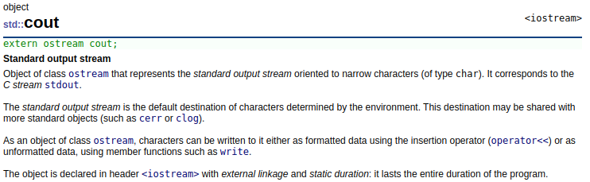

# CodeWithMosh C++ - Part 2

## 1 Arrays

### 1.1 Creating and Initializing Arrays

```cpp
#include <iostream>

int main() {

    int numbers[4] = {10, 20};

    std::cout << numbers[0] << std::endl;

    return 0;
}
```

### 1.2 Determing the Size of Arrays

```cpp
#include <iostream>

int main() {

    int numbers[4] = {10, 20};

    // Do NOT use this method, big wasting on the memory!!!
    for (int i = 0; i < sizeof(numbers) / sizeof(int); i++)
        std::cout << numbers[i] << std::endl;

    for (int number: numbers)
        std::cout << number << std::endl;

    return 0;
}
```

### 1.3 Copying Arrays

```cpp
#include <iostream>

#define ARRAY_SIZE 4

int main() {

    int first_numbers[ARRAY_SIZE] = {10, 20};
    int second_numbers[ARRAY_SIZE];

    int size = sizeof(first_numbers) / sizeof(int);
    for (int i = 0; i < size; i++)
        second_numbers[i] = first_numbers[i];

    for (int number : first_numbers)
        std::cout << number << std::endl;

    for (int number : second_numbers)
        std::cout << number << std::endl;

    return 0;
}
```

### 1.4 Comparing Arrays

```cpp
#include <iostream>

// #define ARRAY_SIZE 4


int main() {

    int first[] = {10, 20, 30, 40};
    int second[] = {10, 20, 30, 40};

    bool areEqual = true;
    int size = sizeof(first) / sizeof(int);
    for (int i = 0; i < size; i++)
    {
        if (first[i] != second[i])
        {
            areEqual = false;
            break;
        }
    }

    std::cout << areEqual << std::endl;

    return 0;
}
```

### 1.5 Passing Arrays to Functions

```cpp
#include <iostream>

// #define ARRAY_SIZE 4

void printNumbers(const int *numbers, const int size) {
    for (int i = 0; i < size; i++)
        std::cout << numbers[i] << " ";
    std::cout << std::endl;
}

int main() {

    int numbers[] = {10, 20, 30, 40};
    int size = sizeof(numbers) / sizeof(int);
    printNumbers(numbers, size);

    return 0;
}
```

### 1.6 Understanding size_t

Both the `size` function as well as the `sizeof` operator return a value of type `size_t`. `t` here is short for type, or a data type defined in the standard library that is used for representing the size of objects. It's guaranteed to be large enough to contain the size of the largest object the system can handle.

```cpp
#include <iostream>

using namespace std;

int main() {
    int number[] = { 10, 20, 30 };
    cout << "sizeof(int): " << sizeof(int) << endl;
    cout << "sizeof(size_t): " << sizeof(size_t) << endl;
    cout << "sizeof(long long): " << sizeof(long long) << endl;

    return 0;
}
```

```sh
sizeof(int): 4
sizeof(size_t): 8
sizeof(long long): 8
```

An integer takes 4 bytes, but the `size_t` value takes 8 bytes, so it takes more memory and can store larger values. This is equivalent to the `long long` type, which takes 8 bytes of memory.

The difference is that `long long` values are signed by default, so they can be negative or positive, but `size_t` values are always positive, so they can store larger values.

```cpp
#include <iostream>
#include <limits>

using namespace std;

int main() {
    int number[] = { 10, 20, 30 };
    cout << "sizeof(int): " << sizeof(int) << endl;
    cout << "sizeof(size_t): " << sizeof(size_t) << endl;
    cout << "sizeof(long long): " << sizeof(long long) << endl;
    cout << "std::numeric_limits<long long>::min()" << std::numeric_limits<long long>::min() << endl;
    cout << "std::numeric_limits<long long>::max()" << std::numeric_limits<long long>::max() << endl;
    cout << "std::numeric_limits<size_t>::min()" << std::numeric_limits<size_t>::min() << endl;
    cout << "std::numeric_limits<size_t>::max()" << std::numeric_limits<size_t>::max() << endl;

    return 0;
}
```

```sh
sizeof(int): 4
sizeof(size_t): 8
sizeof(long long): 8
std::numeric_limits<long long>::min()-9223372036854775808
std::numeric_limits<long long>::max()9223372036854775807
std::numeric_limits<size_t>::min()0
std::numeric_limits<size_t>::max()18446744073709551615
```

| `size_t` equivalent | machine type |
| ------------------- | ------------ |
| unsing int          | 32 bit       |
| unsing long long    | 64 bit       |

There is nothing magical about it, it's just a data type for representing the sizes, this type is guaranteed to be large enough to contain the size of the largest object the system can handle.

### 1. Unpacking Arrays

- C++: str7uctured binding
- JavaScript: destructuring
- Python: unpacking

```cpp
#include <iostream>

using namespace std;

int main() {
    int values[] = { 10, 20, 30 };
    auto [x, y, z] = values;

    // int x = values[0];
    // int y = values[1];
    // int c = values[2];

    cout << "x: " << x << endl;
    cout << "y: " << y << endl;
    cout << "z: " << z << endl;

    return 0;
}
```

### 1.8 Searching Arrays - Linear Searching


**EXERCISE**

Implement the linear search algorithm.

Create a function for finding a value in an integer array. If the target value exists, return its index; otherwise return -1.

```cpp
#include <iostream>

using namespace std;

int find(int *numbers, int size, int target);

int main() {

    int numbers[] = { 10, 20, 30 };

    int index = find(numbers, 3, 20);

    cout << index << endl;

    return 0;
}

int find(int *numbers, int size, int target) {

    for (size_t i = 0; i < size; i++) {
        if (numbers[i] == target)
            return i;
    }

    return -1;
}
```

### 1.9 Sorting Arrays - Bubble Sorting


Let's say we have an area of integers and we want to sort this array in an increasing order with bubble sort algorithm.

We scan the array from left to right, and if items are out of order we swap them. So we start off by comparing the items at index 0 and 1, if the right item is smaller than the left item, we swap them because we want to sort this aray in ascending order.


So here 2 is smaller than 9 and we have to swap them, now we compare the items at index 1 and 2.


Again the right item is smaller, so we have to swap these items as well.


One more time, again we have to swap these items.


And one last time.


This was our first iteration or first pass, we need multiple passes to fully sowrdness array, at the end of each pass, the next largest item moves to its correct position. So here 8 is in the correct position.


This is why we call this algorithm "Bubble Sword". Because after each pass, the next largest item bubbles up, and moves to its correct position.


So in the next pass, the next largest item which is 4 will bubble up. Once again we compare the items at index 0 and 1, these items are in the right order, because 4 is greater than 2, so we don't need to swap them.


Let's look at the next 2 items, 1 is smaller than 4, so we should swap these items.


And one more time, again these items are out of order, so we need to swap them.


And the last items are in the right order, so we're done with the second pass, now 4 is in the right position.


As you can see, our array is almost sorted, we just need one more pass to swap 2 and 1, and then our array will be fully sorted.


```cpp
#include <iostream>

using namespace std;

void swap(int *numbers, int i, int j);
void sort(int *numbers, int size);

int main() {

    int numbers[] = { 8, 2, 4, 1, 3 };
    int size = sizeof(numbers) / sizeof(int);
    sort(numbers, size);

    for (int i = 0; i < size; i++)
        cout << numbers[i] << endl;

    return 0;
}

void swap(int *numbers, int i, int j) {
    int temp = numbers[i];
    numbers[i] = numbers[j];
    numbers[j] = temp;
}

void sort(int *numbers, int size) {
    for (int pass = 0; pass < size; pass++) {
        for (int i = 1; i < size; i++) {
            if (numbers[i] < numbers[i - 1])
                swap(numbers, i, i-1);
        }
    }
}
```

### 1.10 Multi-dimensional Arrays

```cpp
#include <iostream>

#define ROW 2
#define COL 3

void printMatrix(int matrix[ROW][COL]){
    for (int row = 0; row < ROW; row++)
    {
        for (int col = 0; col < COL; col++)
            std::cout << matrix[row][col] << " ";
        std::cout << std::endl;
    }
}

int main() {

    int matrix[ROW][COL] = {
        {11, 12, 13},
        {21, 22, 23}
    };

    printMatrix(matrix);

    return 0;
}
```

## 2 Pointers

### 2.1 What is a Pointer?

**Pointer is a special variable that hold the address of another variable in memory.**


**The reasons for using pointers:**

- Efficently passing large objects
- Dynamic memory allocation
- Enabling polymorphism

### 2.2 Delcaring and Using Pointers

```cpp
#include <iostream>

int main() {

    int number = 10;
    std::cout << "&number: " << &number << std::endl;

    int* ptr = &number;

    std::cout << "ptr: " << ptr << std::endl;
    std::cout << "*ptr: " << *ptr << std::endl;

    // Indirection (de-referencing) operator
    *ptr = 20;
    std::cout << "*new ptr : " << *ptr << std::endl;

    int* newPtr = nullptr;  // NULL - conventional C
                            // 0 - ealier C++

    std::cout << "nullptr: " << newPtr << std::endl;


    return 0;
}
```

### 2.3 Constant Pointers

**3 Scenarios**

1. Data is constant
2. Pointer is constant
3. Both data and pointer are constant

```cpp
/* Scenario 1: Data is constant */

#include <iostream>

int main() {

    const int x = 10;
    // int* ptr = &x; // Error
    const int* ptr = &x;

    int y = 20;
    ptr = &y; // Pointer is not constant

    return 0;
}
```

```cpp
/* Scenario 2: Pointer is constant */

#include <iostream>

int main() {

    int x = 10;
    int* const ptr = &x;

    int y = 20;
    // ptr = &y; // Error

    *ptr = 20;

    return 0;
}
```

```cpp
/* Scenario 3: Pointer and Data are constant */

#include <iostream>

int main() {

    const int x = 10;
    const int* const ptr = &x;

    int y = 20;
    // ptr = &y; // Error

    // *ptr = 20; // Error

    return 0;
}
```

### 2.4 Passing Pointers to Functions

```cpp
#include <iostream>

void increasePrice(double* price) {
    *price *= 1.2;
}

int main() {

    double price = 100;
    double *ptr = &price;
    increasePrice(ptr);

    std::cout << "Price: " << price << std::endl;

    return 0;
}
```

```cpp
#include <iostream>

void swap(int* first, int* second) {
    int temp = *first;
    *first = *second;
    *second = temp;
}

int main() {

    int a = 40;
    int *ptr_a = &a;
    int b = 80;
    int *ptr_b = &b;

    std::cout << "a = " << a << ", b = " << b <<std::endl;

    swap(ptr_a, ptr_b);
    std::cout << "a = " << a << ", b = " << b <<std::endl;

    return 0;
}
```

### 2.5 The Relationship Between Arrays and Pointers

### 2.6 Pointer Arithmetic

```cpp
#include <iostream>

using namespace std;

int main() {

    int numbers[] = { 10, 20, 30 };
    int* ptr = numbers;

    ptr++; // Increament by the size of element

    cout << *ptr << endl; // 20 -> not used
    cout << *(ptr + 1) << endl; // 30

}
```

### 2.7 Comparing Pointers

```cpp
#include <iostream>

using namespace std;

int main() {

    int x = 10;
    int y = 20;

    int* ptrX = &x;
    int* ptrY = &y;
    int *ptrXX = &x;

    if (ptrX == ptrY)
        cout << "ptrX == ptrY: " << "Same" << endl;
    else
        cout << "ptrX == ptrY: " << "Different" << endl;

    if (ptrX == ptrXX)
        cout << "ptrX == ptrXX: " << "Same" << endl;
    else
        cout << "ptrX == ptrXX: " << "Different" << endl;

    return 0;
}
```

In the quality comparisom is avoiding null pointers, as a best practice, whenever we want to use a pointer, we should make sure it's not a null pointer.

Before we are dereferencing the pointer `ptrX`, we should make sure `ptrX` is not an null pointer.

```cpp
if (ptrX != nullptr)
    std::cout << *ptrX;
```

**EXERCISE**

Given this array:

```cpp
int numbers[] = { 10, 20, 30 };
```

Create a pointer that points to the last element in this array.

Use a while loop to iterate over this array, and print the numbers in reverse order.

```cpp
#include <iostream>

using namespace std;

int main() {

    int numbers[] = { 10, 20, 30 };
    int* ptr = numbers;
    int* last = ptr + 2;

    cout << "Last element: " << *last << endl;

    while (ptr != last) {
        cout << *last << " ";
        last--;
    }
    cout << *ptr;
    cout << endl;

    return 0;
}
```

```cpp
#include <iostream>

using namespace std;

int main() {

    int numbers[] = { 10, 20, 30 };
    int* ptr = &numbers[size(numbers) - 1];

    while (ptr >= numbers) {
        cout << *ptr << " ";
        ptr--;
    }
    cout << endl;

    return 0;
}
```

### 2.8 Dynamic Memory Allocation

The second applicational pointers in dynmaic memory allocation, so if you declare an area of integers like this, you are limiting our program to handle a maximum of 10 numbers.

```cpp
int numbers[10];
```

Now what if we run the program and we get more than 10 numbers from the user or as part of reading a file. Well we can increase the size of this array to 100 or 1000 or even more, but again there is always a limit.

Now we receive only a single value from the user then we are wasted a lot of space, just to store a single value. This is where dynamic memory allocation helps, so instead of committing to a high number, like 1000 initially.

We can allocate space for storing let's say 10 numbers, then during our program execution or at runtime. If we need more space we can allocate it on **Demont**, this is dynamic memory allocation.

Now to allocate memory dynamically, we are going to use a different syntax, we cannot use this syntax to declare variables.

So to do that we are going to use the new operator followed by the target type which is on integer array. Here in square brackets we specify the initial size like 10, now this returns an integer pointer.

```cpp
new int[10];
```

Now this returns an integer pointer, so we store it in a variable called numbers.

```cpp
int* numbers = new int[10];
```

Now when we declare a variable using this syntax that variable is declared in a prt of memory called **heap** or **free store**. In contrast with the first syntax that variable is declared on a different part of memory called the **stack**.

The great things about variables declared on the **stack** is that they get automatic clean up, so once they go out of scope, the memory that was allocated to them, gets released automatically.

In this case, you know that the scope of this variable is limited to this function. So once this function finishes execution, our number is variable is going to go out of scope and the memory that was allocated to it will get released automatically.

So it can be reused in the future, now in contrast, when we declare a variable on the heap using the new operator. We programmers are responsible for the cleanup and that means if we don't do our job properly, that memory that was allocted for these variables will never get released and our program will end up consuming more and more memory and eventually is going to crash. We say our program is having a **memory leak**, meaning it's constantly consuming more and more memory.

So once we are finished with this variable, then we should always dealocate memory usin the `delete` operator. Now here we are dealing with an array, so we should type square brackets.

```cpp
delete[] numbers;
```

We can also use this declaration to allocate a single integer on the heap.

```cpp
int* number = new int;
```

Technically there's really no reason we ever want to do with this because it's much easier to declare an integer on the stack, and with this we don't have to wory about cleanup.

**Reset the pointers:**

```cpp
number = nullptr;
numbers = nullptr;
```

This was the basic of dynamic memory allocation, using the `new` and `delete` operators.

### 2.9 Dynmaically Resizing an Array

```cpp
#include <iostream>
#include <cstdlib>
using namespace std;

int main() {
    int capacity = 5;
    int* numbers = new int[capacity];
    int entries = 0;

    while (true)
    {
        cout << "Number: ";
        cin >> numbers[entries];
        if(cin.fail()) break;
        entries++;
        if (entries == capacity)
        {
            // Create a temp array (twice the size)
            capacity *= 2;
            int* newNumbers = new int[capacity];
            // Copy all the elements
            for (int i = 0; i < capacity; i++)
            {
                newNumbers[i] = numbers[i];

            }
            // Have "number" pointer point to the new array
            delete[] numbers;
            numbers = newNumbers;
        }
    }

    for (int i = 0; i < entries; i++)
        cout << numbers[i] << endl;

    delete[] numbers;

    return 0;
}
```

### 3.0 Smart Pointers

#### 3.1 Working with Unique Pointers

A unique pointer is a kind of pointer that owns the piece of memory points to, so we cannot have 2 unique pointers pointing to the same memory location -> for that we have to use the share pointer.


- **_To `#include <memory>`_**
- In this cpp file, we have a type called unique pointer `uniuqe_ptr` which is a class.
- This is a generic class, so we can work with different data types, so right after the class name, we type `<>`.
- In side the `<>`, we are specified the type of pointer we want to create - `<int>`.
- Now we need to give our variable a name, like `x`, then we type a pair of `()`.
- Inside the `()` we use the new operator to create an integer pointer `(new int)`.
- Enssentially we're creating an integer pointer here and then passing that to the variable `x` which is called an object.
- Now this object is an instance of the unique pointer class.
- So in this class we have a bunch of code we have some functions and one of this functions is going to be responsible for deleting this integer pointer that we have created over here.

```cpp
#include <iostream>
#include <memory>

using namespace std;

int main()
{
    // unique_ptr<int> x(new int);
    auto x = make_unique<int>();
    // unique_ptr<int> y = make_unique<int>();
    auto y = make_unique<int>();

    auto numbers = make_unique<int[]>(10);

    *x = 10;
    cout << *x << endl;

    cout << numbers[0] << endl;

    return 0;
}
```

#### 3.2 Working with Shared Pointers

Using share pointer, we can have to pointers pointing to the same memory location.


```cpp
#include <iostream>
#include <memory>

using namespace std;

int main()
{
    // shared_ptr<int> x = make_shared<int>();
    auto x = make_shared<int>();

    *x = 10;

    shared_ptr<int> y(x);

    if (x == y)
        cout << "Equal" << endl;

    return 0;
}
```

## 3 String

### 3.1 C Strings

### 3.2 C++ Strings

### 3.3 Modifying Strings

```cpp
#include <iostream>
#include <string>

using namespace std;

int main()
{
    string name = "Jun";

    name.append(" Luo");
    cout << name << endl;


    name.insert(0, "I am ");
    cout << name << endl;

    name.erase(0, 4);
    cout << name << endl;

    name.replace(0, 4, "I am");
    cout << name << endl;

    return 0;
}
```

```sh
Jun Luo
I am Jun Luo
 Jun Luo
I am Luo
```

### 3.4 Searching Strings

```cpp
#include <iostream>
#include <string>

using namespace std;

int main()
{
    string name = "Jun Luo";

    cout << name.find('L') << endl;

    if (name.find("Ant") == -1)
        cout << "Doesn't Exist!" << endl;

    cout << name.find("Jun") << endl;

    cout << name.find_last_of('u') << endl;

    cout << name.find_last_not_of('u') << endl;

    return 0;
}
```

### 3.5 Extracting Substrings

```cpp
#include <iostream>
#include <string>

using namespace std;

int main()
{
    string name = "Jun Luo";
    size_t index = name.find(' ');
    string firstName = name.substr(0, index);
    string lastName = name.substr(index + 1);

    cout << "(" << firstName << ")" << endl;
    cout << "(" << lastName << ")" << endl;

    return 0;
}
```

### 3.6 Working with Characters

```cpp
#include <iostream>
#include <string>

using namespace std;

int main()
{
    string name = "Jun Luo";

    cout << islower(name[0]) << endl;
    cout << isupper(name[0]) << endl;
    cout << isalpha(name[0]) << endl;
    cout << isdigit(name[0]) << endl;
    cout << isspace(name[0]) << endl;
    // ...

    return 0;
}
```

**EXERCISE**

Given the following format for customer numbers:

2 alphabetic characters
4 digits

Write a function to validate a customer number

```cpp
bool isValid(const string customerNumber);
```

```cpp
#include <iostream>

using namespace std;

bool isValid(const string customerNumber)
{
    if (customerNumber.length() != 6)
        return false;

    for (int i = 0; i < 2; i++)
        if(!isalpha(customerNumber[i]))
            return false;

    for (int i = 2; i < customerNumber.length(); i++)
        if(!isdigit(customerNumber[i]))
            return false;

    return true;

}

int main()
{
    string customerNumber = "AB1234";

    cout << isValid(customerNumber) << endl;

    return 0;
}
```

### 3.7 String_Numeric Conversion Functions

```cpp
#include <iostream>

using namespace std;


int main()
{
    double price = stod("19.99");

    cout << price << endl;

    cout << to_string(19.99) << endl;

    return 0;
}
```

### 3.8 Escape Sequence

```cpp
#include <iostream>

using namespace std;


int main()
{
    string str = "c:\my folder";

    cout << str << endl;

    return 0;
}
```


```cpp
string str = "c:\\my folder";
string str = "\"Hello World\"";
```

### 3.9 Raw Strings

```cpp
string str = R"("Hello World")";
```

## 4 Structures and Enumerations

### 4.1 Defining Structures

```cpp
#include <iostream>

using namespace std;

struct Customer {
    int id;
    string name;
    string email;
};

int main()
{
    Customer customer;

    cout << "ID: ";
    cin >> customer.id;

    cout << "Name: ";
    cin >> customer.name;

    cout << "Email: ";
    cin >> customer.email;

    cout << customer.id << " " << customer.name << " " << customer.email << endl;

    return 0;
}
```

### 4.2 Initializing Structures

```cpp
#include <iostream>

using namespace std;

struct Movie {
    string title = "";
    int releaseYear = 0;
    bool isPopular = false;
};


int main()
{
    Movie movie = {"Terminator", 1984};

    cout << movie.title << " " << movie.releaseYear << endl;

    return 0;
}
```

### 4.3 Unpacking Sturctures

```cpp
#include <iostream>

using namespace std;

struct Movie {
    string title = "";
    int releaseYear = 0;
    bool isPopular = false;
};


int main()
{
    Movie movie = {"Terminator", 1984, true};

    auto [title, releaseYear, isPopular] {movie};

    cout << title << " " << releaseYear << " " << isPopular << endl;

    return 0;
}
```

```sh
g++ ./src/struct_unpacking.cpp -o ./bin/struct_unpacking -std=gnu++17
```

### 4.4 Array of Structures

```cpp
#include <iostream>
#include <vector>

using namespace std;

struct Movie {
    string title = "";
    int releaseYear = 0;
    bool isPopular = false;
};


int main()
{
    vector<Movie> movies;
    // Movie movies[5];
    movies.push_back({"Movie A", 2001});
    movies.push_back({"Movie B", 2002});
    movies.push_back({"Movie C", 2003});
    movies.push_back({"Movie D", 2004});

    for (const auto& movie: movies)
        cout << movie.title << endl;

    return 0;
}
```

### 4.5 Nesting Structures

```cpp
#include <iostream>
#include <vector>

using namespace std;

struct Date {
    short year = 1900;
    short month = 1;
    short day = 1;
};

struct Movie {
    string title = "";
    Date releaseDate = {1970, 1, 1};
    bool isPopular = false;
};


int main()
{
    Movie movie {"Terminator", {1984, 6, 1}, true};

    cout << movie.releaseDate.year << endl;

    return 0;
}
```

### 4.6 Comparing Structures

```cpp
#include <iostream>

using namespace std;

struct Date {
    short year = 1900;
    short month = 1;
    short day = 1;
};

struct Movie {
    string title = "";
    Date releaseDate = {1970, 1, 1};
    bool isPopular = false;

    bool equals (const Movie& movie) {
        // movie.title = "A"; // Error
        return (
            title == movie.title &&
            releaseDate.year == movie.releaseDate.year &&
            releaseDate.month == movie.releaseDate.month &&
            releaseDate.day == movie.releaseDate.day
        );
    }
};


int main()
{
    Movie movieA {"Movie A", {1984, 6, 1}, true};
    Movie movieB {"Movie B", {1985, 6, 1}, true};
    Movie movieCopy {"Movie A", {1984, 6, 1}, true};

    cout << movieA.equals(movieB) << endl;
    cout << movieA.equals(movieCopy) << endl;


    return 0;
}
```

### 4.7 Operator Overloading

#### 4.7.1 Solutiuon inside the Structure

```cpp
struct Movie {
    string title = "";
    Date releaseDate = {1970, 1, 1};
    bool isPopular = false;

    bool equals (const Movie& movie) {
        // movie.title = "A"; // Error
        return (
            title == movie.title &&
            releaseDate.year == movie.releaseDate.year &&
            releaseDate.month == movie.releaseDate.month &&
            releaseDate.day == movie.releaseDate.day
        );
    }

    bool operator==(const Movie& movie) const {
        // title = "A"; // Error
        return (
            title == movie.title &&
            releaseDate.year == movie.releaseDate.year &&
            releaseDate.month == movie.releaseDate.month &&
            releaseDate.day == movie.releaseDate.day
        );
    }
};
```

#### 4.7.2 Solution outside the Structure

```cpp
bool operator==(const Movie& first, const Movie& second) {
        // title = "A"; // Error
        return (
            first.title == second.title &&
            first.releaseDate.year == second.releaseDate.year &&
            first.releaseDate.month == second.releaseDate.month &&
            first.releaseDate.day == second.releaseDate.day
        );
    }
```

#### 4.7.3 Implementation of Stream Operator

```cpp
ostream& operator<<(ostream& stream, Movie& movie) {
    stream << movie.title;
    return stream;
}
```

#### 4.7.4 Implementation of Point Structure

```cpp
#include <iostream>

using namespace std;

struct Point {
    float x;
    float y;
};

bool operator==(Point& first, Point& second) {
    return (
        first.x == second.x &&
        first.y == second.y
    );
}

ostream& operator<<(ostream& stream, Point& point) {
    stream << "(" << point.x << " " << point.y << ")";
    return stream;
}

int main()
{
    Point pointA = {4.4, 8.8};
    Point pointB = {4.4, 8.8};
    Point pointC = {4.8, 8.4};

    cout << (pointA == pointB) << endl;
    cout << (pointA == pointC) << endl;
    cout << pointA << endl;
    cout << pointC << endl;

    return 0;
}
```

### 4.8 Pointers to Structures

```cpp
Movie getMovie() {
    return {"Terminator", 1984};
}

void showMovie(Movie* movie){
    cout << movie->title << endl;
}

int main()
{
    auto movie = getMovie();
    showMovie(&movie);

    return 0;
}
```

### 4.9 Defining Enumerations

```cpp
#include <iostream>

using namespace std;

enum Action {
    List = 1,
    Add,
    Update
};

int main() {

    cout <<
         "1: List invoices" << endl <<
         "2: Add invoices" << endl <<
         "3: Update invoices" << endl <<
         "Select: ";

    int input;
    cin >> input;
    if (input == Action::List) {
        cout << "List invoices" << endl;
    }

    return 0;
}
```

### 4.10 Strong Typed Enumerations

There is a problem with this kind of defining an enum, with our current definion, we cannot have another enum with the same members.

So if we duplicate this, let's call the second enum `Operation`, so we have two different enums with the same members.

```cpp
enum Action {
    List = 1,
    Add,
    Update
};

enum Operation {
    List = 1,
    Add,
    Update
};
```

Now look we have a compilation error saying "conflicts with a previous declaration". Now the error is complaining that we have redefined the list enumerator, this is a problem with classic enums in C++.

So C++11 introduced a new kind of enum to solve this problem, that is called a **strongly typed enum**.


```cpp
enum class Action {
    List = 1,
    Add,
    Update
};

enum class Operation {
    List = 1,
    Add,
    Update
};
```

So going forward we should always use strongly typed enums to prevent name collisions. Now these enums are slightly different from the class enums you saw in previously.

So down here now we have a compliation error:


So the complier doesn't know how to compare an integer with an action, we didn't have this problem in the previous lesson, because classic enums get implicitly converted to integers.

But that is not the case with strongly type enums, so to solve this problem, we have to explictly cast this action to an integer.

```cpp
if (input == static_cast<int>(Action::List)) {
        cout << "List invoices" << endl;
    }
```

## 5 Stream

### 5.1 Understanding Streams

In real life applications, we want to be able to read or write data to a variety of sources, not just terminal windows.

We want to be able to read data from a file or network, and so on. We can work with all these data sources the same way - streams.


You can think of a stream as a data source or destination. Now we have various types of streams but all these have the same interface, meaning that they have the same functions and we can work with them the same way.


### 5.2 Writing to Streams



`cout` is the name of an object, the type of this object is `ostream`. So `cout` is an instance of the ouput stream class.


### 5.3 Reading from Streams

```cpp
#include <iostream>

using namespace std;

int main() {
    cout << "First: ";
    int first;
    cin >> first;

    cout << "Second: ";
    int second;
    cin >> second;

    cout << "You entered " << first << " and " << second << endl;

    return 0;
}
```


In the second time, our program didn't pause to capture the second number, it didn't behave probably.

Why is this happening? All these input streams, whether it's the standard input stream or an input stream for reading data from a file, all these streams have what we call a buffer.

A buffer is a temporary storage in memory for reading values, when we get to this line and read something from the user. What the user enters, first goes into the buffer. Now `cin` is going to read the value from the buffer, so it's going to start reading all these characters, until it gets to **_white space_**.

When we go the the second `cin`, because the buffer is not empty, the program is not going to wait for the user to enter some value. It's going straight to the buffer and get the `20` and stored it in a second. That's why our program didn't pause.

```cpp
#include <iostream>

using namespace std;

int main() {
    cout << "First: ";
    int first;
    cin >> first;
    cin.ignore(10, '\n');

    cout << "Second: ";
    int second;
    cin >> second;

    cout << "You entered " << first << " and " << second << endl;

    return 0;
}
```

Why did we use `10` here, that's an arbitrary number, what if the user types so many more characters after the first value, so we cannot rely on 10 characters.

So to properly clear all the remaining characters in the buffer, we should pass the largest value that we can represent using the stream size. That is the type of this parameter.

```cpp
cin.ignore(numeric_limits<streamsize>::max(), '\n');
```


### 5.4 Handling Input Errors

```cpp
int first;
    while (true)
    {
        cout << "First: ";
        cin >> first;
        if (cin.fail()) {
            cout << "Enter a valid number!" << endl;
            cin.clear();
            cin.ignore(numeric_limits<streamsize>::max(), '\n');
        }
        else break;
    }
```

```cpp
#include <iostream>
#include <limits>

using namespace std;

int getNumber(string prompt) {
    int number;
    while (true)
    {
        cout << prompt;
        cin >> number;
        if (cin.fail()) {
            cout << "Enter a valid number!" << endl;
            cin.clear();
            cin.ignore(numeric_limits<streamsize>::max(), '\n');
        }
        else break;
    }
    cin.ignore(numeric_limits<streamsize>::max(), '\n');

    return number;
}

int main() {
    int first = getNumber("First: ");
    int second = getNumber("Second: ");

    cout << "You entered " << first << " and " << second << endl;

    return 0;
}
```

### 5.5 File Streams

You learnt that all stream classes shared a common base, so they have the same interface and we can work with them the same way.

Now when it comes to files, there are 3 classes you need to know.

- **ifstream**
  - input file stream which represents an input stream for files
  - we can use it to read data from a file
- **ofstream**
  - outfire stream which represents an output stream for files
  - we can use it to wirte data into a file
- **fstream**
  - combines the functionality of the 2 other classes
  - it's a stream that we can use both for reading and writing data

### 5.6 Writing to Text Files

```cpp
#include <fstream>
```

All the stream classes are defined in this file.

```cpp
#include <iostream>
#include <fstream>

using namespace std;

int main() {
    ofstream file;
    file.open("data.txt");

    if (file.is_open()) {
        file << "Hello World" << endl;
    }

    return 0;
}
```

Here we can also use our stream manipulators for formatting ouput.

```cpp
#include <iostream>
#include <fstream>
#include <iomanip>

using namespace std;

int main() {
    ofstream file;
    file.open("data.txt");

    if (file.is_open()) {
        // file << "Hello World" << endl;
        file << setw(20) << "Hello" <<
                setw(20) << "world" << endl;
        file.close();
    }

    return 0;
}
```

To create a csv(Comma Separated Value) file.

```cpp
file << "id,title,year" << endl;
file << "1,movie_a,1984" << endl;
file << "2,movie_b,1985" << endl;
file << "3,movie_c,1986" << endl;
```

Now here we could also use backslash `\n` instead of `endl`, and this is preferred for performance reasons.

Because these output streams, just like input stream have a buffer, so when we write something to an output stream, the data is not written to the output stream immediately.

First it gets stored in a buffer, which is a temporary storage in memory, and then at some point, the buffer is going to get flushed, and the content is going to get written to the output stream.

Now the difference between `\n` and `endl` is that `endl` always flushes the buffer. So if we have a thousand movies and we use `endl` after writing each movie, we're going to flush the buffer a thousand times.

in contrast if we use `\n` the buffer is going to get flushed only once.

```cpp
#include <iostream>
#include <fstream>
#include <iomanip>

using namespace std;

int main() {
    ofstream file;
    file.open("data.csv");

    if (file.is_open()) {
        file << "id,title,year\n";
        file << "1,movie_a,1984\n";
        file << "2,movie_b,1985\n";
        file << "3,movie_c,1986\n";

        file.close();
    }

    return 0;
}
```

### 5.7 Reading from Text Files

```cpp
#include <iostream>
#include <fstream>

using namespace std;

struct Movie {
    int id;
    string title;
    int year;
};

int main() {
    ifstream file;
    file.open("data.csv");

    if (file.is_open()) {
        string str;
        // file >> str;
        getline(file, str); // To fetch out the headers
        while (!file.eof())
        {
            getline(file, str, ',');
            if(str.empty()) continue;

            Movie movie;
            movie.id = stoi(str);

            getline(file, str, ',');
            movie.title = str;

            getline(file, str, '\n');
            movie.year = stoi(str);

            // cout << str << endl;;
            cout << movie.title << endl;
        }

        file.close();
    }

    return 0;
}
```

### 5.8 Writing to Binary Files

There are two ways to store data in files.

- As text in fext files
- As data in binary files
  - Examples of binary files are images, audios files, PDFs, etc.
  - Unlike text files are not human readable, because the data gets stored in them excatly the same way it stored in memory.
  - These binary data ar efor machines and not for humans. We often use them when we're dealing with not textual data meaning numbers.

```cpp
#include <iostream>
#include <fstream>

using namespace std;

int main() {

    int numbers[] = {1'000'000, 2'000'000, 3'000'000};
    // ofstream file("numbers.txt");
    ofstream file("numbers.data", ios::binary);

    if (file.is_open()) {
        // for (auto number : numbers)
        //     file << number << endl;
        file.write(reinterpret_cast<char*>(&numbers), sizeof(numbers));
        file.close();
    }

    return 0;
}
```

### 5.9 Reading from Binary Files

```cpp
#include <iostream>
#include <fstream>

using namespace std;

int main() {

    int numbers[3];
    ifstream file("numbers.data", ios::binary);

    if (file.is_open()) {
        int number;

        while(file.read(reinterpret_cast<char*>(&number), sizeof(number)));
            cout << number << endl;
        file.close();
    }

    return 0;
}
```

### 5.10 Working with File Streams

```cpp
#include <iostream>
#include <fstream>

using namespace std;

int main() {

    fstream file;
    file.open("file.txt", ios::in | ios::out | ios::app);
    // Manipulate the file
    file.close();

    return 0;
}
```

### 5.11 String Streams

In the cpp, in the C standard library, we have 3 stream classes to work with streams:

- **istringstream**
  - for reading a string
- **ostringstream**
  - for writing a string
- **stringstream**
  - for reading and writing a string

Why we need this classes, we use this class as when we need to convert some value to its stream and vice versa.

### 5.12 Converting Values to Strings

```cpp
#include <iostream>

using namespace std;

int main() {

    double number = 12.34;
    string str = to_string(number);

    cout << number << endl;

    return 0;
}
```


But in some platform, the output is `12.340000`, if you need to have full control over how this number is converted to a string, then you have to use a string stream.

```cpp
#include <iostream>
#include <sstream>
#include <iomanip>

using namespace std;

string to_string(double number, int precision) {
    stringstream stream;

    stream << fixed << setprecision(2) << number << endl;

    return stream.str();

}

int main() {

    double number = 12.34;

    cout << to_string(number, 2) << endl;

    return 0;
}
``
```

### 5.13 Parsing Strings

```cpp
#include <iostream>
#include <sstream>

using namespace std;


int main() {

    string str = "10 20";
    stringstream stream;

    stream.str(str);

    int first;
    stream >> first;

    int second;
    stream >> second;

    cout << first + second << endl;

    return 0;
}
```

**EXERCISE**

Given the following string, write a function to parsethis into a Movie structure.

"Terminator 1,1984"

Note that here the title contains a space, so we cannot use the extraction operator to extract the title. Instead we have to use the `getline` function.
