# CodeWithMosh C++ - Part 3

## 1 Classes

### 1.1 What is Object-oriented Programming?

Why shall we learn the object-oriented programming, well, just like we have different ways to bake a cake. We also have different ways to write software. These are called programming paradigms.

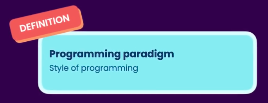

So a programming paradigm is a way of writing software, now we have many differnt programming paradigms, procedural, **Functional**, **Object-oriented**, even-driven, ... and many many more.

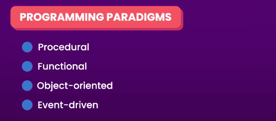

Out of these, **Functional** and **Object-oriented** programming are the 2 most popular paradigms these days. With each paradigm, we think of building software in a different way.

For example, in **Functional** programming, we build software by creating and composing functions. In **Object-oriented** programming, we write software by creating objects rather than functions.

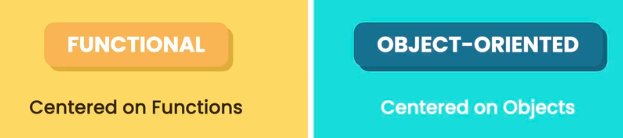

Now each paradigm has its pros and cons, and should be used to solve certain problems. So there is no such a thing as the best program in paradigm. Just like there is no best way to bake a cake.


In a real application, we can use multiple paradigms to solve different kinds of problems. So these paradigms are not mutually exclusive.

In **Object-oriented** programming, we build applications in terms of objects that work together to solve a problem. Each object has a clear responsibility.


An object is a software entity or a building block that contains some attributes or properties as well as some functions or methods.

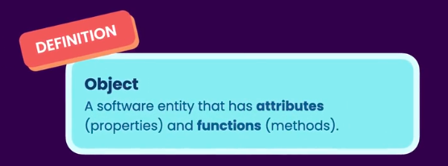

A good example is a dialog box, a dialog box has attributes like size and posiiton on the screen, as well as funcitons like show height resize and move.

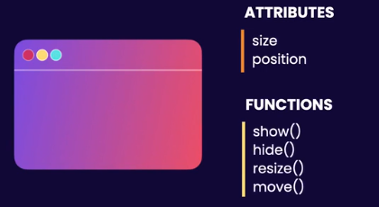

But objects are not always about viusal things, in a real application, we have tons of objects that power the user interface, we have objects for

- storing and retrieving data
- sending emails and notifications
- performing computations

Now to create an object we need a class, a class is a blueprint or a recipe for creating objects, so just like we can use a recipe to bake many cakes of the same kind.

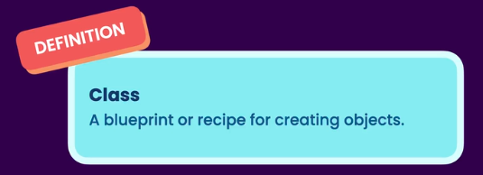

We can use a class to create many objects of the same type.

**UML**

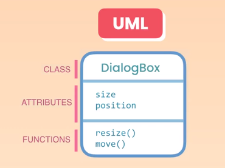

These variables and functions are called the **members** of the class.

Quite often we use structures as simple data containers, and classes for creating objects that can do things.


So a class combines data and functions that operate on the data together, this is one of the core principles of object oriented programming, and is called **encapsulation**.

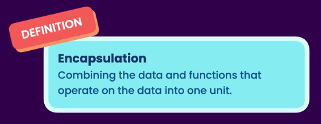

### 1.2 Defining a Class

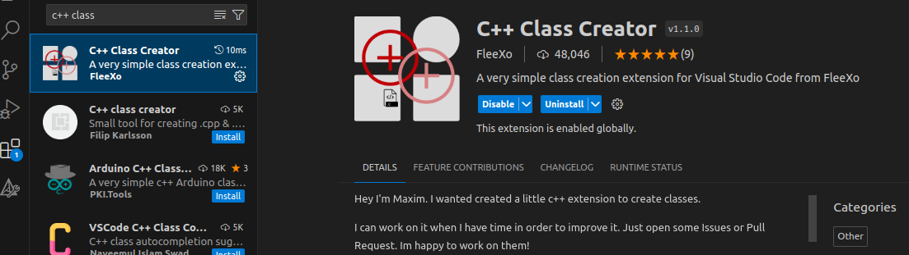

**Rectangle.h**

```cpp
#ifndef RECTANGLE_H
#define RECTANGLE_H

#pragma once

class Rectangle
{
public:
    Rectangle();
    ~Rectangle();

    int width;
    int height;
    void draw();
    int getArea();

private:

};

#endif
```

**Rectangle.cpp**

```cpp
#include "Rectangle.h"
#include <iostream>
using namespace std;

Rectangle::Rectangle()
{

}

Rectangle::~Rectangle()
{

}

void Rectangle::draw()
{
    cout << "Drawing a rectangle" << endl;
    cout << "Dimensions: " << width << ", " << height << endl;
}

int Rectangle::getArea()
{
    return width * height;
}
```

### 1.3 Creating Objects

In the `class_main.cpp` file, first on the top we have to `#include "Rectangle.h"` -> include the header or the interface file of the **_Rectangle_** class.

We are not going to include the cpp or the implementaiton file. Only the header file. Now the reason we have this separation, the reason we have 2 files per class, is to reduce the compilation times.

So currently our `class_main.cpp` file is dependent on `Rectangle.h`, and that means if we go to this file, and make any changes here, as well as every file is dependent on this file, has to be recompiled.

However if we go to our implementation file, and make any change here, only this file has to be re-compiled, and then it will be linked with other compiled files. So the other files are not going to be re-compiled.

This is the reason, we need to separate the implementaiton of a class from its interface. Because most of the time, the changes are in the implementation or in algorithms.

But sometimes as part of building a new feature or changing an existent one, we also have to change the interface o a class. In that cause, `Rectangle.h`.

```cpp
#include "Rectangle.h"
#include <iostream>

using namespace std;

int main() {
    Rectangle rectangle;
    rectangle.width = 10;
    rectangle.height = 20;

    cout << rectangle.getArea();

    return 0;
}
```

### 1.4 Access Modifiers

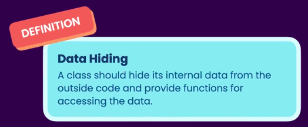

```cpp
#ifndef RECTANGLE_H
#define RECTANGLE_H

#pragma once

class Rectangle
{
public:
    Rectangle();
    ~Rectangle();

    void draw();
    int getArea();

private:
    int width;
    int height;

};

#endif
```

### 1.5 Getters and Setters

```cpp
#ifndef RECTANGLE_H
#define RECTANGLE_H

#pragma once

class Rectangle {
  public:
    Rectangle();
    ~Rectangle();

    void draw();
    int getArea();

    int getWidth();
    void setWidth(int width);
    int getHeight();
    void setHeight(int height);

  private:
    int width;
    int height;


};

#endif
```

```cpp
#include "Rectangle.h"
#include <iostream>
using namespace std;

Rectangle::Rectangle() {

}

Rectangle::~Rectangle() {

}

void Rectangle::draw() {
    cout << "Drawing a rectangle" << endl;
    cout << "Dimensions: " << width << ", " << height << endl;
}

int Rectangle::getArea() {
    return width * height;
}

int Rectangle::getWidth() {
    return width;
}

void Rectangle::setWidth(int width) {

    if(width < 0)
        throw invalid_argument("width");
    this->width = width;
}

int Rectangle::getHeight() {
    return height;
}

void Rectangle::setHeight(int height) {
    if(height < 0)
        throw invalid_argument("height");
    this->height = height;
}
```

### 1.6 Construtors

```cpp
#ifndef RECTANGLE_H
#define RECTANGLE_H

#pragma once

class Rectangle {
  public:
    Rectangle();
    Rectangle(int width, int height);
    ~Rectangle();

    void draw();
    int getArea();

    int getWidth() const;
    void setWidth(int width);
    int getHeight() const;
    void setHeight(int height);

  private:
    int width = 0;
    int height = 0;


};

#endif
```

```cpp
Rectangle::Rectangle(int width, int height) {
    cout << "Constructing a rectangle object." << endl;
    setWidth(width);
    setHeight(height);
}
```

### 1.7 Member Initializer List

### 1.8 The Default Constructor

A default constructor is a constructor with no parameters. Note that just like functions, we can also overload constructors, so here we have 2 constructors with different signatures.

```cpp
class Rectangle {
  public:
    Rectangle() = default;
```

```cpp
Rectangle::Rectangle() {
    width = height = 0;
}
```

This cpp complier always automatically generates a default constructor for every class unless we provide a constructor, and that is the reason why earlier before we define this constructor, we could create instances of the rectangle class without initial values.

### 1.9 Using the Explicit Keyword

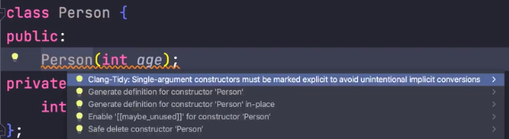

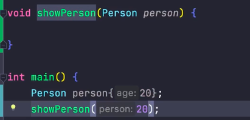

The reason of this works is because the compiler knows that in this class, we have a constructor that takes an integer, so when we pass an integer to this function, the complier is going to do an implict conversion.

So it's going to implictly convert this integer to a person object, so underflying is going to create a person object, and then it will pass that person object to this function.

But look at the syntax, in this case it doesn't really make sense to pass an integer to this function. This is where we can use the `explicit` keyword to prevent the complier from doing an implict conversion.

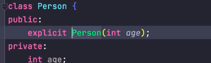

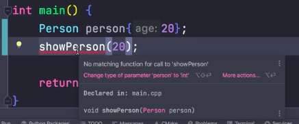

### 1.10 Constructor Delegation

```cpp
Rectangle::Rectangle(int width,
                     int height,
                     const string &color) : Rectangle(width, height) {
    // setWidth(width);
    // setHeight(height);
    cout << "Constructing a rectangle object with color." << endl;
    this->color = color;
}
```

### 1.11 The Copy Constructor

Now we have a special kind of constructor called the copy constructor which is used for copying objects.

```cpp
int main() {
    Rectangle first(10, 20);
    Rectangle second = first;

    return 0;
}
```

A copy of the `first` rectangle is taken and stored in the `second` rectangle object. So we have **2 independent** objects in memory.

The reason copying works is because, under the hood, the complier automatically generates a copy constructor in the rectangle class. This copy constructor takes a source object, in this case -> the `first` rectangle, and then it will copy all the values in this object into the `second` object.

This copy constructor works perfectly fine pretty much all the time, but there are special situations where we have to control over how objects are copied.

In these situations, we need to explicitly define a copy constructor to decide how objects are copied.

Back to the header file, let's declare a new constructor. This constructor should have a single parameter, the type of the parameter has to be the same as the class, because that is the object we're copying.

```cpp
Rectangle(Rectangle)
```

Now we have t omake this a reference parameter `&`, because if we don't do so, the complier doesn't know how to copy this object, because the copy operation is going to be defined in this constructor.

```cpp
Rectangle(Rectangle&)
```

Also we should make this constant parameter, so we don't accidentally modify the source object as part of the copy operaiton.

```cpp
Rectangle(const Rectangle&)
```

So let's call the parameter `source`.

```cpp
Rectangle(const Rectangle& source);
```

In the definition:

```cpp
Rectangle::Rectangle(const Rectangle& source) {
    cout << "Rectangle copied" << endl;
    this->width = source.width;
    this->height = source.height;
    this->color = source.color;
}
```

Now there is a problem with this approach, if tomorrow we decide to add a new member variable in the `Rectangle` class, we have to remember to come back and modify the copy constructor to copy that member variable as well. If we don't do so, we're going to create bugs tha tare hard to find. That's why it's always best to rely on the copy constructor that the compiler generates for us.

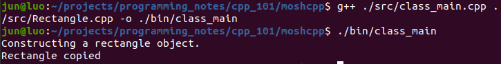

Pass the object, it will be copied.

```cpp
void showRectangle(showRectangle rectangle) {}
```

Pass the reference, it will not be copied.

```cpp
void showRectangle(showRectangle& rectangle) {}
```

There are situations where we want to stop the copy operation, we want to prevent an object from being copied by value. In those situation, we can explicitly delete the copy constructor. And remove the definition.

```cpp
Rectangle(const Rectangle& source) = delete;
```

What we are doing here, is that we are telling the compiler to delete the copy constructor for us. Then we can not copy in the main file.

### 1.12 The Desctructor

We have another special function in our classes called a **desctructor**, desctructors are automatcially called when our objects are being desctroyed.

This is an opportunity for us to free system resources that an object is using. So if we allocate memory or open a file or network connection. Then we need to release resources and desctructors.

```cpp
~Rectangle();
```

### 1.13 Static Members

All the functions and variables we have declared as above are what we call instance members. These members belong to instances of the `Rectangle` class.

So each instance is going to have its own copy of these members. But we can also declare members that belong to the `Rectangle` class itself.

So we will have a single copy of these members in memory, and that single copy will be shared by all instances. We refer to members tha belong to the class as static members.

Added in `Rectangle.h`

```cpp
private:
    static int objectsCount;
public:
```

Whenever we declare a static variable in the class, we should always define it in our implementation file.

Back to our implementation file `Rectangle.cpp`

```cpp
Rectangle::Rectangle(int width, int height) {
    objectsCount++;
    cout << "Constructing a rectangle object." << endl;
    setWidth(width);
    setHeight(height);
}

...

int Rectangle::objectsCount = 0;

int Rectangle::getObjectsCount() {
    return this->objectsCount;
}
```

### 1.14 Constant Objects and Functions

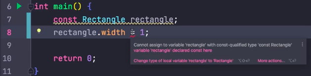

When we make an object constant, all its attributes become constant or read only as well.

In programming we say this objects becomes **immutable**. To mutate something means to change it, so mutable means changeable, and immutable means unchangeable.

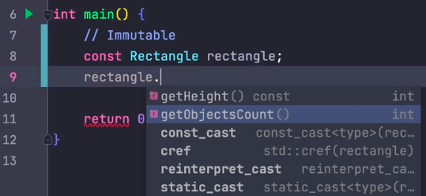

We only have `getters`, and we don't have any `setters`, but we have a few other methods that are missing here. We have the `draw` method and `getArea` method...where are those methods?

Look at the declaration of the `getHeight()` method, this method is declared as a constant, that means, in this method, we are not changing the state of this object.

```cpp
int Rectangle::getHeight() const {
    return height;
}
```

Added `const` in `Rectangle.h`

```cpp
    int getArea() const ;
    int getWidth() const;
```

Added `const` in `Rectangle.cpp`

```cpp
void Rectangle::draw() const {
    cout << "Drawing a rectangle" << endl;
    cout << "Dimensions: " << width << ", " << height << endl;
}

int Rectangle::getArea() const {
    return width * height;
}
```

### 1.15 Pointer to Objects

All the `Rectangle` objects we have created so far, we're on the **stack** which is a part of memory that automatically gets cleaned up, when our objects go out of scope.

So when the main function finishes execution, this `Rectangle` variable will go out of scope. So the desctructor of the `Rectangle` object gets called. And then after allocated to this object will be freed automatically.

So objects on the stack are useful when they are local to a function. So we don't need them outside of a function, but sometimes we need an object to stay in memory after a funciton finishes execution.

In those cases, we need to create that object on the heap, or the free store using the new operator.

```cpp
#include "Rectangle.h"
#include <iostream>

using namespace std;

int main() {
    auto* rectangle = new Rectangle(10, 20);
    rectangle->draw();

    delete rectangle;
    rectangle = nullptr;

    return 0;
}
```

If we don't point `rectangle` to `nullptr`, we'll have a pointer pointing to a memory address that doesn't exist anymore. We refer to that as a **dangling** pointer.

If you forget to free up the memory and reset the pointer, our program will have a memory leak. So it's going to take up some memory, but it will never release that memory.

So in morden c++, we should never use the `new` and `delete` opertors anymore, instead we should use smart pointers.

The great thing about smart pointers is that they will take care of freeing up the memory using its desctructor. So we don't have to worry about doing this.

```cpp
#include "Rectangle.h"
#include <iostream>
#include <memory>

using namespace std;

int main() {
    auto rectangle = make_unique<Rectangle>(10, 20);
    rectangle->draw();

    return 0;
}
```

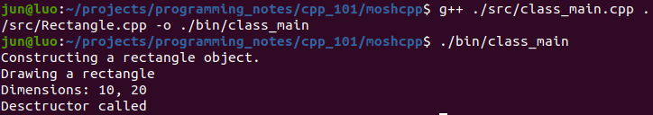

### 1.16 Object Array

## 2 Operator Overloading

### 2.1 Overloading the Equality Operator

The whole idea behind operator overloading is to implement the built-in operators for our classes.

```cpp
#ifndef LENGTH_H
#define LENGTH_H

#pragma once

class Length {
  public:
    explicit Length(int value);
    bool operator==(const Length& other) const;
    bool operator==(int other) const;
    bool operator!=(int other) const;
    ~Length();

  private:
    int value;
};

#endif
```

```cpp
#include "Length.h"

Length::Length(int value) {
    this->value = value;
}

bool Length::operator==(const Length& other) const {
    return value == other.value;
}

bool Length::operator==(int other) const {
    return value == other;
}

bool Length::operator!=(int other) const {

    // return value != other;
    return !(value == other);
}

Length::~Length() {

}
```

```cpp
#include <iostream>
#include "Length.h"

using namespace std;

int main() {

    Length first{10};
    Length second{10};

    if(first == second)
        cout << "first == second" << endl;

    if(first == 10)
        cout << "first == 10" << endl;

    if(first != 20)
        cout << "first != 20" << endl;

    return 0;
}
```

In the `!=` implemtatation, we don't write `return value != other;`, because if in the future, we change the logic for comparing 2 length objects, we have to make changes to several functions.

We have to change both the equality and inequality. So the better to implement the ineqaulity operator, is to implement it in terms of the equality operator. We can rewrite the implementation like this `return !(value == other);`.

First we compared the value with other value in terms of Equality, at this point this function will get executed. Now whatever this funciton returns will simply invert the value.

```cpp
bool Length::operator!=(int other) const {

    // return value != other;
    return !(value == other);
}
```

### 2.2 Overloading the Comparison Operators

### 2.3 Overloading the Spaceship Operator

In C++, we have a new operator called the spaceship or three-way comparison operator.

```cpp
#include <iostream>

using namespace std;

int main() {
    int x = 10;
    int y = 20;

    if(x < y) {
        cout << "x < y" << endl;
    } else if(x > y) {
        cout << "x > y" << endl;
    } else {
        cout << "x == y" << endl;
    }

    return 0;
}
```

So here we're doing 2 comparisons to identify the relationship between x and y, now both x and y are integers, thre are small primitive types, so the comparison are pretty cheap.

But sometimes we might be working with large complex objects, and these objects might have several attributes that we need to take into account as part of the comparison, in that case our comparisons are going to be expensive.

## 3 Inheritance

## 4 Polymorphism

## 5 Exceptions

## 6 Tempates
