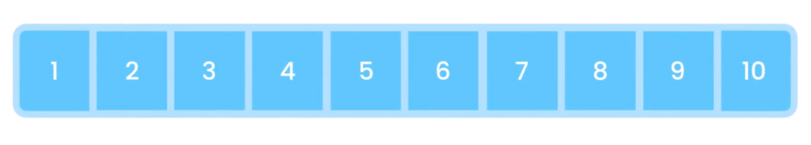

# Data Structures

## 1 Big O Notation

### 1.1 What is Big O?

**Big O from Wikipedia:**
Big O notation is a mathematical notation that describes the limiting behavior of a function when the argument tends towards a particular value or infinite.

We use Big O to describe the performance of an algorithem, and this helps us determine if a given algorithm is scalable or not. Which basically means is an algorithm going to scale well as the input grows really large.

So just because your code executes quickly on your computer doesn't mean it's going to perform well when you give it a large data set.

So that's why we use the **Big O Notation** to describe the performance of an algorithm. Now what does have to do with data structures? Certain operations can be more or less costly depending on what data structures we use.


For example, access an array element by it's index is super fast. But arrays have a fixed length and if you want constantly add or remove items, they have to get resized, and this will get costly as the size of our input grows very large.


So, if that's what we need to do. Then we have to use another data structure called a **linked-list**. These data structures can grow or shrink very quickly, but accessing a **linked-list** element by its index is slow.

So that's why you need to learn about the Big O Notation first before we can talk about various data structures.

### 1.2 O(1)

Here is our example. This method takes an array of integers and paints the first item on the console.

```c
#include <stdio.h>

void log(int *numbers)
{
    printf("%d\n", numbers[0]);
}

int main()
{
    int numbers[4] = {};

    log(numbers); // (O)1

    return 0;
}
```

It doesn't matter how big the array is. We can have an array with one or one million items. All you're doing here is printing the first item. So this method has a single operation, and takes a constant amount of time to run.

You don't worry about the exact execution time in milliseconds, because that can be different from one machine to another or even on the same machine.

All we care about is that this method runs in ocnstant time, and we represent it using the **O(1)**. This is the runtime complexity of this method.

So in this example, the size of input doesn't matter, this method will always run in constant time or **O(1)**.

```c
#include <stdio.h>

void log(int *numbers)
{
    printf("%d\n", numbers[0]);
}

int main()
{
    int numbers[4] = {};

    //  O(2) -> O(1)
    log(numbers);
    log(numbers);

    return 0;
}
```

Well, what about we duplicate the _`printf()`_, and both operations run in constant time, so the runtime complexity of this method is **O(2)**.

Now when talking about the runtime complexity. We don't really care about the number of operations, we just want to know how much algorithm slows down as the input grouws larger.

So in this example, whether we have one or one million items, our method runs in constant time. So we can simplify by writing down **O(1)**, meaning **<span style="color:#2874A6">constant time</span>**.

### 1.3 O(n)

Here we have a slightly more complex example. Have a loop. So we are iterating over the items this array, and printing each item.

```c
#include <stdio.h>

void logArray(int *parray, int size)
{
    // O(n)
    for (int i = 0; i < size; i++)
    {
        printf("%d\n", *(parray + i));
    }
}

int main()
{
    int numbers[4] = {0, 1, 2, 3};

    logArray(numbers, 4);

    return 0;
}
```

If you have million items (_`size`_ equals a million), obviously you're going to have a million _`printf()`_ operations.

So the cost of this algorithm grows linearly, and in direct correlation to the _`size`_ of the input. So we represent the runtime complexity of this method using **O(n)**.

The **O(n)**, where **n** represents the _`size`_ of the input. So as **n** grows, the cost of this algrithm also grows linearly, now it doesn't matter what kind of loop we use to iterate over this array.

Now what if we have a _`printf()`_ statement before and after our loop.

```c
void logArray(int *parray, int size)
{

    printf("Before the loop");       // O(1)
    for (int i = 0; i < size; i++)   // O(n)
    {
        printf("%d\n", *(parray + i));
    }
    printf("After the loop");        // O(1)
}
```

You saw that these single operations run in constant time, so here we have the **O(1)**, so the runting operation complexity of this method is **O(1 + n +n)**. However, when using the Big O notation, we drop these constant **O(1)**s because they don't really matter.

Here is the reason, if our array has one million inputs (_`size`_ equalis a million), adding 2 extra operations doesn't rally have a significant increase on the cost of our algorithm.

The cost of our algorithm still increases linearly, so we can simplify this by dropping the constant **O(1 + n +n)**, what matters is that the cost of algorithm increases linearly and in direct proportion to the _`size`_ of our input.

Then what if you had two loops here.

```c
void logArray(int *parray, int size, int length)
{
    // O(n) + O(m)

    for (int i = 0; i < size; i++)   // O(n)
    {
        printf("%d\n", *(parray + i));
    }

    for (int i = 0; i < length; i++)   // O(m)
    {
        printf("%d\n", *(parray + i));
    }
}
```

### 1.4 O($n^2$)

Here we have the nested loops. This is the algorithm that we use for printing all combinations of items in an array. So we need to use runtime complexity here?

```c
void logArray(int *parray, int size)
{
    for (int i = 0; i < size; i++)      // O(n)
    {
        for (int j = 0; j < size; j++)  // O(n)
        {
            printf("first: %d, second: %d.\n", *(parray + i), *(parray + j));
        }
    }
}
```

In our outer loop, we're iterating over out input array, so here we have to **O(n)**. In each iteration, once again you're iterating over all the items in this array, in another example of **O(n)**. So the runtime complexity of this method is **O($n^2$)**.


We say this algorithm runs in quadratic time. As you can see in this diagram. Algorithms that run in the **O($n^2$)**, is slower than algorithms that run in **O(n)**. Of course this depends on the size of the input.

If you are dealing with an array of let's say 50 items, you're not going to see any differences. But as our input grows larger and larger, algorithms that run in **O($n^2$)** get slower and slower.

Now, what if you had another loop before or after this loop?

```c
void logArray(int *parray, int size)
{
    for (int i = 0; i < size; i++)   // O(n)
    {
        printf("%d\n", *(parray + i));
    }

    for (int i = 0; i < size; i++)      // O(n)
    {
        for (int j = 0; j < size; j++)  // O(n)
        {
            printf("first: %d, second: %d.\n", *(parray + i), *(parray + j));
        }
    }

    for (int i = 0; i < size; i++)   // O(n)
    {
        printf("%d\n", *(parray + i));
    }
}
```

It's still **O($n^2$)**.

What happen if we had another nested loop inside.

```c
void logArray(int *parray, int size)
{
    for (int i = 0; i < size; i++)      // O(n)
    {
        for (int j = 0; j < size; j++)  // O(n)
            for (int k = 0; k < size; k++)
            {
                printf("first: %d, second: %d, third: %d.\n", *(parray + i), *(parray + j), *(parray + k));
            }
    }
}
```

The the runtime complexity is now **O($n^3$)**. As you can imagine, this algorithm gets far slower than an algorithm with **O($n^2$)**.

### 1.5 O(log n)


Here is the logarithmic curve, compare this with a linear curve, the linear grows at the same rate, but the logarithmic curve slows down at some point.

So the algorithm that runs in logarithmic time is more efficient and more scalable that an algorithm that runs in linear or poor value time.

Let's see an example here. We have an array of sorted numbers from one to ten and you want to find the number 10.



one way to find the 10 is iterate over this array using a _`for`_ loop, going forward until we find a 10. This is called the **_linear search_** because it runs in a linear time.


In the worst case scneario, if the number we're looking for is at the end of an array. we have inspect every cell in this array to find a target number.

The moe items we have, the longer this operation is going to take. So the run time of this algorithm increases lineary and in direct proportion with the size of our array.

Now, we have another searching out for them called binary search, and this algorithm runs logarithmic time. It's much faster than the linear search.


**_Assuming that our array is sorted_**, we start off by booking at the middle item. If is this item smaller or greater than the value we're looking for? It's smaller, so our target number, in this case 10, must be in the right partition of this array. So we don't need to inspect any of the items in the left partition of this array.

Assuming that out array is sorted, we start off by looking at the middle item. If this item smaller or rither nugreater than the value we're looking for? It's smaller.

So our target number, int this case, must be in the light.


So partition of this array? So we don't need to inspect any of the items in the left part of the partition, in partition and with this, we can narrow down our search by half. With this we can narrow down our search by half.


Now, in the right partition, again, we look at the middle item, is it smaller or greater than the target value? It's smaller, so again ignore the items on the left, and focus on the items on the right.

So every step, we're essentially narrowing down our search by half.


With this algorithm if we have one million items in this array, we can find a target item with a maximum of 19 comparaisons.

We don't have to inspect every item in our array, this is logarithmic time in action, we have logarithimic growth in algorithms where you reduce our work by half in every step.

### 1.6 O($2^n$)

O($2^n$) is the opposite of the O(log n) growth.


Remember these five curves.


### 1.7 Space Complexity

You have seen how we can use the big **O** notation to describe the runtime complexity of our algorithms.

In an ideal world, we want our algorithms to be super fast and scalable, and take minimum amount of memory. But unfortunately, that hardly if ever happens. It's like asking for a Ferrari for 10 dollars. It just doesn't happen.

Most of the time, you have to do a trade-off between saving time and saving space. There are times when we have more space, so we can use that to optimize an algorithm to make it faster and more scalable. But there are also times where you have limited space, like when we build an app for a small mobile device. In those situations we have to optimize for the space, because scalability is not a big factor. Only one user is going to use our application at that moment, not a million users.

So we need a way to talk about how much space an algorithm requires, and that is where we use the big **O** notation again.

Let's look at a few example, here we have this greet method that takes an array of string, and prints a high message for every name in this array.

```c
#include <stdio.h>
#include <string.h>

void greet(char **names, int size)
{
    // O(1) space
    for (int i = 0; i < size; i++)
    {
        printf("Hi, %s.\n", names[i]);
    }
}


int main()
{
    char *names[4] = {"JunLuo", "CherylTan", "RoyLuo", "YummyLuo"};
    greet(names, 4);
    return 0;
}
```

Now in this one we're declaring a loop variable, and this is independent of the signs of the input, so whatever our input size is 10 or one million, this method will only allocate some additional memory for the loop variable _`i`_. So it takes **O(1)** space.

Now, what if you declare a string like this. Call it copy and initialize it like this.

```c
#include <stdio.h>
#include <string.h>
#include <stdlib.h>

void greet(char **names, int size)
{
    // O(n) space
    char **new_names = (char*)malloc(size * sizeof(char*));

    for (int i = 0; i < size; i++)
    {
        printf("Hi, %s.\n", names[i]);
    }
}


int main()
{
    char *names[4] = {"JunLuo", "CherylTan", "RoyLuo", "YummyLuo"};
    greet(names, 4);
    return 0;
}
```

So if our input size is 1000, this array *`*new_names[]`\* will also have 1000 items, what is the space complexity of this method? It's **O(n)**, the bigger size we have input, the more space our method is going to take, we have **O(n)** here.

By the way when we talk about space complexity, we only look at the addtional space that we should allocate relative to the size of the input.

We always have the input of size n, so we don't count it, we just analyze how much extra space we need to allocate for this algorithm, so that's all about space.

## 2 ArrayList

### 2.1 Introduction

Arrays are built into most programming lanaguages and we use them to store a list of item sequentially.

The topics in this section:

- Vary the strengths and weaknesses of arrays
- How to use arrays
- Build an array

### 2.2 Understanding Arrays

We use arrays to store a list of items like a list of strings, numbers, objects and literally anything. These items are stored sequentially in memory.

For example, if we allocate an array of 5 integers, these integers get stored in memory like this.

| 0x100 | 0x104 | 0x108 | 0x10A | 0x10C |
| ----- | ----- | ----- | ----- | ----- |
| 10    | 20    | 30    | 40    | 50    |

Let's say the address of the first item in memory is 0x100, as you probably know, integers in C take 4 bytes of memory. So the 2nd item would be stored at the memory location 104, the 3rd item would be stored at the memory location 108.

For this very reason, looking up items in an array is super fast. We give our array an index and it will figure out where exactly in memory we should access.

Now what do you think is the runtime complexity of this operation? -> **O(1)**

Because the calculation and the memory address is very simple, it doesn't involve any loops or complex logic. So if you need to store the list of items and access them by their index, arrays are the optimal data structures for your.

Now let's look at the limitation or weaknesses of arrarys. In C/C++ or Java, arrays are static which means when we allocate them, we should specify their size and this size cannot change later on, so we need to know ahead of time, how many items we want to store in an array.

Now, what if you don't know? You have to make a guess. If our guess is too large, we'll waste memory, because we'll have cells that are never filled. If our guess is too small, our aray gets filled quickly.

Then to add another item, we'll have to resize the array. Which means we should allocate a large array and then copy all the items in the old array into the new array.

| 0x100 | 0x104 | 0x108 | 0x10A | 0x10C |
| ----- | ----- | ----- | ----- | ----- |
| 10    | 20    | 30    | 40    | 50    |

=>

| 0x400 | 0x404 | 0x408 | 0x40A | 0x40C | 0x40E | 0x50 | 0x54 |
| ----- | ----- | ----- | ----- | ----- | ----- | ---- | ---- |
| 10    | 20    | 30    | 40    | 50    |       |      |      |

This operation can be costly. This operation you guess the runtime complexity of this object?

Let's say our item has 5 items, now we want to add a 6th item, you have to allocate a new array, and copy all of these five items into that new array.

So the runtime complexity of this operation is **O(n)**, which means the cost of copying these items into the new array increases linearly and in direct proportion to the size of the array.

Now let's talk about removing an item, here we have another couple scenarios, if you want to remove the **_last item_**, that's pretty easy, you can look it up by it's index and clear the memory. So here we have **O(1)**.


Which is our best case scenario. But when doing **O** analysis, we should think about the worst case scenario. What is the worse case scenario here? This is when we want to remove an item from the beginning of the array, you have to shift all of the items on the right one step to the left to fill in the hole.

**Worst Case**
| 0x100 | 0x104 | 0x108 | 0x10A | 0x10C |
| ----- | ----- | ----- | ----- | ----- |
| 10 | 20 | 30 | 40 | 50 |

=>

| 0x100 | 0x104 | 0x108 | 0x10A | 0x10C |
| ----- | ----- | ----- | ----- | ----- |
|       | 20    | 30    | 40    | 50    |

=>

| 0x100 | 0x104 | 0x108 | 0x10A | 0x10C |
| ----- | ----- | ----- | ----- | ----- |
| 20    | 30    | 40    | 50    |       |

The more items we have the more the shifting operation is going to cost. So for the worst case scenario, deletion is **O(n)**.

So because arrays have a fixed size, in situation where we don't know ahead of time, how many items we want to store in them, or when we need to add or remove a lot of items from them, they don't perform well. In those cases, we use LinkedList.

### 2.3 Working with Arrays

```c
#include <stdio.h>

#define ARRAY_SIZE 4

void printArray(int *array, int size)
{
    for (int i = 0; i < size; i++)
        printf("%d ", array[i]);
    printf("\n");
}

int main()
{
    int arr[ARRAY_SIZE] = {0};

    printf("The address of arr: %p\n", arr);
    printArray(arr, ARRAY_SIZE);
    printf("Updated the array: \n");
    arr[1] = 40;
    printArray(arr, ARRAY_SIZE);
    return 0;
}
```

_Output:_

```sh
The address of arr: 0x7ffe546529c0
0 0 0 0
Updated the array:
0 40 0 0
```

### 2.4 Exercise - Creating Array Struct

**C Version**

```c
#include <stdio.h>
#include <stdlib.h>

typedef struct IntArrayList IntArrayList;

struct IntArrayList
{
    int *items;
    int length;
};

IntArrayList *createIntArrayList(const int len)
{
    IntArrayList *intArrayList = malloc(sizeof(IntArrayList));
    int *array = malloc(sizeof(int) * len);
    intArrayList->items = array;
    intArrayList->length = len;

    return intArrayList;
}

void printIntArrayAll(IntArrayList *intArrayList)
{
    for (int i = 0; i < intArrayList->length; i++)
        printf("%d ", intArrayList->items[i]);
    printf("\n");
}

int main()
{
    IntArrayList *intList = createIntArrayList(4);
    printIntArrayAll(intList);

    return 0;
}
```

**C++ Version**

```cpp
#include <iostream>

class IntArrayList
{
private:
    int *_items;
    int _length;
public:
    IntArrayList(int length)
    {
        this->_length = length;
        this->_items = new int[length];
    }
    ~IntArrayList()
    {
        delete this->_items;
    }

    void print()
    {
        for(int i = 0; i < this->_length; i++)
            std::cout << this->_items[i] << " ";
        std::cout << std::endl;
    }

};

int main()
{
    IntArrayList intList = IntArrayList(4);
    intList.print();

    return 0;
}
```

### 2.5 Exercise - insert()

- If the array is full, resize it
- Add the new item at the end

### 2.6 Exercise - removeAt()

- Validate the index
- Shift the items to the left to fill the hole
- **O(n)**

### 2.7 Exercise - indexOf()

- If we find it, return index
- Otherwise, return -1
- **O(n)**

### 2.8 Dynamic Arrays

### 2.9 Summary

**YOU LEARNED...**

- Simplest data structure
- Static vs dynamic
- Java - ArrayList
- Cpp - Vector
- Great when you know how many items you have

**RUNTIME COMPLEXITIES**

- **Lookup by Index** - O(1)
- **Lookup by Value** - O(n)
  - We have to iterate over all the item to find a given value
  - In the worst case scenario, this item is going to be the last item in the array
- **Insert** - O(n)
- **Delete** - O(n)
  - Both **Insert** and **Delete** have to be copied to a new array, and shifted to left in cae of deletion

## 3 LinkedList

### 3.1 Introduction

### 3.2 What are Linked Lists

We use Linked Lists to store a list of objects in sequence. But unlike Array Lists, Linked Lists can grow and shrink automatically.

As you can a Linked List consists of a group of nodes in sequence. Each node holds two pieces of data, one is a value, and the other is the address of the next node in the list.


So we say each node points to or references the next node. That's why we refer to these structure as Linked List. Because these nodes are linked togehter.

We call the first node **_the head_** and the last node **_the tail_**.

**RUNTIME COMPELEXITY**

let's say you want to find out if our list contains a given number. We have to traverse the list, starting from the head all the way to the tail.

-> **By Value - O(n)** -> Because the value of what we're looking for maybe stored in the last node, that is our worst case scenario.

What about looking up by index? Unlike Array Lists, where items are stored sequentially, the nodes of a linked lists can be all over the place in memory, they may not be next to each other.

That's why each node needs to keep a reference to the next node. For this reason, unlike Array Lists, we cannot look up an item by it's item. We have to traverse the list until we find that item. In the worst case scenario, that item can be at the end of the list.

-> **By Index - O(n)**

What about insertion? It depends where we want to insert an item, if you want to insert a new item at the end, you simply want to create a new node and have the last node or the tail point to it.


We should have a reference to the last node somewhere, so we don't have to traverse the list every time. Now we need to have the tail reference this new node.


So **inserting a new item at the end of O(1)** opearation.

What about inserting at the beginning? -> **At the beginning - O(1)** -> We should have a reference to the head of the first node, so to insert a new item at the beginning of the list we create a new node, link it to the first node.


We create a new node, link it to the first node, and then change the head to point this new node, again this is very fast.


Unlike Array Lists, we don't have to copy or shift items around, we simply update the links or references.

Now what if you want to insert an item somewhere in the middle. Let's say after the 10th node, first we need to find the node, that's an **O(n)** opeartion. We have to update the links which is an **O(1)** operation.

- **INSERT**
  - From the Beginning - O(1)
  - From the End - O(1)
  - From the Middle - O(n)

So inserting an item in the middle is an **O(n)** opeartion.

Now let's talk about deletions:

- **DELETE**
  - From the Beginning - O(1)
  - From the End - O(n)
  - From the Middle - O(n)

Deleting the first item is super fast. We simply set the head to point to the second node. That's **O(1)**. Now we should also remove the link from the previous head, so it doesn't reference the second node anymore, and then free the memory of the previous head.


What about deleting the last item, this one is a bit tricky. We can easily get the trail, but we need to know the previous node, so we can have the tail point to that node.

We have to traverse the list from the head all the way to the tail, as soon as we get to the node before the last node. We keep a reference to it as the previous node, the n we'll unlink this node. Then finally have the tail point to the previous node and free the previous tail node.


So the runtime complexity here is **O(n)**, because we have to traverse the list all the way until the end.

What about deleting from the middle? Again, we have to traverse the list to find out the node, as well as its previous node. We should link the previous node to the node after this node. And then remove this link and free this node in memory.


-> **Deleting from the middle - O(n)**

### 3.3 Working with Linked Lists

### 3.4 Exercise - Building a Linked List

- **C Implementation**

  - **Node Structure:** First, define a structure for the nodes that will make up the linked list.
  - **Create a Node:** Implement a function to create a new node with a given value.

- **C++ Implementation**
  - **Node Class:** Define a class for the nodes that will make up the linked list.
  - **Linked List Class:** Define a class for the linked list that will use the Node class.

### 3.5 addLast

### 3.6 AddFirst

### 3.7 indexOf

### 3.8 contains

### 3.9 removeFirst

### 3.10 removedLast

### 3.11 Implmenting size()

### 3.12 Converting Linked List to Arrays

### 3.13 Cheat Sheets

### 3.14 Array Lists vs Linked Lists

### 3.15 Reversing a Linked List

### 3.16 Kth Node from the End

### 3.17 Summary
